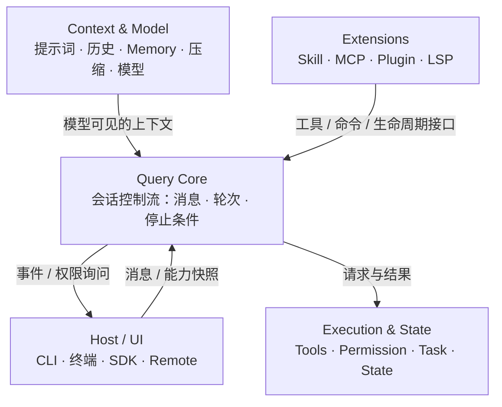

## 回答上一篇的问题

上一篇最后留下的问题是，因为这次源码泄漏事件，网友们发现了 Claude Code 中的哪些 bug。

先说答案。源码公开以后，网友确实顺着它找到了不少有意思的问题。不过，这些发现并不都代表 Claude Code 现在仍然存在漏洞。有些 bug 可以实际复现，有些只是源码注释记录下来的历史事故，还有一些属于值得继续验证的攻击面。

第一个问题和 prompt cache 有关。一份公开 issue 记录了这样一个现象，恢复会话以后，Skills 列表和其他系统信息移动到了新的位置。人眼看到的文本内容近似不变；按照前缀匹配的缓存会因顺序变化而重写后续内容。复现数据中，每恢复一次会话，都会重新创建大约 3800 个缓存 token。这也解释了为什么有些用户只是继续一段旧对话，token 消耗却像重新开始了一次会话。

第二个问题更夸张。泄露源码中的一段注释记录，Claude Code 曾经有 1279 个会话连续压缩失败 50 次以上，最严重的一个会话失败了 3272 次，每天因此浪费大约 25 万次 API 调用。独立的源码整理也记录了这组数字。2.1.88 已经加上熔断保护，连续失败 3 次就停止重试。因此，这段源码记录的是已经加入保护的历史故障。

第三个问题出现在权限检查里。某些看起来安全的命令曾经可以提前得到允许，后面的重定向检查因此不会继续执行。一条原本只是提交 Git 记录的命令，就可能把输出写进 shell 启动配置，并在用户下次打开终端时产生副作用。2.1.88 中已经能看到针对这个路径的保护。安全分析也把重点放在了多套 shell 解析逻辑之间的差异上。

这三个 bug 分别落在上下文与模型、会话内核、执行与权限三个区域。理解它们的共同前提，是把 Claude Code 看成一套由多个区域协作的 Agent 系统。

## 介绍本章的一些概念

- Claude Code 是一个围绕**会话内核（Query Core）**组织的 Agent 系统。外围区域不断向内核提供输入、上下文、执行能力和扩展能力，内核把这些内容拼成下一轮请求。
- **控制平面**负责决定下一步动作、权限与停止条件，Query Core 是这条决策链的中心；**数据平面**承载消息、工具结果、文件状态和扩展能力，让控制决策能够作用到真实环境。
- 四个外围区域，Host/UI、Context & Model、Execution & State、Extensions，各自持有一类状态，通过稳定的事件与调用边界与 Query Core 交换。
- 这张架构地图是**源码重建的阅读坐标，不是 Anthropic 发布的官方模块图**；它的作用是先把"谁决定"和"谁执行"两类职责分开。

## 问题｜一次失败该去哪个区域找

先看一个最小的失败现场。凌晨的 CI 上，一条 `claude -p` 任务失败，日志停在"`mcp__tools__xxx` 工具不可用"后不再前进。值班同事把这一行日志贴进开发群，四个人的第一反应各不相同，有人翻终端渲染，有人查提示词组装，有人看工具权限，还有人怀疑文件执行被沙箱拦截。半小时后，群里出现四种不同的"根因"。

排查失败时，问题往往出在**缺少一张地图**，

> 一次请求失败时，错误可能出现在终端渲染、提示词组装、工具权限、文件执行或 MCP 连接。只按文件名找入口，通常会把"谁决定"和"谁执行"混在一起。如何从系统级别理解各个区域的职责边界？

本篇的答案是一张源码重建的架构图，把 2.1.88 的代码沿"状态归属"划分成四个外围区域和一个中心内核。读任何函数之前，先问它维护的是哪类状态、通过哪个调用边界把状态交回中心。答案清晰以后，那一行"MCP 工具不可用"属于哪个区域，会立刻有解。

在进入地图之前，先固定贯穿全系列的两个概念和一个提醒，

- **控制平面**，负责决定下一步动作、权限与停止条件；Query Core 是这条决策链的中心。
- **数据平面**，承载消息、工具结果、文件状态和扩展能力，让控制决策能够作用到真实环境。
- **宿主适配层**，REPL、IDE、SDK 与远程入口通过稳定事件契约复用同一套运行时。

下文的地图，就是这两条平面在代码里的落点，控制平面上的节点做决策，数据平面上的边搬运状态，两条平面在 Query Core 交汇。

## 最小心智模型



模型，一张控制平面与数据平面的关系图（仓库中对应手绘版 `./assets/01-control-data-planes-detail-handdrawn.png`）。读图时记住一句话，这张图只表达职责边界，不表达每次请求都经过的固定顺序。读到具体函数时，先判断它是在做决策、搬运数据，还是把能力接给宿主，再追它如何回到 Query Core。

把这张图变成读源码的三步法，**第一步，定位区域**，这个函数在维护输入输出、上下文、副作用，还是扩展能力；**第二步，找边界**，它通过什么事件、参数或注册项回到 Query Core；**第三步，判断状态归属**，如果它同时碰了两个区域的状态（比如既改终端又决定权限），停下来，检查它是否越过了职责边界。后文每一篇分析函数时，都会先执行这三步。

## 正文

本文的判断是，2.1.88 的代码可以沿一次会话分成四个外围区域，但它们都通过 Query Core 交换状态。接下来只回答两个问题，**每个区域保存什么状态，哪个调用边界把它交给 Query Core**。具体工具的实现先留到后文。

先说证据边界。系列沿用 00 章建立的三级证据，源码能够直接确认的内容写成事实，调用关系连接出的职责写成解释，缺少运行证据的部分明确标成推断。本篇的函数名与代码块均来自 2.1.88 source map 还原源码（`restored-src/`）；四区划分本身属于解释，它来自代码结构，Anthropic 未发布官方模块图。


整张图以 Query Core 为中心，外围分成 Host/UI、Context & Model、Execution & State、Extensions 四个区域。这样划分以后，Claude Code 就不再是一堆互相调用的文件，而是一个以会话内核为中心、不断从外围获得输入、上下文、执行能力和扩展能力的 Agent 系统。

### Query Core｜把各个区域组织起来

Query Core 接收宿主提交的消息和能力快照，调用模型，消费 `tool_use`，再把事件交回宿主。它持有的是一次会话的**控制流**，不是终端状态，也不是某个文件的内容。

```ts
let state: State = {
  messages: params.messages,
  toolUseContext: params.toolUseContext,
  turnCount: 1,
  transition: undefined,
  // 省略压缩、输出 token 恢复等状态
}
```

> 证据，`restored-src/src/query.ts`（2.1.88 source map 还原源码），`queryLoop()` 的起始状态，会话控制流的载体。

`messages` 决定模型当前能看到什么，`toolUseContext` 保存这一轮可调用的能力，`turnCount` 支持轮次边界，`transition` 记录上一轮为何继续。这一条状态就是 Query Core 的"领地"。

它保存的状态有限而明确，消息历史、轮次计数、上一轮的继续原因、压缩与预算字段，以及一份读文件凭据缓存。它把状态交给宿主的边界是异步事件流，`submitMessage()` 返回生成器，模型 token、工具进度、权限结果与最终消息沿同一条链路不断产出；宿主只消费事件，不修改循环。

这个区域最容易读错的边界，是把 Query Core 当成"路由器"。它不转发消息，而是**持有控制流状态并自己推进循环**；宿主拿到的是事件流，不是路由表。判断一个函数是否属于 Query Core，就看它是否在读写 `State` 本身。

这条边界解释了许多调用关系，REPL 负责输入和渲染，Context & Model 准备模型看到的内容，Execution & State 执行并记录副作用，Extensions 只通过工具、命令或生命周期接口加入能力。Query Core 把这些输入拼成下一轮请求。

反过来说，如果一个模块既直接改终端、又直接决定工具权限，它就跨越了这张图的职责边界；阅读源码时应当继续追它把状态交给哪个区域，而不是按目录名猜职责。

### Host / UI｜系统怎样被使用

Host/UI 是 Claude Code 与用户或其他程序接触的边界。最常见的宿主是命令行和交互式终端，用户在这里输入任务，看到模型输出、工具进度和权限确认。除此之外，同一套能力也可以通过 SDK 或远程连接交给其他程序使用。

不同宿主关心的东西并不一样。终端更重视交互体验，SDK 更重视结构化事件，远程模式还要处理连接和传输。但它们最终完成的是同一件事，**把外部输入交给会话内核，再把内核产生的结果变成外部能够使用的形式。**

因此，终端只是 Claude Code 的一种外壳。换一个宿主，并不需要重新实现整个 Agent，这是"四区"划分最直接的收益，宿主适配层通过稳定的事件契约复用同一套运行时。

它保存的状态是"这次交互的入口形态"，输入消息、输出通道、权限询问如何呈现。交给 Query Core 的边界是 `QueryEngine.ask()`，宿主只需要提供 prompt、会话状态、权限回调与工具上下文，之后从返回的事件流上消费结果，不需要理解模型流内部的分支。

这个区域最容易读错的边界，是把终端渲染当成内核。REPL 的渲染层（Ink TUI）在图上属于 Host/UI，改动渲染不应该触碰控制流；反过来，把渲染逻辑塞进内核，Bug 1 那样的"顺序变化导致缓存失效"就会失去排查入口。

### Context & Model｜模型这一刻知道什么

模型输入由用户消息和运行时上下文共同构成。系统指令、项目说明（如 CLAUDE.md）、历史消息、Memory 和可用能力都会共同形成当前上下文。会话变长以后，系统还要处理内容压缩和历史保留，否则上下文会不断膨胀，这正是后面第 16、17 章的主题。

Model 部分则决定当前使用什么模型，以及相关的推理和资源配置。相同的用户输入，在不同上下文、不同模型或不同历史状态下，可能产生完全不同的下一步。

所以，**Context & Model 区域管理的是模型眼中的世界**。Query Core 负责让会话继续，Context & Model 决定这一轮会话建立在什么信息之上。读源码时，凡是"构造模型即将看到的文本"的逻辑，都归在这个区域，而不是归在终端或工具里。

它保存的状态是"模型这一刻能看到什么"，组装完成的上下文、缓存位置、压缩后的摘要、当前选定的模型与推理配置。交给 Query Core 的边界是每轮请求的参数，`deps.callModel()` 收到的 `messages`、`systemPrompt`、`thinkingConfig`、`tools` 和 `options.model` 全部来自这个区域；Query Core 只负责把参数送进网络请求，不参与上下文内容的决策。

这个区域最容易读错的边界，是把压缩当成普通工具。压缩改变的是模型输入，属于 Context & Model；但"失败后要不要重试、重试几次"是控制流决策，属于 Query Core，Bug 2 正是横跨这两条边界的案例。

### Execution & State｜让决定落到真实环境

模型可以提出读取文件、搜索代码、执行命令或修改内容，但这些动作最终要由 Claude Code 在真实环境中完成。Execution & State 正是干这件事的区域，

- **Tools** 提供具体能力（读文件、跑命令、搜索代码……）；
- **Permission** 控制能力边界（allow、ask、deny 三种结果）；
- **Task** 管理持续时间更长的工作（前台、后台、取消与终态）；
- **State** 记录系统当前处于什么状态（工作区状态、执行进度、读文件凭据缓存）。

权限与副作用的分界点写得很明确，只有允许分支才会进入真正的工具调用，

```ts
const resolved = await resolveHookPermissionDecision(
  hookPermissionResult, tool, processedInput, toolUseContext,
  canUseTool, assistantMessage, toolUseID,
)
const permissionDecision = resolved.decision

// 只有允许分支才会继续到这里
const result = await tool.call(callInput, { ...toolUseContext, toolUseId: toolUseID }, canUseTool, ...)
```

> 证据，`restored-src/src/services/tools/toolExecution.ts`（2.1.88 source map 还原源码），工具执行路径中权限决定与副作用的分界点。

这个区域之所以重要，是因为 **Agent 与普通聊天产品的差别就在这里**，聊天产品主要生成内容，Agent 还会对外部环境产生影响。一旦涉及文件、命令和网络，系统就必须知道当前能做什么、是否允许做、执行到哪里，以及怎样停止。执行能力越强，状态和权限就越不能被当成附属功能，它们决定了模型的想法能否安全地变成真实动作。

它保存的状态是"真实环境发生了什么"，工具返回值、权限决定（含用户是否修改过输入的 `userModified` 标记）、Task 运行状态与工作区状态。交给 Query Core 的边界是 `tool_result`，工具内部返回值被映射成带同一 `tool_use_id` 的 user 消息，再放回消息历史，让模型可以继续推理。

这个区域最容易读错的边界，是把权限当成独立弹窗。权限决定必须发生在 `tool.call()` 之前，它和工具执行是同一段路径；11、12 章会拆开看这段路径的每一层，但先在图上记住它的整体位置。

### Extensions｜把能力继续向外扩展

Claude Code 通过扩展接口继续增加核心之外的能力。Skill 可以提供可复用的工作方法，MCP 可以接入外部工具和服务，Plugin 可以组合命令、能力与配置，LSP 则把语言服务引入代码工作流。

这些扩展来自不同位置，却有一个共同目标，**在不重写会话内核的前提下，让 Claude Code 获得新的能力**。这说明扩展系统的核心指标是**边界稳定性**，只要新能力能够通过已有接口进入系统，Query Core 只依赖接口契约即可推进请求，扩展内部怎么实现都不影响控制流。

它保存的状态是"当前会话装配了哪些能力"，工具池中由扩展提供的工具定义、命令注册表、生命周期 hook。交给 Query Core 的边界是 `toolUseContext`，扩展装配的结果在会话开始时注册进去，Query Core 只消费这些注册项，从不直接 import 某个扩展的实现。

这个区域最容易读错的边界，是把扩展加载当成每次请求都发生。装配是会话级的，一次会话装配一次，请求循环只消费已注册的能力。所以 MCP 工具不可用，优先检查装配条件，而不是请求循环。

当然，某种扩展存在，不代表它会在每次会话中启用。最终可用能力仍然取决于配置、运行模式和当前环境。这一条对排障极其重要，MCP 工具不可用，未必是内核坏了，可能只是该会话没有装配这个扩展。

### 四个区域怎样配合

这张图表达职责，不表达固定顺序。简单问答可能只触及 Host、Context 和 Model；启用 MCP 后，扩展能力才会装进当前工具池；涉及文件修改时，Execution & State 才跨过副作用边界。

阅读 Claude Code 时，先问模块维护的是哪类状态，以及它通过什么事件或回调回到 Query Core。这个判断比记住文件路径更稳定，模型流、权限结果和工具输出最后都要回到同一条会话控制流。

一张表收束正文开头提出的两个问题，

| 区域 | 保存的状态 | 交给 Query Core 的边界 |
|---|---|---|
| Query Core | 消息历史、`turnCount`、`transition`、压缩与预算字段 | 事件流，从外围接收输入，向宿主产出结果 |
| Host / UI | 输入消息、输出通道、权限询问的呈现方式 | `QueryEngine.ask()` 的参数与生成器消费 |
| Context & Model | 组装后的上下文、缓存位置、当前模型 | `deps.callModel()` 的 `messages` / `systemPrompt` / `tools` |
| Execution & State | 工具结果、权限决定、Task 状态、工作区状态 | `tool_result` 回到消息历史 |
| Extensions | 装配出的工具定义、命令注册表、hook | 注册进 `toolUseContext` |

## 三个泄漏 Bug 的架构映射

00 章末尾留下一个问题，源码泄露到底揭示了哪些 bug？三个被反复讨论的问题，恰好分别落在三个不同区域。把它们放进地图，能立刻看出地图的价值，**每个 bug 都能归到"谁拥有哪类状态"**。

### Bug 1｜恢复会话后 prompt cache 被重写，Context & Model 与 Query Core 的边界

一份公开 issue 记录，恢复会话以后，Skills 列表和其他系统信息移动到了新的位置。人眼看到的文本内容近似不变；按前缀匹配的缓存却会因顺序变化而失效，后续内容全部重写。复现数据中，每恢复一次会话都会重新创建约 3800 个缓存 token，用户只是继续一段旧对话，消耗却像重新开始了一次会话。

区域归属，**Context & Model（组装顺序）+ Query Core（会话恢复）**。缓存按前缀匹配，而前缀由上下文组装顺序决定；恢复会话时顺序被打乱，说明"恢复后重新组装上下文"这段控制流没有保持组装顺序的不变量。地图给出的排障顺序是，先查 Query Core 的恢复路径，再看 Context & Model 的组装顺序，而不是去终端渲染里找。

### Bug 2｜1279 个会话压缩失败，Query Core 控制流里的失控重试

泄露源码中的一段注释记录，Claude Code 曾经有 1279 个会话连续压缩失败 50 次以上，最严重的一个会话失败了 3272 次，每天因此浪费约 25 万次 API 调用。2.1.88 已经加上熔断保护，连续失败 3 次就停止重试。

区域归属，**Query Core（重试控制流）+ Context & Model（压缩触发）**。压缩本身是 Context & Model 的职责，但"失败后要不要再试、试多少次"是控制流决策，属于 Query Core。这个 bug 的教训是，跨区域的失败，重试策略必须由拥有控制流的区域统一管理，否则每个区域各自重试，就会放大成 25 万次 API 调用。

### Bug 3｜权限检查被绕过，Execution & State 的 Permission 边界

某些看起来安全的命令曾经可以提前得到允许，后面的重定向检查因此不会继续执行。一条原本只是提交 Git 记录的命令，就可能把输出写进 shell 启动配置，并在用户下次打开终端时产生副作用。2.1.88 中已经能看到针对这条路径的保护；安全分析也把重点放在了多套 shell 解析逻辑之间的差异上。

区域归属，**Execution & State（Permission 子区域）**。权限决定与副作用执行必须在同一条工具执行路径上连续完成，中间任何"提前放行"都会拆开这条链。地图把权限放回执行路径，回到上面 `toolExecution.ts` 的代码可以看到，只有允许分支才进入 `tool.call()`，这个不变量一旦被绕过，就是 Bug 3。

把三个 bug 收进同一张表，

| Bug | 现象 | 区域归属 | 状态 |
|---|---|---|---|
| prompt cache 重写 | 恢复会话后约 3800 个缓存 token 被重建 | Context & Model + Query Core（恢复路径） | 公开 issue 记录，值得继续验证 |
| 压缩失败失控 | 1279 个会话连续失败 50+ 次，最严重 3272 次，日浪费约 25 万次 API 调用 | Query Core（重试控制流）+ Context & Model（压缩触发） | 2.1.88 已加熔断，属于历史故障 |
| 权限检查绕过 | git commit 的输出可能写进 shell 启动配置 | Execution & State（Permission） | 2.1.88 已有保护，攻击面仍被分析 |

注意这张表的读法，**归因看区域，处置看状态**。"哪个区域拥有出问题的状态"决定排查方向，"这条记录是当前代码还是历史注释"决定它是否还能复现。

## 源码映射表

| 区域 | 关键文件（`restored-src/src/`） | 关键函数 / 符号 | 证据 | 展开章节 |
|---|---|---|---|---|
| Query Core | `QueryEngine.ts` | `QueryEngine.ask()`、`submitMessage()`、`query()` | 源码已确认 | 05 |
| Query Core | `query.ts` | `queryLoop()`、`runTools()`、`deps.callModel()` | 源码已确认 | 06、08 |
| Host / UI | `cli.ts`、`repl/`、`sdk/`、`bridge/`、`remote/` | CLI 入口、Ink REPL、SDK 会话、Bridge 消息 | 源码已确认；各宿主细节待核对 | 03、04、32、34、37 |
| Context & Model | `system-prompt/`、`context/`、`compact/`、模型路由 | 系统提示组装、上下文压缩、模型选择 | 源码已确认；路径按章节主题引用 | 16、17、36 |
| Execution & State | `services/tools/toolExecution.ts` | `resolveHookPermissionDecision()`、`tool.call()` | 源码已确认 | 11、12 |
| Execution & State | 权限引擎、`task/`、`appState.ts` | 权限决策、Task 状态机、AppState | 源码已确认；路径按章节主题引用 | 12、23、31 |
| Extensions | `skills/`、`mcp/`、`plugins/`、`lsp/` | Skill 加载、MCP 客户端、插件 manifest、LSP 诊断 | 路径按章节主题引用，逐行核对见各章 | 22、27、28、29 |

> 证据说明，表中 Query Core 与 `toolExecution.ts` 三行的函数名已在 02 章由还原源码确认；其余文件按系列章节主题引用，具体实现会在对应章节逐步核对。沿用 00 章建立的约定，路径前缀 `restored-src/` 表示 2.1.88 source map 还原源码。

表的读法是，左边三列回答"它在哪、是谁、做什么"，最后一列回答"什么时候展开验证"。随着系列推进，"路径按章节主题引用"的行会逐行升级为"源码已确认"，这张表既是坐标，也是验证进度表。

## 设计决策｜为什么是四区，而不是一个整体

既然所有逻辑最终都汇入 Query Core，为什么不干脆做成单体？源码里找不到官方选型记录，下面的判断来自代码结构本身，属于解释而非官方声明。

**第一，决策与执行必须分离。** "谁决定"和"谁执行"是两类不同的错误模式。决定出错（选了错误的模型、错误的上下文），错误在推理层；执行出错（命令失败、权限拒绝），错误在副作用层。混在一起时，一次失败无法定位。四区划分让每一类状态有一个明确的主人。

**第二，宿主必须可替换。** 终端、SDK、远程共用同一套运行时，但交互体验、结构化事件和传输协议完全不同。如果终端渲染逻辑与内核耦合，每加一个宿主都要重写整个 Agent；宿主适配层独立成区，是支持 REPL、IDE、SDK、Bridge 多种入口的先决条件。

**第三，权限是安全边界，不能是附属功能。** 执行能力越强，权限越不能"顺便"挂在工具旁边。Permission 成为 Execution & State 的正式子区域，意味着权限决定是执行路径上的强制关卡（只有允许分支才进入 `tool.call()`），而不是可选的审批提示。Bug 3 之所以值得研究，正是因为它在实际代码里绕过了这条关卡。

**第四，扩展以接口契约为界。** Skill、MCP、Plugin、LSP 来自完全不同的位置，却都通过已有接口进入系统。如果扩展直接修改内核，边界稳定性就无从谈起；四区划分明确要求，新能力只能通过工具、命令或生命周期接口加入。

**第五，也是反直觉的一点，内核大不等于单体。** 02 章已经确认 `queryLoop()` 本身跨约 1489 行，但它的复杂度集中在循环内部的产品语义（模型流、工具并发、预算、压缩、取消），仍然通过 `toolUseContext`、`canUseTool` 等依赖注入从外围取能力，并没有自己实现终端渲染或文件编辑。换句话说，即使最核心的文件很大，职责仍然沿四区边界切分，文件大小是组织问题，状态归属才是架构问题。

把单体与四区放在一起对比，

| 维度 | 单体实现 | 四区架构 |
|---|---|---|
| 排障 | 失败原因散落，只能按文件名猜 | 按状态归属定位区域 |
| 宿主适配 | 每加一个宿主重写一次 Agent | 适配层复用同一内核 |
| 权限 | 工具旁的可选步骤 | 执行路径上的强制关卡 |
| 扩展 | 直接修改内核 | 只经接口契约加入 |
| 演进 | 改动互相耦合 | 区域内部可独立演进 |

如果做成单体，Bug 1 到 Bug 3 仍然会出现，但很难被命名，缓存顺序问题会混在"渲染逻辑"里，压缩重试会混在"上下文处理"里，权限绕过会混在"命令解析"里。四区划分的价值在于把每一次失败放进一个区域，帮助我们问出正确的问题；它不会消灭 bug。

那为什么不是两个区域或八个区域？两个区域（内核 + 外围）粒度太粗，无法区分上下文错误与执行错误，一次失败仍然要在半个代码库里找；八个区域则会把每个子功能拆成孤岛，调用关系图重新复杂化。四区恰好对应四个**独立演进的速度**，宿主形态、模型上下文、执行权限、外部能力各自变化的节奏不同，边界就放在变化节奏的分界处。这是从代码结构得出的解释，不是官方声明。

## 练习｜把 `claude -p "list files"` 走一遍

不打开任何源码，先在脑海里把这条命令沿四个区域走一遍。对每个区域，回答"它贡献了什么状态"，

1. **Host/UI**，`-p` 无头宿主把参数变成一条 prompt 消息，准备 stdout 输出通道，跳过交互式 REPL。
   - 贡献状态，prompt 消息、输出格式选择（`--output-format`）。
2. **Query Core**，无头宿主创建 `QueryEngine`，`submitMessage()` 装配消息与能力，`queryLoop()` 推进控制流。
   - 贡献状态，消息历史、`turnCount`、`transition`、读文件状态缓存。
3. **Context & Model**，系统提示、CLAUDE.md（若项目存在）、历史消息（新会话为空）、可用能力快照组装成模型输入；选定模型。
   - 贡献状态，模型可见的上下文、模型选择。
4. **Execution & State**，模型返回 `tool_use`（比如 Glob 或 Bash `ls`）；权限决定发生，`-p` 模式无交互，权限交给配置或外部宿主；工具执行并产出结果。
   - 贡献状态，工具结果、权限决定、工作区状态（本例无变更）。
5. **Extensions**，若没有配置 MCP/Skill，这一轮它**不贡献任何状态**，扩展是条件性装配。

走完以后，把失败现场放回这张表，输出没出来，查 Host/UI 与 Query Core 的事件流；模型根本没调工具，查 Context & Model 的能力快照；工具被拒绝，查 Execution & State 的权限；工具压根没有注册，查 Extensions 的装配条件。开头的那个"MCP 工具不可用"，答案立刻收敛到第 5 步。

再把这四种失败症状倒过来查，

| 失败症状 | 优先排查区域 | 为什么 |
|---|---|---|
| 没有输出 | Host / UI + Query Core | 事件流没送到宿主，或控制流提前退出 |
| 模型不调工具 | Context & Model | 能力快照缺失，或上下文没包含工具定义 |
| 工具被拒绝 | Execution & State | 权限决定为 deny，或 ask 无人应答 |
| 工具未注册 | Extensions | 装配条件不满足，该会话没有该扩展 |

**扩展练习**，把 `"list files"` 换成 `"修复这个失败测试"`，再数一遍每个区域新增的状态。Host/UI 多了进度渲染；Context & Model 多了 CLAUDE.md 的项目规则与测试失败输出；Execution & State 多了编辑历史、文件快照与测试进程状态；Extensions 若配置了浏览器或任务管理 MCP，还会新增外部系统状态。任务变复杂，区域不变，**复杂度的增长发生在区域内部，而不是区域数量上**。

**识别区域小练习**，不看源码，判断下面三个"函数描述"属于哪个区域，并说明依据。

1. `formatPrompt()`，把用户输入、CLAUDE.md 与历史消息拼成一个字符串，交给模型。→ **Context & Model**，它在构造模型即将看到的文本。
2. `askUserPermission()`，把工具调用转成 allow/ask/deny 决定，拒绝时返回错误。→ **Execution & State（Permission）**，它在工具执行路径上决定副作用能否发生。
3. `printProgress()`，把工具进度渲染到终端。→ **Host/UI**，它在把内核产出的事件变成外部可见的形式。

三题做完，回到正文开头那句话。判断函数归属时，看它维护的状态，以及它回到 Query Core 的边界。

## 自测

不看上文，先凭地图回答三题，再展开参考答案核对。

1. 权限检查由哪个区域处理？
2. 如果 MCP 工具不可用，哪个区域受影响？
3. Query Core 拥有的状态，与 Execution & State 拥有的状态，区别是什么？

<details>
<summary>参考答案</summary>

1. **Execution & State 中的 Permission 子区域**。具体位置在工具执行路径 `toolExecution.ts` 的 `resolveHookPermissionDecision()` 与 `canUseTool` 回调处；权限决定先于副作用，只有允许分支才进入 `tool.call()`。

2. **受影响的是 Extensions 区域**，症状从 Query Core 暴露，该会话的工具池里缺少 MCP 装配出的工具，模型拿不到这项能力，调用报错回到控制流。扩展是条件性装配，某个扩展缺失不影响内核本身，这也是"MCP 不可用 ≠ 内核坏了"的原因。

3. **Query Core 拥有会话控制流**，消息历史、`turnCount`、`transition`、停止条件，它回答"下一步做什么"。**Execution & State 拥有副作用与执行状态**，工具实现、权限决定、Task 状态、工作区状态，它回答"能不能做、做到哪、结果是什么"。Query Core 请求执行，Execution & State 返回结果；权限拒绝本身也是执行区域产出的状态，会作为 `tool_result` 回到消息历史。举例，模型说"读 package.json"，Query Core 记录这条消息与轮次；Execution & State 执行读取并把内容映射成 `tool_result` 送回；下一轮 Query Core 的消息历史里同时包含请求与结果，两类状态在同一条控制流上相遇，但拥有者不同。

</details>

## 回顾｜源码泄漏揭示了哪些 bug

回到 00 章末尾的问题，用这篇地图收束答案。

<details>
<summary>展开查看回顾</summary>

源码公开后，网友沿三条线索发现问题，性质各不相同。

第一条与 prompt cache 有关。恢复会话后，Skills 等系统信息移到新位置；文本近似不变，按前缀匹配的缓存却因顺序变化失效，每次恢复约重写 3800 个 token。这是上下文组装顺序问题，落在 Context & Model 与 Query Core 的恢复边界。

第二条是压缩重试失控。源码注释记录，曾有 1279 个会话连续压缩失败超过 50 次，最严重的失败 3272 次，每天浪费约 25 万次 API 调用；2.1.88 已加熔断，连续失败 3 次停止重试。这是已被保护的历史故障。

第三条是权限检查绕过。部分看似安全的命令提前获得允许，重定向检查被跳过，一条 git commit 命令可能把输出写进 shell 启动配置；2.1.88 已有保护，攻击面仍在分析。

三个 bug 分别落在上下文与模型、会话内核、执行与权限三个区域，这正是本篇地图要建立的坐标。

</details>

## 留给下一篇的问题

LangGraph 是一个有状态 Agent 编排框架。开发者可以把模型调用、工具执行和状态更新组织成不同节点，再通过节点之间的连接和条件，决定任务接下来怎样运行。

如果我们用 LangGraph 开发一个编程 Agent，它和 Claude Code 到底有什么区别？

## 相关链接

- **上一篇**，[00 系列导读，从源码泄露开始，读懂 Claude Code](./00-series-guide.md)
- **下一篇**，[02 一次请求如何走完全程](./02-end-to-end-turn.md)，把静态地图变成时间线
- **平行阅读**，[03 第一次提问前，它到底做了什么](./03-startup-and-bootstrap.md)，四个区域的"装配"发生在启动阶段
