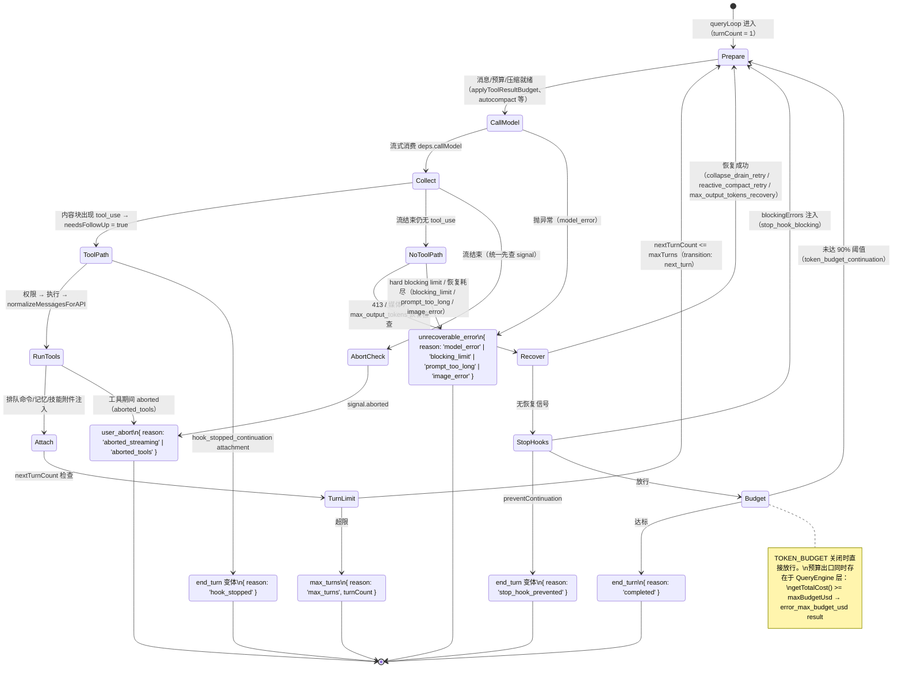

## 回答上一篇的问题

上一篇最后的问题是，在 Claude Code CLI 中执行 `/new` 时，它究竟重置了哪些会话状态，又保留了哪些运行现场？

`/new` 的边界是，**它在当前 CLI 进程内切换活动会话，保留项目环境和进程级基础设施。**

在 2.1.88 中，`/new` 复用 `/clear` 的实现。`restored-src/src/commands/clear/index.ts` 把它注册成别名，

```ts
const clear = {
  type: 'local',
  name: 'clear',
  description: 'Clear conversation history and free up context',
  aliases: ['reset', 'new'],
  supportsNonInteractive: false,
  load: () => import('./clear.js'),
} satisfies Command
```

这段注册对象的 `type: 'local'` 表示命令在本地宿主执行，`name: 'clear'` 是主名称，`description` 用于命令列表说明，`aliases` 让 `reset` 和 `new` 命中同一实现；`supportsNonInteractive: false` 限制它只能在交互式宿主使用，`load` 通过动态导入延迟加载 `clear.js`。输入 `/new` 后，调用会落到 `clearConversation()`。先看会被重置的部分，主要有四类，

1. 当前消息数组清空，下一次模型请求不再携带旧对话。
2. `conversationId` 与 `sessionId` 重新生成，session file 指针和待写入项清空，后续 transcript 写进新会话。
3. read-file state、文件历史快照、会话 metadata、plan slug、已发现 Skill、nested memory 路径以及多种 session cache 被清理。
4. MCP 的 clients、tools、commands 和 resources 回到空状态等待重新初始化；旧会话先执行 `SessionEnd('clear')`，新会话再执行 `SessionStart('clear')`，Hook 返回的消息可能成为新消息列表的起点。

再看被保留下来的运行现场。

CLI 进程和项目文件都会保留。`clearConversation()` 只更新 AppState 中明确列出的字段，其余进程配置、认证与权限基础设施仍由同一个宿主持有。当前工作目录会回到本次启动时的 `originalCwd`；Coordinator/normal mode 与 worktree 状态会在清理后重新写入，继续沿用清理前的模式语义。

任务按运行形态分别处理。源码只清理显式标记为 `isBackgrounded === false` 的前台任务；后台任务和 in-process teammate 可以保留，对应 Agent 的部分 session state 也会绕过缓存清理。MCP 的 `pluginReconnectKey` 同样保留，确保 `/new` 后插件仍能重连。

旧会话还会成为新会话的 `parentSessionId`。`resetSessionFile()` 把当前文件指针设为 `null` 并清空 `pendingEntries`，旧 transcript 继续保留在磁盘。旧对话由此退出当前上下文，同时作为可追溯的父会话存在。

所以，更准确的心智模型是，`/new` 把“正在和模型说的这段话”换成一张白纸，同时保留“Claude Code 正在哪个项目、以什么配置运行、后台还有哪些工作”这层宿主现场。

新会话的第一条输入仍会进入同一套 Agent loop。`/new` 改变的是循环看到的消息和会话状态，不是循环的控制算法。本篇沿 `query()` → `queryLoop()` 追踪它如何在工具结果、恢复信号和预算之间选择继续或退出。

事实边界是 `@anthropic-ai/claude-code@2.1.88` 的 source map 还原源码；`restored-src/` 只是定位证据的路径。代码块保留真实函数名和关键分支，省略的参数不会改变下面的控制流。

## 介绍本章的一些概念

- `queryLoop()`（`src/query.ts:241-1729`，恰好 1488 行）的继续信号只有一个，模型流中出现真实的 `tool_use` 内容块（`needsFollowUp = true`）。源码注释原话，`stop_reason === 'tool_use'` 并不可靠，循环不依赖它。
- 停止是双层判断，模型决定「这次不再调用工具」不等于运行时立刻收口，恢复、Stop hook、token budget 仍可注入新消息让循环继续，并在 `state.transition.reason` 留下不同原因。
- 取消与错误也必须先补齐 `tool_use` / `tool_result` 配对（协议收口）再退出；权限拒绝本身就是一个 `is_error: true` 的 `tool_result`。
- 预算不在同一层，`maxTurns` 在 `queryLoop()` 内、`TOKEN_BUDGET` gate 在本地续写判断（90%/3 次/500 token）、`taskBudget` 进入 API 的 `output_config.task_budget`，而 `maxBudgetUsd` 在 `QueryEngine.submitMessage()` 层截停，配置了「预算」不代表副作用能在同一瞬间硬停止。
- 骨架只有约 30 行，真实 `queryLoop()` 约 1488 行；多出的 1458 行没有引入新控制流思想，它们就是 Harness。

上一篇（05）说明了谁保存 turn；本篇回答它为什么会一轮一轮继续。我们沿 `query()` → `queryLoop()` 追踪，在工具结果、恢复信号和预算之间，循环如何决定「继续请求模型」还是「从某个终止出口返回」。
事实边界是 `@anthropic-ai/claude-code@2.1.88` 的 source map 还原源码；`restored-src/` 只是定位证据的路径。代码块保留真实函数名与关键分支，省略的参数不会改变下面描述的控制流。

### 面经回看｜Agent 是受边界约束的循环

面试题问“Agent 是什么、一次请求怎么走、为什么不能只用一个大 Prompt”时，可以把答案压缩成一条源码可核对的链：**模型输出消息，消息中的 `tool_use` 触发执行器，执行结果以配对的 `tool_result` 回到消息历史，`queryLoop()` 再决定是否继续请求模型**。权限、预算、取消、Stop hook 和错误恢复不是模型的“自觉”，而是循环外侧的控制边界。

这能解释 Agent 与固定 Workflow 的差别：本章源码直接证明的是运行时会根据上一轮真实结果继续或退出；“ReAct”“Planner/Executor/Critic”“Plan-and-Execute”是对这类控制流的设计归纳，不是 2.1.88 中名为这些角色的统一实现。回答时可以用这些概念做比较，但不能把比较名称说成源码事实。

## 最小心智模型｜20 行 Python 先于 1488 行 TypeScript

在读任何 TypeScript 之前，先看这个最小模型。它只有 20 行，却已经包含 `queryLoop()` 的全部控制流骨架，调用模型、收集消息、检查工具调用、执行、回填、循环。

```python
# [pseudocode] 教学伪代码（非源码），对应 docs/blog/examples/minimal-agent/loop.py 的核心逻辑
def agent_loop(prompt, tools, max_turns=10):
    messages = [{"role": "user", "content": prompt}]
    for turn in range(max_turns):
        # 1. 调用模型
        resp = client.messages.create(model=MODEL, messages=messages, tools=tools)
        messages.append({"role": "assistant", "content": resp.content})
        # 2. 检查流中的 tool_use 块
        tool_uses = [b for b in resp.content if b.type == "tool_use"]
        if not tool_uses:
            # 3a. 无工具调用：运行时还要检查恢复、Stop hook、预算，全过才结束
            return "".join(b.text for b in resp.content if b.type == "text")
        # 3b. 有工具调用：执行并回填 tool_result（权限拒绝也返回错误结果）
        results = []
        for b in tool_uses:
            output = execute_tool(b.name, b.input)
            results.append({"type": "tool_result", "tool_use_id": b.id, "content": output})
        # 4. 结果作为 user 消息回填，下一轮继续
        messages.append({"role": "user", "content": results})
    return "[max_turns reached]"
```

请记住这个循环的四个动作，**call model → check tool_use → execute & collect → append results → loop**。生产代码不管有多少行，循环的骨架就是这样。

这个 20 行循环已经包含本章的三个核心概念，

- **继续谓词**，第 2 步的 `tool_use` 检查。循环依据真实的 `tool_use`、恢复信号与预算状态决定是否再次请求模型，三者任意满足其一就继续。
- **协议收口**，第 3b 步的 `tool_result` 用 `tool_use_id` 与原请求配对。取消或错误发生时也必须补齐这层配对，让下游消费者拿到合法消息链。
- **终止原因**，完成、达到上限、取消、错误对应不同出口（`completed`、`max_turns`、`aborted_*`、`*_error`），宿主据此选择后续动作。

把一次迭代看成一台**两出口机器**，流结束后只有两条主路，

1. `tool_use` 集合为空，依次检查恢复、Stop hook 和 token budget；所有继续条件都未触发时结束。
2. 有 `tool_use`，执行工具，把结果和附件追加到消息，再回到下一次模型调用。


图里把权限拒绝画进 `error tool_result`，因为拒绝首先要作为调用结果回填协议。模型提出动作，运行时负责写回真实结果；下一步怎么做，再由模型结合新证据判断。

## 正文｜queryLoop 如何持续推进

上午 09，18，你把金额单位工单交给 Claude Code：“请检查支付服务中的金额单位问题，订单使用优惠券后，结算页显示 99.90 元，支付回调却记录为 9991 分；请查清原因、修复并运行测试。”

你看到的执行现场不会只有一次模型调用，先读优惠券结算函数，再查支付回调的字段定义，接着核对最近一次提交，最后运行回归测试。每次工具结果回来，模型都要重新判断“证据够不够”“下一步是否需要副作用”“现在能不能结束”。

### query() 只是外壳，状态真正留在 queryLoop() 里

`restored-src/src/query.ts` 的 `query()` 很短（219-239 行）。它把工作委托给 `queryLoop()`，等循环正常返回以后，再补齐队列命令的生命周期通知，

```ts
// [source] restored-src/src/query.ts:219-239 —— query() 外壳与生命周期通知
export async function* query(
  params: QueryParams,
): AsyncGenerator<
  | StreamEvent
  | RequestStartEvent
  | Message
  | TombstoneMessage
  | ToolUseSummaryMessage,
  Terminal
> {
  const consumedCommandUuids: string[] = []
  const terminal = yield* queryLoop(params, consumedCommandUuids)

  // Only reached if queryLoop returned normally. Skipped on throw (error
  // propagates through yield*) and on .return() (Return completion closes
  // both generators). This gives the same asymmetric started-without-completed
  // signal as print.ts's drainCommandQueue when the turn fails.
  for (const uuid of consumedCommandUuids) {
    notifyCommandLifecycle(uuid, 'completed')
  }
  return terminal
}
```

三个要点。第一，`query()` 是公开的异步生成器入口，通过 `yield*` 原样转发 `queryLoop()` 的流事件、消息和附件。第二，**不对称的生命周期信号**，`queryLoop()` 正常 `return` 时才会把本轮消费过的队列命令标记为 `completed`；抛错时错误穿过 `yield*` 向上传播，`.return()` 时两个生成器同时关闭，注释明确说这给出与 `print.ts` 的 `drainCommandQueue` 相同的“已开始未完成”信号。第三，`terminal` 是循环的收工信号，一个结果对象，至少包含统一字段 `reason`（本轮为什么结束），某些分支还附带 `turnCount`（`max_turns`）或 `error`（`model_error`）。

`params` 是 `QueryParams`（`query.ts:181-199`），必填字段包括 `messages`、`systemPrompt`、`userContext`、`systemContext`、`canUseTool`、`toolUseContext` 与 `querySource`。`fallbackModel`、`maxOutputTokensOverride`、`maxTurns`、`skipCacheWrite`、`taskBudget` 和测试用 `deps` 都可以是 `undefined`；未提供时，相应的回退、上限、缓存跳过或 API task budget 分支不会启用。

### queryLoop() 入口｜State 与消息准备

`queryLoop()` 用跨迭代的 `State` 和 `while (true)` 推进每一轮，

```ts
// [source] restored-src/src/query.ts:268-321 —— State 初始化与循环顶部
let state: State = {
  messages: params.messages,
  toolUseContext: params.toolUseContext,
  maxOutputTokensOverride: params.maxOutputTokensOverride,
  autoCompactTracking: undefined,
  stopHookActive: undefined,
  maxOutputTokensRecoveryCount: 0,
  hasAttemptedReactiveCompact: false,
  turnCount: 1,
  pendingToolUseSummary: undefined,
  transition: undefined,
}

while (true) {
  let { toolUseContext } = state
  const { messages, autoCompactTracking, maxOutputTokensRecoveryCount,
          hasAttemptedReactiveCompact, maxOutputTokensOverride,
          pendingToolUseSummary, stopHookActive, turnCount } = state
  // ...
```

`State` 类型在 204-217 行定义。`messages` 与 `toolUseContext` 由调用方提供；`turnCount` 固定从 1 开始；`maxOutputTokensRecoveryCount: 0` 允许从第一次输出截断恢复开始计数；`hasAttemptedReactiveCompact: false` 允许本轮首次尝试响应式压缩，两者共同限制恢复重试。**`transition` 是上一个继续分支留下的原因**（`next_turn`、`reactive_compact_retry`、`stop_hook_blocking` 等），它让测试不必检查消息内容就能断言恢复路径是否触发。每个继续分支都会构造新的 `State` 再 `continue`，每个终止分支返回带 `reason` 的 terminal。

进入模型前还有一整段消息准备流水线，从 compact boundary 后取出有效消息，依次执行工具结果预算、snip、microcompact、context collapse 和 autocompact，再更新 `toolUseContext.messages`。这些属于上下文管理，第 17 篇会单独展开；本篇只保留决定循环方向的两次调用之一，工具结果预算，

```ts
// [source] restored-src/src/query.ts:379-394 —— applyToolResultBudget 调用（先于 microcompact）
messagesForQuery = await applyToolResultBudget(
  messagesForQuery,
  toolUseContext.contentReplacementState,
  persistReplacements ? records => void recordContentReplacement(records, toolUseContext.agentId).catch(logError) : undefined,
  new Set(toolUseContext.options.tools
    .filter(t => !Number.isFinite(t.maxResultSizeChars))
    .map(t => t.name)),
)
```

它把过大的工具结果替换为占位符（或按 `src/utils/toolResultStorage.ts:924` 的策略持久化到磁盘），避免历史里的巨型输出把上下文撑爆。`persistReplacements` 只在 `querySource` 以 `agent:` 开头或等于 `repl_main_thread` 时为真，只有 resume 会读回记录的来源才落盘。跳过名单是 `maxResultSizeChars` 为 `Infinity` 的工具（例如 Read），它们不参与替换。

### 每轮迭代｜callModel 与 tool_use 收集

消息就绪后进入每轮。第一步，`deps.callModel()` 接收整理后的消息、完整系统提示词、工具定义和取消信号，

```ts
// [source] restored-src/src/query.ts:659-708（摘录）—— deps.callModel 流式调用
for await (const message of deps.callModel({
  messages: prependUserContext(messagesForQuery, userContext),
  systemPrompt: fullSystemPrompt,
  thinkingConfig: toolUseContext.options.thinkingConfig,
  tools: toolUseContext.options.tools,
  signal: toolUseContext.abortController.signal,
  options: {
    async getToolPermissionContext() {
      const appState = toolUseContext.getAppState()
      return appState.toolPermissionContext
    },
    model: currentModel,
    toolChoice: undefined,
    fallbackModel,
    // ...省略 fastMode、MCP tools、taskBudget、queryTracking 等字段
  },
})) { // 消费流的主体在下面
```

`deps` 是模型调用依赖，生产环境由 `productionDeps()` 提供（`src/query/deps.ts:21-40`，只注入 callModel、microcompact、autocompact、uuid 四个依赖），测试可以通过 `QueryParams.deps` 注入假实现。`for await` 逐条消费模型流，所以 assistant 消息、部分事件和工具调用不必等完整响应结束后才对上层可见。`thinkingConfig` 的源码类型可以表达 `adaptive`、带 `budgetTokens` 的 `enabled` 或 `disabled`；`signal` 是必传的 `AbortSignal`；`getToolPermissionContext()` 每次读取最新权限上下文。

第二步，消费流时收集 assistant 消息和其中的 `tool_use` 内容块（826-845 行），

```ts
// [source] restored-src/src/query.ts:826-845 —— 收集 assistant 与 tool_use 块
if (message.type === 'assistant') {
  assistantMessages.push(message)

  const msgToolUseBlocks = message.message.content.filter(
    content => content.type === 'tool_use',
  ) as ToolUseBlock[]
  if (msgToolUseBlocks.length > 0) {
    toolUseBlocks.push(...msgToolUseBlocks)
    needsFollowUp = true
  }
  if (streamingToolExecutor && !toolUseContext.abortController.signal.aborted) {
    for (const toolBlock of msgToolUseBlocks) {
      streamingToolExecutor.addTool(toolBlock, message)
    }
  }
}
```

这段代码旁边就是那条著名注释（`query.ts:553-557`），`stop_reason === 'tool_use'` 并不总是被正确设置，**内容块才是唯一的主循环继续信号**。文本本身不决定继续，模型可以先输出一段解释再输出工具调用，只要流里出现工具块，文本与工具调用都作为这次 assistant 轨迹保留。

### 分支 A｜出现 tool_use，执行、回填、进入下一轮

`needsFollowUp === true` 时，循环选择流式工具执行器，或调用 `src/services/tools/toolOrchestration.ts:19` 的 `runTools()`。后者先按并发安全性分组，只读、安全的批次可以并行，可能修改状态的批次按顺序执行。主循环消费工具更新的代码很直接，

```ts
// [source] restored-src/src/query.ts:1380-1408 —— 消费工具更新
const toolUpdates = streamingToolExecutor
  ? streamingToolExecutor.getRemainingResults()
  : runTools(toolUseBlocks, assistantMessages, canUseTool, toolUseContext)

for await (const update of toolUpdates) {
  if (update.message) {
    yield update.message
    if (update.message.type === 'attachment' &&
        update.message.attachment.type === 'hook_stopped_continuation') {
      shouldPreventContinuation = true
    }
    toolResults.push(
      ...normalizeMessagesForAPI(
        [update.message],
        toolUseContext.options.tools,
      ).filter(_ => _.type === 'user'),
    )
  }
  if (update.newContext) {
    updatedToolUseContext = { ...update.newContext, queryTracking }
  }
}
```

工具执行产生的 `MessageUpdate` 同时送往两个方向，`yield` 让 UI 或 SDK 看到进度与结果；`normalizeMessagesForAPI()` 把可以回传模型的部分归一化为 user message 存入 `toolResults`。工具若返回新的上下文，还会替换下一轮使用的 `ToolUseContext`。

`normalizeMessagesForAPI`（`src/utils/messages.ts`）的目标是把内部消息改成“下一次模型请求可接受”的序列，处理链是，先把 `attachment` 上推到最近的 assistant 或含 `tool_result` 的 user 前；过滤掉 `progress`、非本地命令的 `system`、合成错误消息；分类型标准化（`system` 转 `user` 并合并、相邻 `user` 合并并处理 `tool_reference`，未启用 tool search 时整段去掉、assistant 保留 `tool_use` 并清洗 input、attachment 转 API 片段）；最后修正兄弟节点顺序、清理孤儿 thinking、校验图片；`HISTORY_SNIP` 开启时还会给 user 消息追加 `[id:xxx]` 标记。这里 `filter(_ => _.type === 'user')` 是因为 Anthropic 工具协议要求 `tool_result` 以 user role 回到下一次模型请求。真正的 API 请求前，`services/api/claude.ts` 还会做一层模型相关的二次清洗，所以归一化本身不承载“模型是否支持工具搜索”的决策。

**权限拒绝也是一个工具结果。** 权限检查发生在工具真正执行之前。`src/services/tools/toolExecution.ts` 的 `checkPermissionsAndCallTool()` 先通过 Hook 与 `canUseTool` 得到最终决定；只有 `allow` 会进入工具调用，`ask` 与 `deny` 都会构造错误结果，

```ts
// [source] restored-src/src/services/tools/toolExecution.ts —— 权限拒绝转成协议完整的 user message
if (permissionDecision.behavior !== 'allow') {
  const messageContent: ContentBlockParam[] = [
    {
      type: 'tool_result',
      content: errorMessage,
      is_error: true,
      tool_use_id: toolUseID,
    },
  ]
  // 省略可选图片 content blocks 与 imagePasteIds 的处理
  resultingMessages.push({
    message: createUserMessage({
      content: messageContent,
      imagePasteIds: rejectImageIds,
      toolUseResult: `Error: ${errorMessage}`,
      sourceToolAssistantUUID: assistantMessage.uuid,
    }),
  })
  return resultingMessages
}
```

`permissionDecision.behavior` 的源码联合类型是 `'allow'`、`'ask'` 或 `'deny'`；只有严格等于 `'allow'` 才进入实际工具调用。目标工具保持未调用状态，但对应的 `tool_use` 仍得到一个 `tool_result`，并通过 `tool_use_id` 保持配对，下一次模型调用能同时读到原始请求和拒绝原因。只有 PreToolUse hook 同时产生 `hook_stopped_continuation` attachment 时，主循环才会在工具批次之后返回 `hook_stopped`（1392 行与 1519-1521 行）。工具自身抛错也遵循相似原则，执行层尽量把失败映射为错误 `tool_result`，循环层只检查是否形成可配对、可回填的消息。

工具执行结束后，循环还要注入附件，排队命令、任务通知、文件变化、memory 与 skill attachment。源码注释特别强调，这些普通 user message 不能插在一组 `tool_use` 与 `tool_result` 中间，否则 API 会拒绝消息顺序（`query.ts:1535-1536` 注释原文，*the API will error if we interleave tool_result messages with regular user messages*）。排队命令在 1566-1578 行按优先级快照（Sleep 工具跑过则为 `later`，否则 `next`；slash command 排除在外），随后经 `getAttachmentMessages()` 注入（1580-1590 行）。

等工具结果与附件都准备好以后，`queryLoop()` 才检查 `maxTurns`，再构造下一轮状态，

```ts
// [source] restored-src/src/query.ts:1705-1727 —— maxTurns 检查与下一轮状态
const nextTurnCount = turnCount + 1

if (maxTurns && nextTurnCount > maxTurns) {
  yield createAttachmentMessage({
    type: 'max_turns_reached',
    maxTurns,
    turnCount: nextTurnCount,
  })
  return { reason: 'max_turns', turnCount: nextTurnCount }
}

const next: State = {
  messages: [...messagesForQuery, ...assistantMessages, ...toolResults],
  toolUseContext: toolUseContextWithQueryTracking,
  autoCompactTracking: tracking,
  turnCount: nextTurnCount,
  maxOutputTokensRecoveryCount: 0,
  hasAttemptedReactiveCompact: false,
  pendingToolUseSummary: nextPendingToolUseSummary,
  maxOutputTokensOverride: undefined,
  stopHookActive,
  transition: { reason: 'next_turn' },
}
state = next
```

注意 `maxTurns` 的检查位置，只在**已经产生工具结果、准备再次请求模型**时检查；纯文本最终回答从正常完成分支离开，不受它限制。`maxTurns` 是可选 number，省略或为 0 时 `if (maxTurns && ...)` 不启用限制。`messages` 按查询前历史、assistant 消息、工具结果的协议顺序拼接；`maxOutputTokensRecoveryCount` 重置为 `0`，`maxOutputTokensOverride` 清除临时覆盖；`transition.reason` 固定为 `'next_turn'`。随后 `while (true)` 回到顶部。工具和 `runTools()` 只负责产出结果，**继续推理由 `queryLoop()` 驱动**。

### 分支 B｜没有 tool_use，恢复、Stop hook、预算、收口

模型流结束后，`queryLoop()` 先处理取消（见下文），再检查 `needsFollowUp`。为 `false` 时进入“可能结束”的分支（1062 行起），`lastMessage = assistantMessages.at(-1)`（可能为 `undefined`，源码用可选链处理）。工具列表为空时，循环要区分至少四种结束或续写状态，

1. 模型给出最终回答，Stop hook 放行且 token budget 允许结束，返回 `{ reason: 'completed' }`（1357 行）。
2. 模型返回 API error，跳过 Stop hook（避免“错误 → Hook 阻断 → 再请求 → 再错误”的死循环，注释称其为 death spiral），执行失败 Hook 后以 `completed` 收口（1262-1265 行）。
3. 模型输出撞上 `max_output_tokens`，先尝试提高输出上限（`ESCALATED_MAX_TOKENS`，cap 开启时，一次 per turn，`transition: 'max_output_tokens_escalate'`）或注入一条 meta user message 让模型从中断处继续（“Resume directly ， no apology…”）；恢复次数达到 `MAX_OUTPUT_TOKENS_RECOVERY_LIMIT = 3`（164 行）后，才把之前暂存的错误暴露出去（1188-1256 行）。
4. 模型想结束，但 Stop hook 返回 blocking error，或实验性的 token budget 判断认为工作量还没到目标，两者都生成新的 user/meta message，更新 `state` 后继续下一次迭代。

Stop hook 分支与 token budget 分支在 1267-1355 行，

```ts
// [source] restored-src/src/query.ts:1267-1357（摘录）—— Stop hook 与 token budget
const stopHookResult = yield* handleStopHooks(
  messagesForQuery, assistantMessages, systemPrompt,
  userContext, systemContext, toolUseContext, querySource, stopHookActive,
)

if (stopHookResult.preventContinuation) {
  return { reason: 'stop_hook_prevented' }
}

if (stopHookResult.blockingErrors.length > 0) {
  const next: State = {
    messages: [...messagesForQuery, ...assistantMessages, ...stopHookResult.blockingErrors],
    // ...省略跨轮字段
    stopHookActive: true,
    turnCount,
    transition: { reason: 'stop_hook_blocking' },
  }
  state = next
  continue
}

if (feature('TOKEN_BUDGET')) {
  const decision = checkTokenBudget(
    budgetTracker!, toolUseContext.agentId,
    getCurrentTurnTokenBudget(), getTurnOutputTokens(),
  )
  if (decision.action === 'continue') {
    // 注入 nudge meta message，transition: 'token_budget_continuation'
    state = { ... }
    continue
  }
}

return { reason: 'completed' }
```

`handleStopHooks` 位于 `src/query/stopHooks.ts`，返回 `{ blockingErrors, preventContinuation }`。`checkTokenBudget` 位于 `src/query/tokenBudget.ts:45-93`，

```ts
// [source] src/query/tokenBudget.ts:3-4, 51-76（摘录）—— 预算判定常量与逻辑
const COMPLETION_THRESHOLD = 0.9
const DIMINISHING_THRESHOLD = 500

if (agentId || budget === null || budget <= 0) {
  return { action: 'stop', completionEvent: null }
}
const pct = Math.round((turnTokens / budget) * 100)
const isDiminishing =
  tracker.continuationCount >= 3 &&
  deltaSinceLastCheck < DIMINISHING_THRESHOLD &&
  tracker.lastDeltaTokens < DIMINISHING_THRESHOLD

if (!isDiminishing && turnTokens < budget * COMPLETION_THRESHOLD) {
  return { action: 'continue', nudgeMessage: getBudgetContinuationMessage(pct, turnTokens, budget), ... }
}
```

逻辑，当前 turn 输出 token 低于预算的 90% 且尚未连续收益递减时，注入 meta nudge 继续；连续至少三次后，若最近两次增量都小于 500 token，则按 diminishing returns 提前停止。`agentId` 存在、预算为 `null` 或小于等于 0 时直接 stop（子代理不参与）。nudge 文案来自 `utils/tokenBudget.ts`，*“Stopped at X% of token target (a / b). Keep working ， do not summarize.”* 90%、3 次、500 都是 2.1.88 静态常量，其他版本或线上 feature 的启用状态属于运行时证据。

**所以，模型决定“这次不再调用工具”，运行时决定“这次是否真的可以收口”。** 两层判断叠在一起，才是实际停止条件。

### 预算分四层检查，不在同一层

2.1.88 源码里至少有四种容易被统称为“预算”的机制，它们不在同一层，

1. **`maxTurns`**，`queryLoop()` 的本地迭代上限，只在工具路径末尾检查（见上文）。
2. **`TOKEN_BUDGET` feature**，本地续写判断，模型准备以纯文本结束时注入 nudge（见上文）。
3. **`taskBudget?: { total: number }`**，随模型请求进入 API 的 `output_config.task_budget`（`query.ts:699-705`）。本地循环在 compact 后维护 `taskBudgetRemaining`（`query.ts:291`、508-515 行），避免服务端只看到摘要而低估已消耗上下文；多个 compact 时逐次累减。
4. **`maxBudgetUsd`**，位于更外层，`QueryEngine.submitMessage()` 消费循环消息时检查累计成本，

```ts
// [source] restored-src/src/QueryEngine.ts:972-990（摘录）—— 美元预算截停
if (maxBudgetUsd !== undefined && getTotalCost() >= maxBudgetUsd) {
  // ...可选 flushSessionStorage()
  yield {
    type: 'result',
    subtype: 'error_max_budget_usd',
    is_error: true,
    num_turns: turnCount,
    total_cost_usd: getTotalCost(),
    // ...省略其他字段
    errors: [`Reached maximum budget ($${maxBudgetUsd})`],
  }
}
```

`queryLoop()` 的 `QueryParams` 不接收 `maxBudgetUsd`。因此，美元预算可能在一条消息已经产生后才被宿主截停，它与 `maxTurns` 分属两个检查边界，这就是 05 说的 `error_max_budget_usd` 与 `error_max_turns` 边界不同的原因。

dynamic workflow 的预算再往上一层。官方在 2026-05-28 的 changelog（[Claude Code changelog](https://code.claude.com/docs/en/changelog)）与公告（[Introducing dynamic workflows](https://claude.com/blog/introducing-dynamic-workflows-in-claude-code)）里定义了 dynamic workflows；2.1.202 又补充了 workflow 大小（small/medium/large）这类偏好设置，偏向建议而非硬上限。2.1.88 里只留下“骨架可见”痕迹，`TaskType` 包含 `local_workflow`（`TASK_ID_PREFIXES` 里也有 `w` 前缀）；`tasks.ts` 通过 `feature('WORKFLOW_SCRIPTS')` 动态 require `LocalWorkflowTask`；`getPillLabel()` 能把 `local_workflow` 显示为 `background workflow`。但 source map 缺 `tasks/LocalWorkflowTask/*` 与 `commands/workflows/*` 的实现文件，静态证据不足以复原 run 级统一预算。可确认的透传链是，`runAgent()`（`src/tools/AgentTool/runAgent.ts:756`）调用 `query()` 时透传 `maxTurns ?? agentDefinition.maxTurns`（frontmatter 解析为可选正整数，`loadAgentsDir.ts:89`）；fork 子代理有独立默认 `200`（`forkSubagent.ts:65`）。所以看 dynamic workflow 的总预算要按三层，子代理的 `maxTurns / taskBudget` → QueryEngine 的单会话 `maxBudgetUsd` → 工作流运行器的 run 级预算（当前源码无法验证）。**配置了“预算”不代表所有副作用都能在同一瞬间硬停止**，模型请求、流式事件、工具执行和宿主消费各有自己的检查位置。

### 取消｜先补齐消息配对再退出

取消可能发生在模型流阶段，也可能发生在工具执行阶段。两条路径检查同一个 `AbortController.signal`，但清理动作不同。

模型流被取消时（1015-1052 行），源码优先补齐尚未完成的工具结果，

```ts
// [source] restored-src/src/query.ts:1015-1052（摘录）—— 流式阶段取消
if (toolUseContext.abortController.signal.aborted) {
  if (streamingToolExecutor) {
    // 消费剩余结果：执行器为排队中/进行中的工具生成合成 tool_result
    for await (const update of streamingToolExecutor.getRemainingResults()) {
      if (update.message) yield update.message
    }
  } else {
    yield* yieldMissingToolResultBlocks(assistantMessages, 'Interrupted by user')
  }
  // 省略 chicago MCP computer-use 清理分支
  if (toolUseContext.abortController.signal.reason !== 'interrupt') {
    yield createUserInterruptionMessage({ toolUse: false })
  }
  return { reason: 'aborted_streaming' }
}
```

`yieldMissingToolResultBlocks()`（123-149 行）为已经出现的每个 `tool_use` 生成 `is_error: true` 的 `tool_result`，沿用对应 `tool_use.id`，**取消也要维持协议配对**。取消原因若是特殊字符串 `'interrupt'`，则跳过额外的用户中断消息（排队的新输入已经提供上下文）；其他 reason 追加 interruption message。

工具执行期间被取消时（1485-1516 行），循环已经消费完执行器能给出的更新，随后返回 `aborted_tools`；如果下一 turn 已超过 `maxTurns`，还会在返回前发出上限 attachment。两条路径都先清理 computer-use 状态（feature 开启时）。取消信号不提供事务回滚，已执行的副作用保持已执行。

与 `AsyncGenerator` 的配合是这里的关键，`.return()` 会从任意 `yield` 点中止生成器并关闭两层生成器，`queryLoop()` 的 `finally`/`using`（如 301 行的 `pendingMemoryPrefetch` 用 `using` 声明，所有生成器退出路径都会 dispose）保证资源清理，而 abort 检查则保证**协议层**的完整，这是两种不同职责的取消语义。

### 错误恢复｜从重试到表面化

正常情况下，模型 API 层倾向于把错误包装成 synthetic assistant message，让主循环统一处理（`QueryEngine` 会把 `api_error` 映射成 `api_retry` 事件）。但 `deps.callModel()` 仍可能直接抛异常。此时 `queryLoop()` 补齐孤立的工具结果、暴露真实错误，再返回 `model_error`，

```ts
// [source] restored-src/src/query.ts:955-997（摘录）—— 模型流外层异常
} catch (error) {
  logError(error)
  const errorMessage = error instanceof Error ? error.message : String(error)
  // 省略 ImageSizeError / ImageResizeError 分支 → return { reason: 'image_error' }
  yield* yieldMissingToolResultBlocks(assistantMessages, errorMessage)
  yield createAssistantAPIErrorMessage({ content: errorMessage })
  return { reason: 'model_error', error }
}
```

注意与用户中断的区别，`model_error` 保留运行时异常的真实错误文本（注释指出 SDK 消费者曾把 Node 18 的 `Array.prototype.with()` 缺失误报成 phantom interrupt）；`aborted_streaming` 是用户动作。如果抛错前已经收到 `tool_use`，先补错误 `tool_result`，避免 transcript 和下一层消费者拿到不完整协议。

限流与网络错误的重试位于 API 层，`src/services/api/withRetry.ts` 定义 `DEFAULT_MAX_RETRIES = 10`，在 529（容量级联）等错误上重试；重试耗尽抛出 `FallbackTriggeredError`（160 行），`queryLoop()` 捕获它后切换模型重试整个请求（893-953 行），清理旧批次（含 tombstone 已 yield 的孤儿消息）、丢弃流式执行器、`stripSignatureBlocks` 清洗 thinking 签名（模型绑定的 protected-thinking 重放到无保护 fallback 会 400）、`continue` 回到尝试循环。工具超时与 bash 输入超时由工具执行层各自处理，循环只消费其结果。

上下文过长的恢复更复杂。自动 compact 关闭且到达 hard blocking limit 时，循环发出 prompt-too-long assistant error 并返回 `blocking_limit`（628-648 行）。启用相应 feature 时，413 错误会被流阶段**暂存**（withhold，799-825 行，避免把可恢复错误提前泄漏给会终止会话的 SDK 消费者），恢复路径先 drain context collapse（`transition: 'collapse_drain_retry'`），再尝试 reactive compact（`transition: 'reactive_compact_retry'`），用压缩后的消息 `continue`；恢复仍失败才返回 `prompt_too_long` 或 `image_error`（1085-1183 行）。媒体超限错误（图片/PDF/多图）跳过 collapse drain（collapse 不剥离图片），直接走 reactive compact 的 strip-retry。

这些路径说明 **`continue` 不只来自工具**，恢复上下文、恢复输出截断、Stop hook blocking 和 token budget nudge 都可以构造新状态再请求模型。区别在于它们在 `state.transition.reason` 留下不同原因，`next_turn`、`reactive_compact_retry`、`collapse_drain_retry`、`max_output_tokens_escalate`、`max_output_tokens_recovery`、`stop_hook_blocking`、`token_budget_continuation`。继续谓词的完整表述是，**真实的 `tool_use` 块存在，或恢复信号存在，或预算未耗尽**。

### 五个终止出口


这张手绘图只画循环真正依赖的状态，当前消息、工具结果、恢复信号和预算，它们共同决定下一步是继续请求模型，还是从某个终止出口返回。

`Terminal` 类型定义在 `src/query/transitions.ts`，该文件不在还原源码中（缺失模块），但 1488 行里所有可见的 `return` 暴露了它的形状。按语义归类，循环只有五个出口，

| 出口 | 代码 reason | 触发点 | 触发条件 |
|---|---|---|---|
| end_turn | `'completed'` | `query.ts:1357` | 无 tool_use、无恢复信号、Stop hook 放行、token budget 允许 |
| end_turn 变体 | `'stop_hook_prevented'` / `'hook_stopped'` | `query.ts:1278-1280` / `1519-1521` | Stop hook 阻止继续 / 工具批次带回 `hook_stopped_continuation` attachment |
| max_turns | `'max_turns'`（附 `turnCount`） | `query.ts:1705-1712` | 工具批次后 `nextTurnCount > maxTurns` |
| budget_exhausted | 本地 `completed` 前的预算 stop；上层 `error_max_budget_usd` | `query.ts:1308-1355` / `QueryEngine.ts:972-990` | `checkTokenBudget` 判定 stop；或 `getTotalCost() >= maxBudgetUsd` |
| user_abort | `'aborted_streaming'` / `'aborted_tools'` | `query.ts:1015-1052` / `1485-1516` | `abortController.signal.aborted` 在流后 / 工具后检查 |
| unrecoverable_error | `'model_error'`（附 `error`）、`'blocking_limit'`、`'prompt_too_long'`、`'image_error'` | `query.ts:955-997`、`628-648`、`1085-1183` | `callModel` 抛异常；hard blocking limit；413/媒体恢复失败 |

每个终止分支都保证，已产生的 `tool_use` 都有配对结果（`yieldMissingToolResultBlocks`），宿主能拿到合法的消息链，这就是**协议收口**，取消或错误发生后，循环仍然把消息配对补齐，让下游消费者拿到合法消息链。

把前文的全部路径收进一张状态图。圆角状态是循环阶段，菱形出口是终止状态；`Prepare` 状态被所有继续谓词复用，



## 30 行 vs 1488 行｜多出的 1458 行就是 Harness

这里的问题是，既然骨架只有 30 行，为什么 `queryLoop()` 要写 1488 行？把最小骨架用 `queryLoop()` 自己的形状写出来，大约 30 行，

```ts
// [pseudocode] queryLoop 的最小骨架（约 30 行）：控制流完整，工程细节为零
let state = { messages, turnCount: 1 }
while (true) {
  const { messages, turnCount } = state
  const assistantMessages = []
  const toolUseBlocks = []
  for await (const m of callModel(messages)) {
    if (m.type === 'assistant') assistantMessages.push(m)
    toolUseBlocks.push(...contentBlocksOf(m, 'tool_use'))
  }
  if (toolUseBlocks.length === 0) return { reason: 'completed' }
  const toolResults = await runTools(toolUseBlocks)
  if (maxTurns && turnCount + 1 > maxTurns) return { reason: 'max_turns' }
  state = { messages: [...messages, ...assistantMessages, ...toolResults], turnCount: turnCount + 1 }
}
```

1488 − 30 = **1458 行**。逐列对比骨架与生产，

| 30 行骨架覆盖了什么 | 剩余 1458 行处理什么 |
|---|---|
| 同步调用一次模型 | 流式 `for await` 消费；`stream_request_start` 事件；tombstone；backfill；fallback 重试时清理旧批次 |
| 用 `stop_reason` 判断结束 | 内容块 `needsFollowUp`（`stop_reason` 不可靠）；withhold 可恢复错误 |
| 直接执行工具函数 | 权限链（`canUseTool`/Hook → allow/ask/deny）；并发安全分组；流式执行器；结果归一化；超时 |
| 结果直接回填 | `normalizeMessagesForAPI` 五步清洗；`applyToolResultBudget` 替换/持久化；附件注入排队命令；`max_turns_reached` attachment |
| `for turn in range(max_turns)` | `nextTurnCount > maxTurns` 只在工具路径检查；abort 路径也会先查上限 |
| 无预算 | 四层预算，`maxTurns`、`TOKEN_BUDGET`（90%/3 次/500 token）、`taskBudget`（跨 compact 的 remaining）、`maxBudgetUsd`（QueryEngine 层） |
| 无取消 | `AbortController` + `AsyncGenerator.return()` 配合；`yieldMissingToolResultBlocks` 补齐配对；interruption message |
| 无错误处理 | 限流重试（`withRetry`，`DEFAULT_MAX_RETRIES = 10`）；fallback 模型；输出截断恢复 ×3；413 collapse drain + reactive compact；`model_error`/`blocking_limit`/`prompt_too_long`/`image_error` 出口 |
| 无 Hooks | `handleStopHooks`（blocking/prevent）、`executePostSamplingHooks`、`executeStopFailureHooks`；`hook_stopped` 出口 |
| 无 MCP | `mcpTools` 注入；pending server 感知；工具批次后 `refreshTools` |
| 无上下文管理 | 四层压缩（snip → microcompact → collapse → autocompact）；compact boundary；`taskBudgetRemaining` 跨 compact 累计 |
| 无遥测 | `queryCheckpoint`、`logEvent`、`headlessProfiler`、query chain tracking、tool-use summary |

复杂度还可以用 codebase-memory 图谱的 CALLS 边定位：`queryLoop` 有**约 72 个直接调用者与被调用关系节点**（`docs/audit/claude-code-blog-100-shortcomings.md` 第 63 条记录），直接调用者只有 1 个（`query()`），经 `query()` 间接进入的入口有 5 个（`QueryEngine.submitMessage`、REPL、`runForkedAgent`、`execAgentHook`、`startBackgroundSession`）；直接出站函数约 55 个，第二跳约 36 个。依赖注入让 `deps.callModel`、`runTools` 的编排链在图上只是间接边，真实连接数只会更多。

**这 1458 行就是 Harness 本身。** 30 行骨架 + 1458 行生产工程，才构成一个可用的 Agent 运行时。练习部分会带你亲手把骨架跑起来，感受两者之间的差距。

## 小结

`queryLoop()` 的核心判断很朴素，检查模型流里是否出现真实的 `tool_use`。

工具调用集合为空时，它先处理可恢复错误、Stop hook 和 token budget，随后返回 terminal；存在工具调用时，它经过权限与执行层取得 `tool_result`，按协议顺序追加 assistant 消息、结果和附件，检查 `maxTurns`，再把新状态带回下一次模型请求。

权限拒绝和工具失败之所以通常不会直接结束，是因为它们也是模型下一步推理需要的事实。取消与模型异常之所以还要生成合成 `tool_result`，是因为 Agent 即使失败，也要尽量维持 `tool_use` / `tool_result` 的配对关系。

因此，Claude Code 的 Agent loop 是一段可观察的消息状态机，每次继续都有新增消息，每次停止都有明确出口，每次副作用都要留下能被下一轮理解的结果。

## 源码映射

| 符号 | 位置 | 本篇要点 |
|---|---|---|
| `query()` | `src/query.ts:219-239` | 外壳；`yield*` 委托；队列命令生命周期通知 |
| `queryLoop()` | `src/query.ts:241-1729` | 1488 行主循环；`while (true)` |
| `State` 类型 | `src/query.ts:204-217` | 跨轮状态；`transition` 记录继续原因 |
| `QueryParams` | `src/query.ts:181-199` | `maxTurns`、`taskBudget`、`deps` 等可选参数 |
| `yieldMissingToolResultBlocks()` | `src/query.ts:123-149` | 取消/错误时补齐 `tool_result` 配对 |
| `MAX_OUTPUT_TOKENS_RECOVERY_LIMIT` | `src/query.ts:164` | 输出截断恢复上限 = 3 |
| stop_reason 不可靠注释 | `src/query.ts:553-557` | 内容块是唯一继续信号 |
| `applyToolResultBudget()` 调用 | `src/query.ts:379-394` | 工具结果预算，先于 microcompact |
| `deps.callModel()` | `src/query.ts:659-708` | 流式模型调用；AbortSignal 传入 |
| fallback 重试 | `src/query.ts:893-953` | `FallbackTriggeredError` → 换模型重试 |
| `model_error` catch | `src/query.ts:955-997` | 真实错误表面化 |
| `aborted_streaming` | `src/query.ts:1015-1052` | 流后取消；配对补齐 |
| 413/媒体恢复 | `src/query.ts:1085-1183` | collapse drain → reactive compact |
| `max_output_tokens` 恢复 | `src/query.ts:1188-1256` | 升级上限 → meta message ×3 → 表面化 |
| `handleStopHooks` | `src/query.ts:1267-1276` / `src/query/stopHooks.ts` | `stop_hook_prevented` / `stop_hook_blocking` |
| TOKEN_BUDGET 检查 | `src/query.ts:1308-1355` | 90% 阈值 + diminishing returns |
| `runTools()` | `src/query.ts:1380-1408` / `src/services/tools/toolOrchestration.ts:19` | 并发安全分组执行 |
| `aborted_tools` | `src/query.ts:1485-1516` | 工具期间取消 |
| 附件注入 | `src/query.ts:1580-1590` | 排队命令作为附件；与结果不交错 |
| `max_turns` + next state | `src/query.ts:1705-1727` | 上限检查 + `transition: 'next_turn'` |
| `QueryDeps` / `productionDeps()` | `src/query/deps.ts:21-40` | 依赖注入（callModel/microcompact/autocompact/uuid） |
| `checkTokenBudget` | `src/query/tokenBudget.ts:45-93` | `COMPLETION_THRESHOLD = 0.9`、`DIMINISHING_THRESHOLD = 500` |
| `applyToolResultBudget` 实现 | `src/utils/toolResultStorage.ts:924` | 大结果替换/持久化决策 |
| `getTurnOutputTokens` / `getCurrentTurnTokenBudget` | `src/bootstrap/state.ts:726-729` | 预算计数源 |
| `maxBudgetUsd` 检查 | `src/QueryEngine.ts:972-990` | `error_max_budget_usd` |
| `maxTurns ?? agentDefinition.maxTurns` | `src/tools/AgentTool/runAgent.ts:756` | 子代理透传；fork 默认 200（`forkSubagent.ts:65`） |

## 设计决策

**为什么用 `while (true)` 而不是显式状态机？** 循环的“状态”是数据（`State.messages` + 一组布尔/计数标志），而不是枚举节点；分支用普通 if/else 表达，每个 continue 站点构造新 `State`。`transition.reason` 字段正是为“可观测的状态机”补的元数据，它让测试断言恢复路径是否触发（`query.ts:215-216` 注释原话）。形式化为显式状态机后，所有分支都会被搬进转移表，行数不会减少，只会更难在流式与取消的边界上表达任意点退出；`while (true)` + 数据状态把“任何 continue 站点都可以成为恢复入口”这件事变成了免费的。

**为什么用 AsyncGenerator 作为返回类型？** 一次请求是一条实时事件流，模型 token、工具进度、权限结果、附件、取消和最终消息沿同一条链路持续产出，REPL、IDE 和 SDK 边收边渲染。更关键的是组合性，`query()` 用 `yield*` 委托 `queryLoop()`，`QueryEngine.submitMessage()` 用 `for await` 消费，三层生成器直接拼接。取消有两种分工，`.return()` 从任意 `yield` 点关闭生成器并触发 `using`/`finally` 资源清理；abort 信号检查负责协议层配对补齐。发布订阅模型需要额外一层取消传播，这里不需要。

**为什么对 `callModel` 做依赖注入？** `src/query/deps.ts` 头注释说得直白，`QueryParams.deps` 让测试直接注入假实现，而不是 spyOn-per-module，最常 mock 的 `callModel` 和 `autocompact` 今天就要在 6-8 个测试文件里重复“模块导入 + spy”样板。范围刻意收窄（4 个依赖，callModel、microcompact、autocompact、uuid）以证明模式；注入点也是产品边界，循环本身不知道模型怎么调用、压缩怎么执行，它只定义推进规则。

**ReAct 还是 ReWOO？Claude Code 选了 ReAct。** ReWOO（Reasoning WithOut Observation）把计划、执行、变量替换分开，planner 产出计划并引用占位符，executor 批量执行后一次性替换，token 更省，但模型看不到工具结果的中间形态。ReAct 让思考-行动-观察交错进行，每次 `tool_result` 都作为完整轨迹留在 `state.messages`，模型每一轮都重新读全部证据再决策（`query.ts:1716` 的拼接就是证据）。Claude Code 的停止条件本身就是纯 ReAct 的，没有 `tool_use` 就结束，说明它把“下一步做什么”完全交给模型在上下文中推理。为此付出的 token 成本换来的是每一步都可以被权限、Hook、预算和用户取消细粒度干预。

**“Bitter Lesson”为什么支持把循环设计得越来越简单？** Sutton 的教训，通用搜索（search）与学习（learning）的算力会最终战胜人工提炼的知识。Claude Code 的 Harness 是 search 的载体，`queryLoop` 不编码“怎么修 bug”的启发式，它只反复呈现证据（消息+工具结果）并让模型决定下一步；恢复机制（重试、压缩、配对补齐）是让 search 继续进行的工程保障。随着模型自己学会在恰当时机停止、在少 token 内收敛，Harness 需要的启发式（如 token budget 的 90%/500 常量、`MAX_OUTPUT_TOKENS_RECOVERY_LIMIT = 3`）会逐渐退化为简单检查，这正是 30 行骨架存在的理由，**算法属于模型，循环只负责推进**。

## 练习

**练习 1，给最小循环加 max_turns 语义与 token 预算计数器**

`docs/blog/examples/minimal-agent/loop.py` 已经有 `max_turns` 参数，但生产版的语义更严格，`maxTurns` 只在“已经产生工具结果、准备进入下一次模型调用”时检查（`query.ts:1705`），纯文本完成不受它限制。请把 loop.py 改成这种语义，

```python
# [pseudocode] 练习目标：模拟 queryLoop 的 max_turns 语义（对照 query.ts:1705-1712）
# 1. 把 for turn in range(1, max_turns + 1) 改成 while True + turn_count
# 2. 只有准备回填 tool_results 时才 turn_count += 1 并检查上限
# 3. 上限触发时返回带 reason 的结构，而不是简单字符串
#    return {"reason": "max_turns", "turnCount": turn_count + 1}
```

再加一个 token 预算计数器，累计 `output_tokens` 超过 `BUDGET = 2000` 时注入一条 nudge 消息让模型继续（对照 `getBudgetContinuationMessage` 的文案 *“Keep working ， do not summarize”*），连续三轮增量小于 500 token 就提前停止，对照 `query/tokenBudget.ts` 的 `COMPLETION_THRESHOLD` 与 `DIMINISHING_THRESHOLD` 常量，观察模型在“被推动”时是否真的继续产出。

**练习 2，跑一个需要 5+ 次工具调用的 prompt**

```bash
# [runtime] 可运行命令：docs/blog/examples/minimal-agent/loop.py（需要 pip install anthropic 与 ANTHROPIC_API_KEY）
cd docs/blog/examples/minimal-agent
python loop.py "List this directory, then read loop.py, README.md and every Python file here, then summarize which function implements the agent loop"
```

这个 prompt 至少需要 list + 多次 read，工具调用总数超过 5 次。观察 `─── Turn N ───` 计数，每轮可以包含多个工具调用（生产里由 `runTools` 按并发安全性分组），**turn 数不等于工具调用数**，这正是 `maxTurns` 计 turn 不计工具的原因。最后对照正文的五个出口，这个 prompt 应该从 `end_turn` 出口离开。

## 自测

<details>
<summary>1. 循环用什么判断“是否继续”？为什么不用 stop_reason？</summary>

以模型流中实际到达的 `tool_use` 内容块为准，一旦 `assistant` 消息里筛出至少一个 `tool_use`，就把 `needsFollowUp` 置为 `true`，这是唯一的循环出口信号。不用 `stop_reason` 是因为它不可靠（`query.ts:554` 的源码注释原话，`stop_reason === 'tool_use' is unreliable -- it's not always set correctly`），而且流式模式下要等流末尾的 `message_delta` 才到达。完整的继续谓词是，真实的 `tool_use` 块存在，或恢复信号存在，或预算未耗尽。

</details>

<details>
<summary>2. “协议收口”指什么？权限拒绝、取消、错误三条路径分别如何保证配对？</summary>

协议收口指，无论正常、取消还是异常，每个 `tool_use` 都必须有配对的 `tool_result`，保证下游消费者拿到合法消息链。权限拒绝，`checkPermissionsAndCallTool()` 对 `behavior !== 'allow'`（`ask`/`deny`）构造 `is_error: true` 的 `tool_result`，用原始 `toolUseID` 配对。取消，流后取消走 `yieldMissingToolResultBlocks()` 补齐错误结果再返回 `aborted_streaming`；工具期间取消返回 `aborted_tools`。错误，`model_error` catch 里同样先 `yield* yieldMissingToolResultBlocks` 再暴露真实错误。

</details>

<details>
<summary>3. maxTurns、TOKEN_BUDGET、taskBudget、maxBudgetUsd 四层预算各自在哪一层检查？边界差异是什么？</summary>

`maxTurns` 是 `queryLoop()` 本地迭代上限，只在工具路径末尾检查（`nextTurnCount > maxTurns`），纯文本回答从 `completed` 离开；`TOKEN_BUDGET` feature 是本地续写判断，在纯文本收口前按 90%/3 次/500 token 决定是否 nudge；`taskBudget` 随请求进入 API 的 `output_config.task_budget`，本地在 compact 后维护 `remaining` 避免服务端低估；`maxBudgetUsd` 在 `QueryEngine.submitMessage()` 层按累计 `getTotalCost()` 截停并产出 `error_max_budget_usd`，`queryLoop()` 的 `QueryParams` 根本不接收它，所以美元预算可能在一条消息已经产生后才被宿主截停。四层不是同一个检查点，配置了“预算”不代表所有副作用能在同一瞬间硬停止。

</details>

## 回顾（折叠）

<details>
<summary>回顾，上一篇的问题，在 Claude Code 中执行 /new，重置了什么，又保留了哪些运行现场？</summary>

上一篇最后问，`/new` 重置了哪些会话状态，又保留了哪些运行现场？答案正是 QueryEngine 与 queryLoop 分工的缩影。2.1.88 中 `/new` 复用 `/clear` 实现（`src/commands/clear/index.ts` 注册别名 `aliases: ['reset', 'new']`），实际执行 `clearConversation()`。

**重置（会话壳）**，消息数组清空；`conversationId`/`sessionId` 重生成，session file 指针与 `pendingEntries` 清空；read-file state、metadata、plan slug、Skill、nested memory 与 session cache 清理；MCP clients/tools/resources 置空；旧会话 `SessionEnd('clear')` 后新会话 `SessionStart('clear')`。

**保留（宿主现场）**，CLI 进程与项目文件；cwd 回到 `originalCwd`；只清理前台任务（`isBackgrounded === false`），后台任务与 `pluginReconnectKey` 保留；旧会话成为新会话的 `parentSessionId`，旧 transcript 留在磁盘。

**关键**，`queryLoop` 完全不动，`/new` 只换循环看到的消息与会话状态，不换 `while (true)`、`needsFollowUp` 或五个出口。一句话，`/new` 把「正在说的话」换成白纸，保留「哪个项目、什么配置、后台还有什么」这层宿主现场；新输入仍进入同一套 queryLoop。

</details>

## 留给下一篇的问题

Claude Code 里的 `turn` 到底算什么？我发一句用户消息后，后续每次“工具调用 + 结果反馈”的往返都算一个新的 turn 吗？`maxTurns` 这个上限能不能手动设置？

## 参考资料

- [Claude Code 的工作方式](https://code.claude.com/docs/en/how-claude-code-works)
- [Using Claude Code， session management and 1M context](https://claude.com/blog/using-claude-code-session-management-and-1m-context)
- [错误参考](https://code.claude.com/docs/en/errors)
- [Tool use 协议文档](https://docs.claude.com/en/docs/build-with-claude/tool-use)
- [Introducing dynamic workflows in Claude Code](https://claude.com/blog/introducing-dynamic-workflows-in-claude-code)
