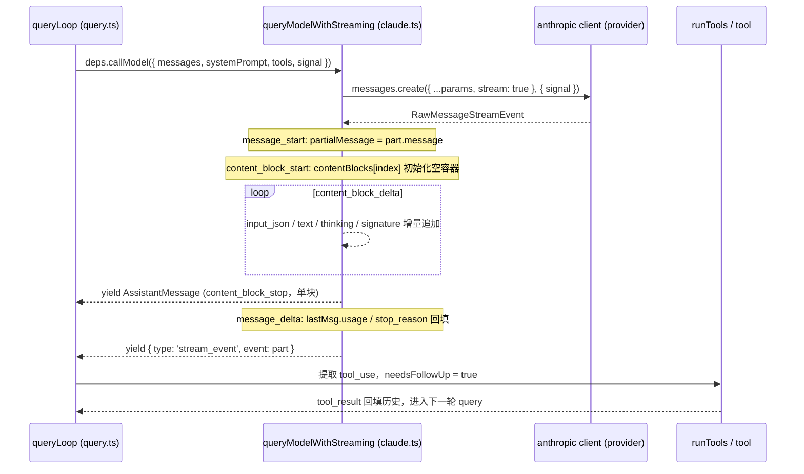

## 回答上一篇的问题

上一篇留下的问题是，**如果用户刚发完一条消息，却马上发现有问题并打断（例如按 `Esc` / `Ctrl+C`），这条消息还会出现在后面的对话里吗？**

这条消息在两层中的命运不同：在 **transcript（持久会话日志）**里通常会先被落盘；在 **当前会话视图**里，REPL 可能会把它回滚成“未发送”，所以页面看起来可能没有记住它。

先是持久化层，`QueryEngine.submitMessage()` 在调用模型前就持久化用户输入。源码里是先 `this.mutableMessages.push(...messagesFromUserInput)`，再在 `persistSession && messagesFromUserInput.length > 0` 分支里执行 `recordTranscript(messages)`。注释明确写了原因，如果进程在 API 返回前被中断，transcript 也能保存用户消息，`--resume` 才不会拿不到会话。

```ts
this.mutableMessages.push(...messagesFromUserInput)

if (persistSession && messagesFromUserInput.length > 0) {
  const transcriptPromise = recordTranscript(messages)
  ...
}
```

再看 UI 层，REPL 的 `onCancel()` 用 `abortController?.abort('user-cancel')` 通知本轮取消。随后在结束回收路径中，如果 reason 是 `user-cancel`、新一轮 query 尚未开始且输入框仍保持原值，就会触发 `removeLastFromHistory()` + `restoreMessageSync(lastUserMsg)`，并把输入框恢复为原始内容，这样当前会话会“退回到打断前”的状态。

```ts
abortController?.abort('user-cancel')

if (abortController.signal.reason === 'user-cancel' && !queryGuard.isActive && inputValueRef.current === '' && getCommandQueueLength() === 0) {
  const lastUserMsg = msgs.findLast(selectableUserMessagesFilter)
  removeLastFromHistory()
  restoreMessageSyncRef.current(lastUserMsg)
}
```

因此，你常见到的现象是，**日志里有痕迹，页面里可能被撤回**。后面继续发送新问题时，这条旧消息通常退出可见上下文；transcript 则保留一个“已提交但未完成”的尝试记录。后续若触发工具阶段，`query.ts` 还会补一条 `createUserInterruptionMessage`（普通打断是 `[Request interrupted by user]`，工具打断是 `[Request interrupted by user for tool use]`）作为链路标记；它与原始用户消息承担不同的协议角色。

```ts
if (toolUseContext.abortController.signal.reason !== 'interrupt') {
  yield createUserInterruptionMessage({ toolUse: false })
}
```

这和本章原问题呼应，网络事件只有在 `content_block_stop` / `message_delta` 等边界出现后，才会被投影成可交付的内部消息；取消可以中止组装，却不会改变“用户输入先入 transcript”的时机。

下面沿 `queryLoop` → `queryModel` → provider client → `withRetry` 追踪请求和响应。源码只支持 2.1.88 的静态调用关系；代码块中的 `// 省略……` 表示删去的无关分支，不是伪代码替代。

## 介绍本章的一些概念

- 请求沿 `queryLoop` → `deps.callModel`（生产装配为 `queryModelWithStreaming`）→ provider client 发出 **raw stream**；SSE 事件按 `message_start → content_block_start/delta/stop → message_delta → message_stop` 的状态机组装成内部 `AssistantMessage`，每个 `content_block_stop` 只产出**一个完成块**。
- **三层分块不能互相替代**，Node data block 的边界由底层读取时机决定；stdio `stream-json` 按换行符 `\n` 分消息；Anthropic stream 按 API 事件与 content block `index` 分块；CCR 再按时间窗口、消息聚合与 HTTP batch 做传输层切分。
- **缓存断点策略**，`addCacheBreakpoints()` 每次请求只放一个 message-level `cache_control` marker（`skipCacheWrite` 时移到倒数第二条），`cache_edits` 去重、pinned edits 原位插回；`usage` 与 `stop_reason` 由 `message_delta` 回填到已 yield 的消息对象。
- **错误按阶段分流**，`shouldRetry()` 分类连接错误 / 408 / 409 / 429（订阅约束）/ 401 / 5xx；`withRetry` 单独识别 Bedrock 与 Vertex 的认证错误并重建 client；不完整流降级到 `executeNonStreamingRequest()`；`cleanupStream()` 在 `finally` 释放 stream 与 response。
- provider 是静态优先级选路的客户端工厂，**Bedrock → Vertex → Foundry → firstParty**，`getAPIProvider()` 与环境开关一一对应；错误映射、认证刷新和请求字段都按 provider 分叉。

## 本篇新增机制

相对上一篇“message-model”（消息如何关联），本篇新增三块，

| 新增机制 | 解决的问题 | 关键符号 |
|---|---|---|
| 传输边界 | 网络 chunk、SSE 协议事件与 content block 属于不同粒度 | `data chunk` / `\n` / `part.index` |
| 增量组装 | 状态机把 start / delta / stop 事件变成完整内部消息 | `partialMessage`、`contentBlocks[index]`、`usage` |
| Provider adapter | 统一请求语义映射到 Anthropic / Bedrock / Vertex / Foundry | `getAPIProvider()`、`getAnthropicClient()` |

## 问题｜从用户消息到模型回答，传输层经历了什么

你按下回车，模型输出会以一串边生成边到达的网络事件出现。它们可能半途失败，也可以被取消，最后要变成 Query Loop 能安全消费的完整内容块。**从用户消息到模型回答，请求与响应在传输层经历了什么？** 本篇沿 `queryLoop` → `queryModel` → provider client → `withRetry` 追踪这条链。源码只支持 2.1.88 的静态调用关系；代码块中的 `// 省略……` 表示删去的无关分支，代码片段不等于完整实现。

## 正文

### 先建立一个简单模型｜发送、组装、交还

这条链路可以压缩成三个动作，

1. `queryLoop` 把本轮上下文交给模型调用层；
2. `queryModel` 构造请求并把网络增量组装成内容块；
3. 完整内容块作为 `AssistantMessage` 回到 `queryLoop`，若其中有 `tool_use`，Agent 循环就转入工具执行。



> 教学示意图（非源码），按 2.1.88 源码调用关系绘制的序列图，用于展示三个交接点。

图里最重要的边界在 `content_block_stop`，网络层可以不断发 delta，但 Claude Code 不会把半截工具参数当成一次完整工具调用。另一个容易忽略的边界在 `message_delta`，内容块虽然已经产出，计费信息和停止原因仍可能尚未到齐。

### 第一站｜queryLoop 只依赖“模型调用器”

生产环境的依赖装配在 `restored-src/src/query/deps.ts::productionDeps`。它把 `callModel` 指向 `queryModelWithStreaming`，

```ts
export function productionDeps(): QueryDeps {
  return {
    callModel: queryModelWithStreaming,
    microcompact: microcompactMessages,
    autocompact: autoCompactIfNeeded,
    uuid: randomUUID,
  }
}
```

> 证据，`restored-src/src/query/deps.ts`，`productionDeps()` 完整实现。

`callModel` 指向流式模型 I/O，`microcompact` 在当前消息历史上执行细粒度压缩，`autocompact` 在阈值满足时触发完整自动压缩，`uuid` 为循环生成消息标识。测试可以用 `params.deps` 替换这四个实现，因此 `queryLoop` 只依赖契约。

进入本轮 API 调用时，`restored-src/src/query.ts::queryLoop` 把消息、提示词、工具、取消信号和运行选项一起传下去，

```ts
for await (const message of deps.callModel({
  messages: prependUserContext(messagesForQuery, userContext),
  systemPrompt: fullSystemPrompt,
  thinkingConfig: toolUseContext.options.thinkingConfig,
  tools: toolUseContext.options.tools,
  signal: toolUseContext.abortController.signal,
  options: {
    model: currentModel,
    toolChoice: undefined,
    isNonInteractiveSession:
      toolUseContext.options.isNonInteractiveSession,
    fallbackModel,
    querySource,
    // 省略 Agent、MCP、缓存和追踪参数
  },
})) {
  // 省略：消费模型层产出的内部消息与流事件
}
```

> 证据，`restored-src/src/query.ts`，`queryLoop()` 调用 `deps.callModel()` 的参数。

`deps.callModel(...)` 返回异步生成器，所以 `queryLoop` 可以边收到、边处理。`messages` 已经加上用户上下文，`systemPrompt` 是本轮完整系统提示词，`thinkingConfig` 可表达 `adaptive`、带预算的 `enabled` 或 `disabled`；`signal` 把取消传到 SDK 请求。`options.model` 是当前模型；`fallbackModel` 传入字符串时允许降级；`toolChoice` 在主循环明确省略，让下层不强制某个工具；`isNonInteractiveSession` 区分宿主交互能力，`querySource` 标记运行来源。

这里有一个关键设计，**Query Loop 只消费 `queryModelWithStreaming` 产出的 `StreamEvent`、`AssistantMessage` 和 `SystemAPIErrorMessage`，SSE 解码与 JSON 增量组装留在 API 层**。Agent 循环据此判断 assistant 块和 `tool_use` 是否已经形成。

### 第二站｜先把内部上下文整理成 API 参数

`queryModel` 收到 `messages` 后先在 `restored-src/src/services/api/claude.ts` 中整理请求，筛选工具并调用 `toolToAPISchema`，用 `normalizeMessagesForAPI` 转换内部消息，修复 `tool_use/tool_result` 配对，按模型能力裁剪内容，再构造 system blocks 和缓存断点。

`queryModel` 内部的 `paramsFromContext(retryContext)` 负责生成请求体。它接收 `retryContext`，因为重试时模型、thinking 配置或 `max_tokens` 可能被校正，

```ts
return {
  model: normalizeModelStringForAPI(options.model),
  messages: addCacheBreakpoints(
    messagesForAPI,
    enablePromptCaching,
    options.querySource,
    useCachedMC,
    consumedCacheEdits,
    consumedPinnedEdits,
    options.skipCacheWrite,
  ),
  system,
  tools: allTools,
  tool_choice: options.toolChoice,
  ...(useBetas && { betas: betasParams }),
  metadata: getAPIMetadata(),
  max_tokens: maxOutputTokens,
  thinking,
  ...(temperature !== undefined && { temperature }),
  // 省略 context_management、output_config、speed 等条件字段
}
```

> 证据，`restored-src/src/services/api/claude.ts`，`queryModel()` 的 `paramsFromContext()` 返回体。

`model` 会被标准化；`messages` 按缓存策略插入断点；`system` 和 `tools` 分别是系统提示词块与 API 工具 Schema；`tool_choice` 可表示指定工具、自动选择或省略该选项，主 Query Loop 走省略路径；`betas` 仅在非空时出现；`max_tokens` 优先使用重试修正值，其次使用本轮覆盖值，最后回退到模型默认上限；`temperature` 只在计算得出数值时写入。

`thinking` 的静态分支也值得讲清楚，配置为 `disabled`，或环境变量关闭 thinking 时，请求不带有效 thinking 配置；模型支持 adaptive thinking 时使用 `{ type: 'adaptive' }`；否则使用 `{ type: 'enabled', budget_tokens }`，且预算不会超过 `max_tokens - 1`。`temperature` 只在 thinking 关闭时发送，调用方未覆盖时回退为 `1`。`enablePromptCaching` 省略时由 `getPromptCachingEnabled(model)` 决定。

#### 缓存断点策略｜一次请求只有一个 marker

`addCacheBreakpoints()` 是缓存策略的落点。它先把消息数组映射成 `MessageParam[]`，并遵循一条硬规则，**每次请求只放一个 message-level `cache_control` marker**。源码注释解释，Mycro 的 turn-to-turn eviction 会在非缓存前缀位置释放 local-attention KV 页；两个 marker 会让倒数第二个位置被错误保护，一个 marker 才是正确的最小写入点，

```ts
const markerIndex = skipCacheWrite ? messages.length - 2 : messages.length - 1
const result = messages.map((msg, index) => {
  const addCache = index === markerIndex
  if (msg.type === 'user') {
    return userMessageToMessageParam(
      msg,
      addCache,
      enablePromptCaching,
      querySource,
    )
  }
  return assistantMessageToMessageParam(
    msg,
    addCache,
    enablePromptCaching,
    querySource,
  )
})
```

> 证据，`restored-src/src/services/api/claude.ts`，`addCacheBreakpoints()` 的 marker 定位逻辑（2.1.88 source map 还原源码）。

默认把 marker 放在最后一条消息；`skipCacheWrite`（fire-and-forget fork）时移到倒数第二条，那是最后一个 shared-prefix 点，写入是一次 no-op merge，fork 不会在 KV cache 里留下自己的尾巴。`useCachedMC` 为真时，后续还会把 `cache_edits` 块去重后插入（`seenDeleteRefs` 防止同一 `cache_reference` 重复删除），并把之前 pinned 的 edits 原位插回（按 `userMessageIndex` 定位）。

这一步解释了为什么内部消息不能原封不动发给 API，恢复会话、动态工具、MCP 连接状态、提示词缓存和模型能力都会改变最终请求体。Claude Code 先把这些差异消化掉，后面的 provider 层才有一个相对稳定的 Messages API 形状。

### 第三站｜provider 决定请求走哪条云路径

Claude Code 支持 Anthropic 第一方 API、AWS Bedrock、Google Vertex AI 和 Microsoft Foundry。它们提供相似的 Messages API 外观，但认证、SDK、区域、模型名和部分请求字段各不相同。provider 是 API 客户端工厂的路由结果，至少决定四件事，用哪个 SDK 客户端发送请求；用哪套凭证完成认证；把模型别名转换成什么模型 ID，以及选择哪个区域；某些 beta、工具能力、遥测和请求关联字段是否可以发送。

#### `getAPIProvider()` 只根据环境开关选路

选择函数位于 `restored-src/src/utils/model/providers.ts::getAPIProvider`，

```ts
export function getAPIProvider(): APIProvider {
  return isEnvTruthy(process.env.CLAUDE_CODE_USE_BEDROCK)
    ? 'bedrock'
    : isEnvTruthy(process.env.CLAUDE_CODE_USE_VERTEX)
      ? 'vertex'
      : isEnvTruthy(process.env.CLAUDE_CODE_USE_FOUNDRY)
        ? 'foundry'
        : 'firstParty'
}
```

> 证据，`restored-src/src/utils/model/providers.ts`，`getAPIProvider()` 完整实现。

`APIProvider` 是封闭联合类型，`'firstParty' | 'bedrock' | 'vertex' | 'foundry'`。三个环境变量通过 `isEnvTruthy()` 解释布尔语义，支持布尔真值，以及忽略大小写和首尾空白后为 `1`、`true`、`yes`、`on` 的字符串。这里采用静态优先级 **Bedrock → Vertex → Foundry → firstParty**，客户端不会逐个探测网络可用性；多个开关同时打开时，函数直接返回第一个命中的 provider，正常配置应让这些开关互斥。

#### 四种 provider 到底差在哪里

| provider | 客户端 | 认证与部署信息 | 请求侧的特殊点 |
| --- | --- | --- | --- |
| `firstParty` | `Anthropic` | 非订阅路径使用 API key；Claude.ai 订阅路径使用 OAuth token | 官方 API 的模型 ID、第一方能力与第一方遥测路径 |
| `bedrock` | `AnthropicBedrock` | AWS Bearer token，或 AWS access key、secret key、session token；还要确定 AWS region | 模型可能需要 inference profile；部分 beta 参数放进 `extraBodyParams` |
| `vertex` | `AnthropicVertex` | GCP `GoogleAuth` / ADC、项目和 region | region 会根据模型和环境配置选择，认证刷新走 GCP 路径 |
| `foundry` | `AnthropicFoundry` | Foundry API key，或 Azure AD `DefaultAzureCredential` | 传入的可能是 deployment ID，不能假定一定是第一方 `claude-*` 模型名 |

这张表对应的是 `restored-src/src/services/api/client.ts::getAnthropicClient` 的分支，它先准备公共 headers、代理 fetch 和 timeout，再按 provider 动态加载 `AnthropicBedrock`、`AnthropicFoundry` 或 `AnthropicVertex`；三个第三方分支均未命中时构造标准 `Anthropic`。四个对象最后都按统一 client 类型交给 `queryModel`。

这里还藏着一个配置边界，`getAPIProvider()` 的优先级是 Bedrock、Vertex、Foundry，而 `getAnthropicClient()` 的环境分支顺序是 Bedrock、Foundry、Vertex。若多个开关同时为真，provider 标签可能和真正构造的 client 不一致；源码的首项命中逻辑也不会把它解释成“同时启用多个后端”。

#### provider 会继续影响请求内容

选好 client 以后，主循环仍然复用同一个 `queryModel`，但请求参数会根据 provider 做局部调整。例如工具搜索的 beta header 在第一方/Foundry 与 Vertex/Bedrock 上使用不同值；Bedrock 还要求把 header 放进 `extraBodyParams`，第一方等路径则使用普通 `betas` 数组。请求关联 ID 只在 `getAPIProvider() === 'firstParty'` 且 `isFirstPartyAnthropicBaseUrl()` 返回真时生成，并作为 header 发送；第三方 provider 使用各自的日志关联机制。

最后要分清两个概念，`getAPIProvider()` 判断配置选择了哪种接入模式；`isFirstPartyAnthropicBaseUrl()` 判断 `ANTHROPIC_BASE_URL` 是否指向 Anthropic 官方 host。前者默认返回 `firstParty`，后者在 base URL 省略时返回真；Claude Code 需要同时满足两项，才进入完整的第一方路径。

### 第四站｜raw stream 才是传输中的主体

请求发出的位置仍在 `restored-src/src/services/api/claude.ts::queryModel`，

```ts
const result = await anthropic.beta.messages
  .create(
    { ...params, stream: true },
    {
      signal,
      ...(clientRequestId && {
        headers: { [CLIENT_REQUEST_ID_HEADER]: clientRequestId },
      }),
    },
  )
  .withResponse()

streamRequestId = result.request_id
streamResponse = result.response
return result.data
```

> 证据，`restored-src/src/services/api/claude.ts`，`queryModel()` 发起流式请求。

`messages.create()` 的第一个参数展开 `params` 并强制加入 `stream: true`；第二个参数的 `signal` 传播取消，`headers` 只在生成 `clientRequestId` 时出现，其中动态键 `CLIENT_REQUEST_ID_HEADER` 关联客户端请求。`.withResponse()` 同时保留 `result.data` 流、`result.response` HTTP 响应与 `result.request_id` 服务端标识。

源码注释说明这里刻意使用 raw stream，SDK 的 `BetaMessageStream` 会在每个 `input_json_delta` 到来时反复做 partial JSON 解析；Claude Code 自己累积工具参数，因此直接消费原始事件可以避免重复工作。

需要区分两个名字，导出的 `queryModelWithStreaming()` 是主循环使用的流式接口；`queryModelWithoutStreaming()` 虽然名字像另一条 HTTP 路径，实际上仍会完整消费 `queryModel()` 的生成器，只是最终只返回最后一个 `AssistantMessage`。真正的非流式 HTTP 请求位于 `executeNonStreamingRequest()`，它主要用于流式失败后的恢复，并调用 `messages.create()` 时不设置 `stream: true`。

### 传输边界｜三层数据采用三种分块规则

`queryModel` 看到的 `part` 已经是 Anthropic SDK 解码后的事件。如果从 `claude --input-format stream-json --output-format stream-json` 或 Agent SDK 的 stdio 入口观察，外面还有一层 NDJSON 协议。这里至少存在三种不同粒度，Node 异步流收到的 data block、以换行结束的协议消息，以及模型 API 的 `RawMessageStreamEvent`。它们的边界不能互相替代。

#### 输入按换行恢复消息

`main.tsx::getInputPrompt` 在 `inputFormat === 'stream-json'` 时直接返回 `process.stdin`。因此，Node `data` 事件给出的字符串只是暂存材料，大小取决于管道和运行时调度；它可能半条消息，也可能一次包含多条消息。真正的拆分发生在 `StructuredIO.read()`，

```ts
let content = ''

for await (const block of this.input) {
  content += block
  while (content.indexOf('\n') !== -1) {
    const newline = content.indexOf('\n')
    const line = content.slice(0, newline)
    content = content.slice(newline + 1)
    const message = await this.processLine(line)
    if (message) yield message
  }
}

if (content) {
  const message = await this.processLine(content)
  if (message) yield message
}
```

> 证据，`restored-src/src/cli/structuredIO.ts::read` 主干（循环里的前置 user message、诊断和关闭 pending request 分支已省略）。

由此可以确定，**输入的逻辑分块边界是换行符 `\n`；字节数、字符数和 token 数不参与记录切分。** 一个 Node block 可以产出多条消息；一条 JSON 消息也可以跨越多个 block。输入结束时，末尾残余内容即使缺少换行也会作为一条记录处理；空行则在 `processLine` 中跳过。每行解析后还要经过 `processLine` 的类型分支，`StdinMessageSchema` 接受 user message、control request、control response、keep-alive 和环境变量更新，所以 `stream-json` 的 stdin 是宿主事件协议，不能把它等同于“把用户 prompt 切成若干段”。

#### 输出按完整 JSON 行发送

输出侧使用相反的配对操作。`StructuredIO.write()` 把一个完整的 `StdoutMessage` 序列化后追加换行，

```ts
async write(message: StdoutMessage): Promise<void> {
  writeToStdout(ndjsonSafeStringify(message) + '\n')
}
```

> 证据，`restored-src/src/cli/structuredIO.ts`，`StructuredIO.write()` 完整实现。

`runHeadless()` 在 `stream-json` 且 `verbose` 时，对 `runHeadlessStreaming()` 产出的每个消息调用一次 `structuredIO.write()`。因此 stdout 的协议单位是一行完整 JSON；这一行可能是 `assistant`、`result`、`system`、`stream_event` 或控制消息，并不意味着每行都是一段文本。`streamJsonStdoutGuard` 还会把底层任意的 `process.stdout.write()` 调用重新缓存到换行，再用 `JSON.parse` 判断这一行是否完整；合法 JSON 继续留在 stdout，其他输出被转到 stderr。

#### 模型事件与外层协议消息

模型层的分块标准由 API 事件类型和内容块 `index` 决定。`queryModel` 调用 `messages.create({ stream: true })` 后，`for await (const part of stream)` 每次拿到一个语义事件；`content_block_delta` 里的 `text_delta`、`thinking_delta` 和 `input_json_delta` 分别追加到对应内容块。这里的 `input_json_delta.partial_json` 属于模型正在生成的 `tool_use` 输入，stdin 用户输入则由上一层 NDJSON 解析。

Query Engine 只有在 `includePartialMessages` 为真时，才把这些原始 API 事件包装成外部 `stream_event`；默认值为假时，外部仍会收到完整的 assistant、system 和 result 等消息，但不会收到每个原始 delta。

#### 远程 transport 还会再次聚合

如果输出经过 CCR 的远程事件上传器，`stream_event` 会先进入最多 100ms 的延迟缓冲。`accumulateStreamEvents()` 会按会话作用域、API message ID 和 content block `index` 维护文本；同一个块在一个 flush 窗口内只生成一个 full-so-far 快照，非文本 delta 则原样传递。CCR 后面的 HTTP uploader 还会按最多 100 条、累计 10MB 的规则切 POST batch。

因此，本章说“chunk”时要先说明层次，Node data block 的边界由底层读取时机决定；stdio `stream-json` 按 `\n` 分消息；Anthropic stream 按 API 事件和 content block index 分块；CCR 再按时间窗口、消息聚合和 HTTP batch 做一次传输层切分。

### 第五站｜事件怎样驱动组装状态机

请求成功建立后，`queryModel` 维护四份核心状态，`partialMessage` 保存 `message_start` 带来的消息壳；`contentBlocks[index]` 保存各个正在增长的内容块；`usage` 保存 token 使用量；`stopReason` 初始为 `null`。事件循环的开头来自 `restored-src/src/services/api/claude.ts::queryModel`，

```ts
for await (const part of stream) {
  resetStreamIdleTimer()

  switch (part.type) {
    case 'message_start': {
      partialMessage = part.message
      ttftMs = Date.now() - start
      usage = updateUsage(usage, part.message?.usage)
      break
    }
    case 'content_block_start':
      // 省略：按内容块类型初始化 contentBlocks[part.index]
      break
    case 'content_block_delta':
      // 省略：把增量追加到同一 index 的内容块
      break
    // 省略 stop 与 message_delta 分支
  }
}
```

> 证据，`restored-src/src/services/api/claude.ts`，`queryModel()` 的事件循环骨架。

`part` 是 `BetaRawMessageStreamEvent`。`message_start` 初始化消息元数据，并读取可能已经出现的 usage；`content_block_start` 用 `part.index` 创建槽位；后续 delta 必须通过同一个 `index` 找到它。若 delta 或 stop 找不到对应块，源码会记录 `tengu_streaming_error` 并抛错，当前流随即进入错误恢复。

`content_block_start` 会按块类型选择初值，`tool_use` 和 `server_tool_use` 的 `input` 先设为空字符串，`text` 的 `text` 先设为空字符串，`thinking` 的 `thinking` 与 `signature` 也从空字符串开始。文本 start 事件里即使带了内容，这里也不直接采用，因为源码注释记录了 SDK 可能在随后 delta 中再次给出相同文本；选择只累积 delta，是为了避免重复。

#### delta 怎样落到正确字段

`content_block_delta` 按具体 delta 类型更新不同字段，核心分支可以缩成下面这样，

```ts
switch (delta.type) {
  // 省略：各 delta 与 contentBlock.type 的匹配校验
  case 'input_json_delta':
    contentBlock.input += delta.partial_json
    break
  case 'text_delta':
    contentBlock.text += delta.text
    break
  case 'signature_delta':
    contentBlock.signature = delta.signature
    break
  case 'thinking_delta':
    contentBlock.thinking += delta.thinking
    break
}
```

> 证据，`restored-src/src/services/api/claude.ts`，`queryModel()` 的 `content_block_delta` 分支。

`input_json_delta` 只允许落到 `tool_use` 或 `server_tool_use`，并要求当前 `input` 仍是字符串；`text_delta` 只允许落到 `text`；`signature_delta` 通常落到 `thinking`，特性开启时也可用于 `connector_text`；`thinking_delta` 只允许落到 `thinking`。源码还看得到 `citations_delta`（当前分支保持待处理状态）以及受功能开关控制的 `connector_text_delta`。这些类型检查会把事件顺序错误转成显式异常，保护下游消息结构。

工具参数先拼字符串，因为任意一个 `partial_json` 都可能只是一段 `{"file_`；内容块结束后才能解析完整字符串。`restored-src/src/utils/messages.ts::normalizeContentFromAPI` 会用 `safeParseJSON` 解析完整工具输入，空字符串或解析失败会回退到 `{}`，随后再调用对应工具的 `normalizeToolInput`；若非流式 fallback 已经给出对象，则直接保留对象路径。

#### content_block_stop 才产出内部 AssistantMessage

当某个块结束，`queryModel` 才把它包装成内部消息，

```ts
const m: AssistantMessage = {
  message: {
    ...partialMessage,
    content: normalizeContentFromAPI(
      [contentBlock] as BetaContentBlock[],
      tools,
      options.agentId,
    ),
  },
  requestId: streamRequestId ?? undefined,
  type: 'assistant',
  uuid: randomUUID(),
  timestamp: new Date().toISOString(),
}
newMessages.push(m)
yield m
```

> 证据，`restored-src/src/services/api/claude.ts`，`queryModel()` 的 `content_block_stop` 分支。

`partialMessage` 必须已由 `message_start` 建立，`contentBlock` 也必须能按 `part.index` 找到，否则抛错。返回对象的 `message` 继承响应外壳，并由 `normalizeContentFromAPI(content, tools, agentId?)` 把工具输入字符串转成对象、执行工具级修正；`agentId` 省略时跳过 Agent 专属处理。一个 API response 可能包含多个内容块，因此这里会 yield 多个 `AssistantMessage`，每个消息承载一个完成的 block。对上层来说，文本、thinking 和 `tool_use` 都遵守同一内部消息外壳；差别在 `message.content` 的块类型，而不在网络传输方式。

#### usage 与 stop_reason 为什么要“回填”

`content_block_stop` 发生时，`partialMessage` 仍可能带着 `output_tokens: 0` 和 `stop_reason: null`。最终值由后续 `message_delta` 提供，

```ts
case 'message_delta': {
  usage = updateUsage(usage, part.usage)
  stopReason = part.delta.stop_reason

  const lastMsg = newMessages.at(-1)
  if (lastMsg) {
    lastMsg.message.usage = usage
    lastMsg.message.stop_reason = stopReason
  }
  break
}
```

> 证据，`restored-src/src/services/api/claude.ts`，`queryModel()` 的 `message_delta` 分支。

`updateUsage(current, partUsage)` 的第二个参数允许为 `undefined`；此时返回当前 usage 的副本。对 input/cache token 字段，新的正数才覆盖旧值；`output_tokens` 等字段使用 `??` 回退。函数会把分散在事件里的最新可用字段合成一份 `NonNullableUsage`。`stopReason` 的静态类型是 `BetaStopReason | null`；本函数明确处理了 `max_tokens` 和 `model_context_window_exceeded`，也把停止原因交给 refusal 映射逻辑。更重要的是，**Query Loop 不把 `stop_reason === 'tool_use'` 当唯一依据**，因为源码注释明确说这个值并不始终可靠。

这里直接修改属性，以配合 transcript 写队列持有原对象引用并延迟序列化的行为；原地回填能让已经排队的对象最终带上 usage 和 stop reason。每个底层事件随后还会被包装为 `{ type: 'stream_event', event: part }` 继续向上 yield，内部完整消息与原始增量可以同时存在。

### 第六站｜tool_use 怎样把控制权交回 Query Loop

`queryLoop` 收到 `AssistantMessage` 后，从内容中提取 `tool_use`，

```ts
if (message.type === 'assistant') {
  assistantMessages.push(message)

  const msgToolUseBlocks = message.message.content.filter(
    content => content.type === 'tool_use',
  ) as ToolUseBlock[]

  if (msgToolUseBlocks.length > 0) {
    toolUseBlocks.push(...msgToolUseBlocks)
    needsFollowUp = true
  }
}
```

> 证据，`restored-src/src/query.ts`，`queryLoop()` 的模型流消费循环。

`message.type` 必须是 `'assistant'` 才进入；内容块按 `type === 'tool_use'` 过滤；只要至少一个工具块出现，`needsFollowUp` 就设为 `true`。因此完整 `tool_use` 块直接驱动 Agent 继续，stop reason 只提供响应级停止语义。如果启用了 streaming tool execution，完整工具块一到达还会交给 `StreamingToolExecutor.addTool()`；否则流结束后由常规 `runTools()` 统一执行。两条路径都发生在 `content_block_stop` 之后，所以此时工具输入已经经过累积与规范化。

`tool_use` 集合为空时，`needsFollowUp` 保持 `false`，Query Loop 进入停止 hook、预算或正常完成路径；存在 `tool_use` 时，它等待工具结果，把 `tool_result` 追加到消息历史，再开始下一次模型请求。网络流在这里重新接回 Agent 循环。

### 第七站｜错误、重试和取消走不同出口

流式请求的失败分为流建立前和已经收到部分事件之后两个阶段，Claude Code 为它们选择不同的恢复路径。

#### 建连与 API 错误由 withRetry 分类

`queryModel` 用 `restored-src/src/services/api/withRetry.ts::withRetry` 包住客户端创建和流建立。可重试判断集中在 `shouldRetry(error)`，

```ts
// 省略：mock、persistent、header 与认证前置分支
if (error instanceof APIConnectionError) return true
if (!error.status) return false
if (error.status === 408) return true
if (error.status === 409) return true
if (error.status === 429) {
  return !isClaudeAISubscriber() || isEnterpriseSubscriber()
}
if (error.status === 401) return true
if (error.status && error.status >= 500) return true
return false
```

> 证据，`restored-src/src/services/api/withRetry.ts`，`shouldRetry()` 的常规候选分支（前置分支省略，不能当作完整规则）。

源码能确认的常规候选包括连接错误、408、409、受订阅类型约束的 429、401 和 5xx；服务端 `x-should-retry` 还可以显式影响决策。重试间隔由 `getRetryDelay(attempt, retryAfterHeader?, maxDelayMs = 32000)` 计算，`retryAfterHeader` 能解析为整数时按秒转换为毫秒，否则使用指数退避并加最多 25% jitter；`maxDelayMs` 默认 32000，但 persistent 模式还有自己的上限与长等待心跳。取消信号在每轮和 sleep 中都会检查，因此等待重试时仍能被用户中止。

#### 错误映射｜Bedrock 与 Vertex 的认证错误单独识别

`withRetry` 的重试循环并不只按 status 判断。源码注释明确列出四类需要重建 client 的错误，并分别用 `isBedrockAuthError()` 与 `isVertexAuthError()` 识别第三方平台特有的认证失败，

```ts
if (
  client === null ||
  (lastError instanceof APIError && lastError.status === 401) ||
  isOAuthTokenRevokedError(lastError) ||
  isBedrockAuthError(lastError) ||
  isVertexAuthError(lastError) ||
  isStaleConnection
) {
  // On 401 "token expired" or 403 "token revoked", force a token refresh
  if (
    (lastError instanceof APIError && lastError.status === 401) ||
    isOAuthTokenRevokedError(lastError)
  ) {
    const failedAccessToken = getClaudeAIOAuthTokens()?.accessToken
    if (failedAccessToken) {
      await handleOAuth401Error(failedAccessToken)
    }
  }
  client = await getClient()
}
```

> 证据，`restored-src/src/services/api/withRetry.ts`，`withRetry()` 的重试循环中 client 重建分支。

错误映射的分工是，第一方 401 或 OAuth token revoked（403）→ 刷新 OAuth token；**Bedrock 认证错误（403 或 `CredentialsProviderError`）→ 重建 Bedrock client；Vertex 认证错误（credential refresh 失败、401）→ 重建 Vertex client**；`ECONNRESET/EPIPE`（stale keep-alive socket）→ 在 `tengu_disable_keepalive_on_econnreset` 打开时禁用 keep-alive 后重建。因此“认证失败”在不同 provider 上不是同一个对象，统一的重试逻辑必须按 provider 分别识别。

#### 流中断可以降级为非流式请求

已经建立的 stream 若抛错，`queryModel` 会先区分真正的用户取消和 SDK 内部 timeout，用户取消直接重新抛出；SDK timeout 改写成 `APIConnectionTimeoutError`。其他流错误在 fallback 未被禁用时进入 `executeNonStreamingRequest()`。控制这个分支的值包括环境变量 `CLAUDE_CODE_DISABLE_NONSTREAMING_FALLBACK` 和功能开关；流建立阶段返回 404 还有单独的非流式 fallback。另一方面，如果流正常结束却从未收到 `message_start`，或收到 start 但完整内容块与 stop reason 均为空，源码同样把它视为不完整流并触发恢复。

非流式 fallback 会重新调用 `anthropic.beta.messages.create()`，复用 `paramsFromContext` 和 `withRetry`，并对输出 token 上限做额外裁剪。成功后把整条 `BetaMessage` 通过 `normalizeContentFromAPI` 转为一个 `AssistantMessage`。如果前一次流已经向上产出了部分消息，`queryLoop` 会发出 tombstone、清空旧 `assistantMessages/toolResults/toolUseBlocks`，并重建 streaming tool executor，避免半条流里的 tool id 与 fallback 结果混在一起。

#### 取消还必须关闭底层资源

流资源的最后一道防线是 `restored-src/src/services/api/claude.ts::cleanupStream`，

```ts
export function cleanupStream(
  stream: Stream<BetaRawMessageStreamEvent> | undefined,
): void {
  if (!stream) return
  try {
    if (!stream.controller.signal.aborted) {
      stream.controller.abort()
    }
  } catch {
    // Ignore - stream may already be closed
  }
}
```

> 证据，`restored-src/src/services/api/claude.ts`，`cleanupStream()` 完整实现。

`undefined` 直接走 no-op 返回，已有 stream 且 controller 尚未 abort 时执行取消，已关闭或关闭过程中抛错则吞掉异常。`queryModel` 的 `releaseStreamResources()` 还会取消 `Response.body` 并清空引用，而且它放在 `finally` 中，即使上层对异步生成器提前 `.return()`，底层 TLS/socket 相关资源也会被释放。

用户取消与网络错误的上层语义也不同，`APIUserAbortError` 不会被转换成 assistant API error；`queryLoop` 检测到同一个 `AbortSignal` 后，补齐必要的中断消息或缺失的 `tool_result`，再以 `aborted_streaming` 等终态返回。其他不可恢复错误则会映射为内部错误消息，让 UI、headless 或 SDK 有统一对象可以消费。

### 流关闭之后，哪些结论才算成立

到 `message_stop` 并离开事件循环，只能说明这一条响应流结束。Claude Code 还要确认它确实见过 `message_start`，并且至少形成了内容块，或者拿到了合法 stop reason；随后记录 usage、cost、request id、缓存命中相关字段和诊断信息。是否继续 Query Loop，则由已经形成的 `tool_use`、停止 hook、预算、取消状态和恢复分支共同决定，

- `message_stop` 是单次 API response 的边界；
- `content_block_stop` 是一个内部 assistant 内容块可交付的边界；
- 工具列表为空且通过停止检查，才可能结束当前 Agent turn；
- 有 `tool_use` 时，工具结果会进入历史，下一次 API 请求重新开始。

源码里的 30 秒 stall 记录阈值、默认 90 秒 idle timeout 等常量只描述 2.1.88 的默认与可配置逻辑；生产性能需要真实运行数据验证。

### 小结

Claude Code 的 API 层做的事情，可以概括为一句话，**把不完整、可能失败、可以取消的网络事件，变成 Query Loop 能安全消费的完整内容块。**

它先归一化消息、系统提示词与工具 Schema，再由 `addCacheBreakpoints()` 按“一次一个 marker”的策略插入缓存断点；随后按 provider 构造 Anthropic 客户端。请求以 raw stream 发出，`message_start` 建消息壳，`content_block_start/delta/stop` 组装文本、thinking 和工具参数，`message_delta` 回填 usage 与 stop reason。完整 `tool_use` 回到 Query Loop 后，才真正触发下一阶段的工具执行。

异常路径同样属于协议的一部分，可重试错误进入 `withRetry`（401 / 408 / 409 / 429 / 5xx，Bedrock 与 Vertex 认证错误单独识别重建 client），不完整流可以降级为非流式请求，用户取消沿 `AbortSignal` 传播，`finally` 负责关闭 stream 与 response。这样，REPL、print 模式和 SDK 可以共享同一执行内核，却各自决定是否展示原始增量。

## 源码映射

| 主题 | 关键文件（`restored-src/src/`） | 关键函数 / 符号 | 证据 |
|---|---|---|---|
| 循环接入 | `query.ts`、`query/deps.ts` | `queryLoop()`、`productionDeps()`、`deps.callModel()` | 源码已确认 |
| 请求组装 | `services/api/claude.ts` | `queryModel()`、`paramsFromContext()`、`normalizeMessagesForAPI()` | 源码已确认 |
| 缓存断点 | `services/api/claude.ts` | `addCacheBreakpoints()`、`getCacheControl()`、`getPromptCachingEnabled()` | 源码已确认 |
| provider 选路 | `utils/model/providers.ts`、`services/api/client.ts` | `getAPIProvider()`、`getAnthropicClient()`、`isFirstPartyAnthropicBaseUrl()` | 源码已确认 |
| 传输分块 | `cli/structuredIO.ts` | `StructuredIO.read()` / `write()`、`streamJsonStdoutGuard` | 源码已确认 |
| 组装状态机 | `services/api/claude.ts` | `message_start` / `content_block_start/delta/stop` / `message_delta` / `message_stop` 分支 | 源码已确认 |
| 错误与重试 | `services/api/withRetry.ts` | `withRetry()`、`shouldRetry()`、`getRetryDelay()`、`isBedrockAuthError()`、`isVertexAuthError()` | 源码已确认 |
| 降级与清理 | `services/api/claude.ts` | `executeNonStreamingRequest()`、`cleanupStream()`、`releaseStreamResources()` | 源码已确认 |

## 设计决策

**第一，Query Loop 只依赖“模型调用器”契约。** `productionDeps()` 把 `callModel`、`microcompact`、`autocompact`、`uuid` 四项作为依赖注入，测试可以整组替换；SSE 解码与 JSON 增量组装留在 API 层，循环只消费已经归一化的 `StreamEvent` / `AssistantMessage` / `SystemAPIErrorMessage`。

**第二，raw stream 而不是 SDK 的 partial JSON 解析。** 官方 SDK 的 `BetaMessageStream` 会在每个 `input_json_delta` 到来时反复做 partial JSON 解析；Claude Code 自己累积工具参数字符串、在 `content_block_stop` 一次性解析，避免重复工作，这是对“谁拥有增量解析”的明确分工。

**第三，缓存断点必须最少化。** 一次请求只放一个 message-level `cache_control` marker，`skipCacheWrite` 时移到倒数第二条 shared-prefix 点；`cache_edits` 去重、pinned edits 原位插回。过度打点会破坏前缀匹配，甚至让缓存写入变成无效 KV 页保留。

**第四，错误恢复按阶段选择出口。** 建连前错误走 `withRetry`（status + provider 认证错误分类）；流中断走非流式降级；用户取消走 `AbortSignal` 直达上层；资源清理放在 `finally`。每个阶段只处理自己范围的问题，避免“半条流”与“新请求”互相污染。

**第五，provider 差异收敛到适配层。** 四种 provider 暴露同样的 `messages.create()` 外观，认证、模型名、beta 位置、错误识别全部收敛到 `getAPIProvider()` / `getAnthropicClient()` / `withRetry` 内，主循环代码不需要关心走的是哪朵云。

## 练习｜观察你自己的一次流式请求

用 15到20 分钟做下面这件事（需要可用的 Claude API 凭证），

1. 打开一个空会话，`claude -p "用一句话介绍你自己" --output-format stream-json --verbose`，把 stdout 存成文件。
2. 数一数 `stream_event` 里出现了哪些事件类型；确认 `message_start` 只出现一次、`content_block_stop` 与 assistant 消息一一对应。
3. 对照本文的组装顺序，标出 `message_delta` 相对最后一个 `content_block_stop` 的位置，并检查 `usage` 是否在 `message_delta` 中才完整。
4. 再运行 `claude -p "读一个 2000 行的文件并总结"`，观察输出结果是否远大于 25000 token；如果命中 FileRead 的结果上限，看错误信息如何回到 `tool_result`。
5. （进阶）用 `curl -N` 直接打 Messages API 并指定 `stream: true`，对比原始 SSE 事件与 Claude Code 转发的 `stream_event`，确认“原始 delta 默认不外发”。

## 自测

1. 为什么 Claude Code 不直接用 SDK 的 `BetaMessageStream` 解析 partial JSON？
2. `addCacheBreakpoints()` 为什么默认只把 `cache_control` marker 放在最后一条消息？
3. Bedrock 的认证错误和第一方 401 在 `withRetry` 里分别怎么处理？

<details>
<summary>参考答案</summary>

1. **避免重复工作**，SDK 会在每个 `input_json_delta` 到来时反复做 partial JSON 解析；Claude Code 自己累积工具参数字符串、在 `content_block_stop` 一次性解析（`normalizeContentFromAPI` + `safeParseJSON`），因此直接消费 raw stream。

2. **保持最小缓存写入点**，源码注释说明 Mycro 的 turn-to-turn eviction 会释放非缓存前缀位置的 KV 页；两个 marker 会让倒数第二个位置被错误保护，一个 marker 才是正确位置。`skipCacheWrite`（fire-and-forget fork）时移到倒数第二条，让写入变成 no-op merge，fork 不留自己的 KV 尾巴。

3. **第一方 401 / OAuth token revoked（403）→ `handleOAuth401Error()` 刷新 token**；**Bedrock 认证错误（403 或 `CredentialsProviderError`）→ `isBedrockAuthError()` 识别后重建 client**；**Vertex 认证错误（credential refresh 失败、401）→ `isVertexAuthError()` 识别后重建 client**。`ECONNRESET/EPIPE` 走 keep-alive 禁用路径。

</details>

## 回顾｜上一篇的问题

<details>
<summary>回顾，刚发完消息就打断，这条消息还会出现在后面的对话里吗？（回答 07 留下的问题）</summary>

结论，在 **transcript** 里，这条用户消息通常会先被落盘；在 **当前会话视图**里，REPL 可能把它回滚成“未发送”，两层行为不同。

持久化层，`QueryEngine.submitMessage()` 在调用模型前就持久化用户输入，先 `this.mutableMessages.push(...messagesFromUserInput)`，再在 `persistSession && messagesFromUserInput.length > 0` 分支执行 `recordTranscript(messages)`，

```ts
this.mutableMessages.push(...messagesFromUserInput)

if (persistSession && messagesFromUserInput.length > 0) {
  const transcriptPromise = recordTranscript(messages)
  ...
}
```

> 证据，`restored-src/src/QueryEngine.ts`，`submitMessage()` 的持久化时机。注释写明，进程在 API 返回前被中断，transcript 也能保存用户消息，`--resume` 才不会拿不到会话。

UI 层，REPL 的 `onCancel()` 用 `abortController?.abort('user-cancel')` 通知取消；结束回收路径中，若 reason 是 `user-cancel`、新一轮 query 未开始且输入框保持原值，就触发 `removeLastFromHistory()` + `restoreMessageSync(lastUserMsg)`，恢复输入框内容。

因此现象是**“日志里有痕迹，页面里可能被撤回”**；工具阶段被打断时，`query.ts` 还会补 `createUserInterruptionMessage`（普通打断是 `[Request interrupted by user]`，工具打断是 `[Request interrupted by user for tool use]`）作为链路标记，与原始用户消息承担不同的协议角色。

</details>

## 留给下一篇的问题

你知道 Beta 开关打开的时候有什么新功能吗？

## 相关链接

- **上一篇**，[07 对话、工具与内部事件如何关联](./07-message-model.md)
- **下一篇**，[09 工具契约与注册表如何工作](./09-tool-contract-and-registry.md)，`tool_use` 按名称找到工具对象
- [Using Claude Code， session management and 1M context](https://claude.com/blog/using-claude-code-session-management-and-1m-context)
- [Messages API 流式传输](https://docs.anthropic.com/en/api/messages-streaming)
- [Claude Code 模型配置](https://code.claude.com/docs/en/model-config)
