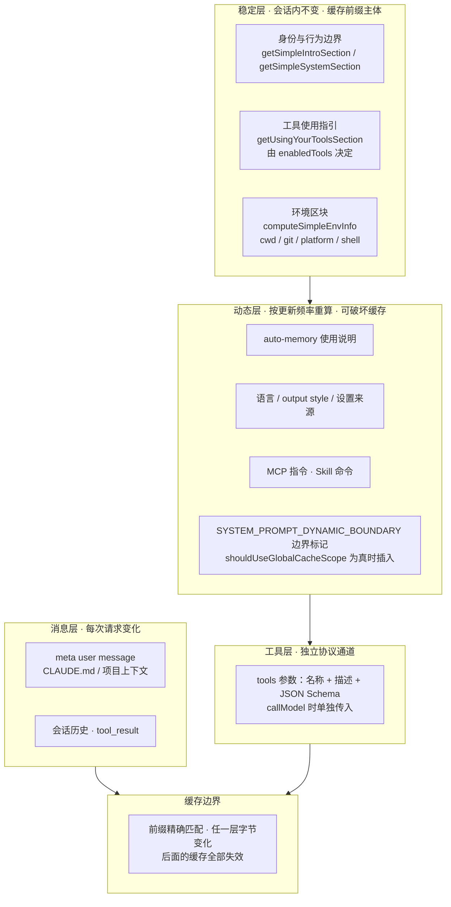

## 回答上一篇的问题

上一篇留下的问题是，你知道 Claude Code 会用你默认的模型进行 WebSearch 吗？

默认情况下，WebSearch 会沿用当前主循环的 `context.options.mainLoopModel`；但运行时功能开关 `tengu_plum_vx3` 为真时，搜索流会切换到 `getSmallFastModel()`，优先使用 `ANTHROPIC_SMALL_FAST_MODEL`，未设置时回退到默认 Haiku。

因此，`isEnabled()` 返回 true 只说明当前 provider/model 组合具备 WebSearch 能力，不代表最终搜索模型已经确定。真正的模型选择发生在 `WebSearchTool.call()`，默认分支使用主循环模型，功能开关分支使用 small fast model；两条路径都通过独立的模型流调用服务端 WebSearch 工具。

所以更准确的回答是，**默认情况下会使用当前主循环模型，但并不是任何情况下都固定使用默认模型。**

本文只引用 `@anthropic-ai/claude-code@2.1.88` 的还原源码。短代码块删去日志、埋点和无关实验分支；`restored-src/` 只用于定位证据，不表示内部仓库原始目录。

## 介绍本章的一些概念

- 一次模型请求有三条上下文通道，**system prompt（稳定规则）、message context（项目指令 + 历史）、tool schema（结构化契约）**；它们在不同时间准备、以不同协议注入，前缀顺序一变，缓存命中范围就变。
- "CLAUDE.md 在 system prompt 里"是宽泛说法，**CLAUDE.md 实际被包装成 meta user message 进入 `messages`**，API 的 `system` 字段只接收 `systemPrompt`。
- prompt 保留为**分块数组**而非拼接字符串，普通 section 复用缓存，只有标记 `cacheBreak` 的 section 每轮重算，这是缓存边界与成本控制的根本单位。
- `customSystemPrompt` 是**替换语义**（替换默认 prompt 并跳过默认 system context），不是追加；想补充指令要走 `appendSystemPrompt`。
- git status 是**会话开始快照**，不会随对话更新；深层目录的 CLAUDE.md 由文件访问**动态触发 attachment** 注入，不动默认 prompt 的缓存前缀。

## 本篇新增机制

本文回答"项目上下文如何组装并注入"，确立四个机制，

1. **三条通道协议分工**，system / messages / tools 各自准备、各自缓存、调用前才汇合。
2. **分层 prompt section**，稳定区块在前、动态区块在后，section 级缓存 + `cacheBreak` 标记，构成版本化 prompt 分层。
3. **CLAUDE.md 四级发现层级**，Managed / User / Project / Local 按 cwd 层级发现，注入为 meta user message。
4. **会话快照与动态补充**，git 状态作为 system context 快照；嵌套目录规则由 Read 访问路径触发附件注入。

## 问题

你在金额单位工单里特别写了一句，

> 先读取 `CLAUDE.md`、金额单位工单和相关代码；按照项目约定修复，不要改变项目之外的文件。

模型请求发出前，Claude Code 会把 system prompt、项目层级的 `CLAUDE.md`、会话历史、当前工单 prompt、git 状态和动态工具结果分开准备，再在调用前合并。于是模型同时知道"应该遵守什么"和"目前查到了什么"，但这两类内容并不是同一个来源。

同时还有一个现象，**同一段 CLAUDE.md 还在，但 cache miss 增多**。系统提示词、项目指令和工具 Schema 并不是一个字符串，它们在不同时间准备、以不同协议注入，前缀顺序一变，缓存命中范围也会变。

本文从这次请求的三条上下文通道开始，追踪项目规则如何进入最终 API 参数，也看它们为什么不能被压成一段随意拼接的字符串。

### 上下文工程是分层和取舍

Prompt 模板和 To-Do List 之所以能让模型更聚焦，关键不在于继续堆长文本，而在于分层：**系统约束 → 当前任务 → 结构化状态/任务清单 → 近期消息 → 长期记忆 → 工具结果**。本篇源码能确认 system、message 和 tool schema 的协议分工，以及 `CLAUDE.md` 按需进入 message context；任务清单作为结构化状态的设计建议，则是基于该分层的工程抽象，不应伪装成 2.1.88 有一个统一的 Todo 状态机。

首次生成、follow-up、槽位补全等业务路由也不能从 prompt 组装函数直接推出。源码确认的是上下文怎样装配；具体产品是否保存 `conversation_id`、任务槽位和 schema 版本，要看业务层实现。

## 正文

本文全部引用 `@anthropic-ai/claude-code@2.1.88` 的 `restored-src/` 还原源码。代码块只保留证明控制流所需的字段，`// ...` 表示省略埋点、UI 消息和无关分支；每个代码块后标注证据位置与证据级别（[source] 直接摘录还原源码 / [pseudocode] 简化复述 / [inference] 依据结构推断 / [runtime] 运行时行为）。

### 一次模型请求，其实有三条上下文通道


这里先明确三条通道各自承担的协议职责。

**System prompt** 承载稳定的身份、行为边界和环境说明。源码用 `SystemPrompt` 这个品牌类型表示 `readonly string[]`，使稳定前缀、动态区块与缓存边界保持可追踪。

**Message context** 承载对话历史。CLAUDE.md 在这条实现中被包装成 meta user message，通过 `<system-reminder>` 标明其按需使用的上下文属性。

**Tool schema** 是模型能够调用什么工具的机器可读契约，包括名称、描述和输入 JSON Schema。自然语言 prompt 负责使用策略，Schema 负责输入结构，两者分别进入请求。

为什么要分开？稳定 prompt 可以保持缓存前缀，CLAUDE.md 可以随着项目层级作为消息上下文补充，工具 Schema 则必须满足 API 的结构化协议。把三者揉成一个字符串，会让一次 git 状态变化或工具变化连带重写稳定前缀，也会丢掉工具输入的机器约束。

### 版本化 prompt 分层｜稳定、动态、工具与缓存边界

[inference] 本文按 2.1.88 还原源码，把最终请求的组装画成一张版本化分层图（对应仓库手绘版 `./assets/16-context-planes-detail-handdrawn.png`），



读图要点，稳定层构成缓存前缀的主体；动态层位于边界标记之后，其 section 各自决定是否破坏缓存；工具 Schema 不混入 prompt 字符串；消息层的变化沉在边界之下，不会连累系统前缀。分层的目的是把"会话开始时才变"的内容留在前缀里，"每轮都变"的内容沉到后缀。

### 第一步｜先并行准备三份原料

`restored-src/src/utils/queryContext.ts` 的 `fetchSystemPromptParts` 是最清楚的入口，

```ts
export async function fetchSystemPromptParts({
  tools,
  mainLoopModel,
  additionalWorkingDirectories,
  mcpClients,
  customSystemPrompt,
}: {
  tools: Tools
  mainLoopModel: string
  additionalWorkingDirectories: string[]
  mcpClients: MCPServerConnection[]
  customSystemPrompt: string | undefined
}): Promise<{
  defaultSystemPrompt: string[]
  userContext: { [k: string]: string }
  systemContext: { [k: string]: string }
}> {
  const [defaultSystemPrompt, userContext, systemContext] = await Promise.all([
    customSystemPrompt !== undefined
      ? Promise.resolve([])
      : getSystemPrompt(
          tools,
          mainLoopModel,
          additionalWorkingDirectories,
          mcpClients,
        ),
    getUserContext(),
    customSystemPrompt !== undefined ? Promise.resolve({}) : getSystemContext(),
  ])
  return { defaultSystemPrompt, userContext, systemContext }
}
```

> 证据，[source] `restored-src/src/utils/queryContext.ts` 的 `fetchSystemPromptParts`（2.1.88 source map 还原源码）。

`fetchSystemPromptParts` 同时准备默认 prompt、user context 和 system context。`tools` 是本轮可用工具数组；`mainLoopModel` 是主循环模型 ID；`additionalWorkingDirectories` 是额外工作目录，允许空数组；`mcpClients` 是当前 MCP 连接数组，也允许为空。`customSystemPrompt` 只有 `string` 和 `undefined` 两种静态类型，`undefined` 构造 `defaultSystemPrompt` 与 `systemContext`；任意字符串（包括空字符串）都让这两个字段分别返回空数组与空对象。`userContext` 始终读取。

三项使用 `Promise.all` 并行获取，因为它们在这一步彼此独立。返回对象仍按 `defaultSystemPrompt`、`userContext`、`systemContext` 三个命名字段组装，并行只让文件读取、环境探测和 git 查询重叠执行。

这里已经出现第一个重要边界，`customSystemPrompt` 采用替换语义，并让这条 QueryEngine 路径同时跳过默认 system context。调用方若只想补充指令，应该走后面介绍的 `appendSystemPrompt`。

### 第二步｜默认 system prompt 先稳定、后动态

默认 prompt 的入口是 `restored-src/src/constants/prompts.ts` 中的 `getSystemPrompt`，

```ts
export async function getSystemPrompt(
  tools: Tools,
  model: string,
  additionalWorkingDirectories?: string[],
  mcpClients?: MCPServerConnection[],
): Promise<string[]> {
  if (isEnvTruthy(process.env.CLAUDE_CODE_SIMPLE)) {
    return [
      `You are Claude Code, Anthropic's official CLI for Claude.\n\nCWD: ${getCwd()}\nDate: ${getSessionStartDate()}`,
    ]
  }

  const cwd = getCwd()
  const [skillToolCommands, outputStyleConfig, envInfo] = await Promise.all([
    getSkillToolCommands(cwd),
    getOutputStyleConfig(),
    computeSimpleEnvInfo(model, additionalWorkingDirectories),
  ])
  const settings = getInitialSettings()
  const enabledTools = new Set(tools.map(_ => _.name))
```

> 证据，[source] `restored-src/src/constants/prompts.ts` 的 `getSystemPrompt`（2.1.88 source map 还原源码）。

`getSystemPrompt` 返回 `Promise<string[]>`，每个元素是一块 prompt。`tools` 和 `model` 必填；`additionalWorkingDirectories`、`mcpClients` 都可为 `undefined`，调用方也常传空数组。环境变量 `CLAUDE_CODE_SIMPLE` 经 `isEnvTruthy` 判断为真时，函数直接返回只含身份、cwd 和会话日期的一块简化 prompt，不再执行后续完整组装。

普通路径会并行读取 Skill 命令、output style 和环境信息。`getInitialSettings()` 提供语言等初始设置；`enabledTools` 只保存当前工具名称，用来决定 prompt 里是否出现某些工具使用指引。运行时只读取组装函数需要的配置字段，并据此选择 prompt 分块。

`computeSimpleEnvInfo` 会生成 `# Environment` 区块。它明确写入 primary working directory、是否是 git 仓库、额外工作目录、平台、Shell、OS 版本、模型与知识截止时间等信息。`additionalWorkingDirectories` 为 `undefined` 或空数组时，对应段落不会出现；无法识别知识截止时间时，返回值是 `null`，也会被过滤。

最终数组把静态区块放在前面，动态区块放在后面，

```ts
return [
  getSimpleIntroSection(outputStyleConfig),
  getSimpleSystemSection(),
  outputStyleConfig === null ||
  outputStyleConfig.keepCodingInstructions === true
    ? getSimpleDoingTasksSection()
    : null,
  getActionsSection(),
  getUsingYourToolsSection(enabledTools),
  getSimpleToneAndStyleSection(),
  getOutputEfficiencySection(),
  ...(shouldUseGlobalCacheScope() ? [SYSTEM_PROMPT_DYNAMIC_BOUNDARY] : []),
  ...resolvedDynamicSections,
].filter(s => s !== null)
```

> 证据，[source] `restored-src/src/constants/prompts.ts` 的 `getSystemPrompt` 返回逻辑（2.1.88 source map 还原源码）。

这段返回逻辑中，`outputStyleConfig` 可以是对象或 `null`。`null` 走默认 coding instructions，`keepCodingInstructions === true` 同样保留该区块，明确为 `false` 时跳过。`shouldUseGlobalCacheScope()` 为真才插入动态边界标记。数组最后只过滤严格等于 `null` 的元素，因此空字符串仍会保留并参与后续数组顺序。

工具在这一层只影响 `getUsingYourToolsSection(enabledTools)` 等自然语言区块。例如 Read、Edit、Task 是否可用，会改变给模型的操作建议。实际工具 Schema 仍会在 `callModel` 时通过 `tools` 参数单独传入。这个分工很重要，prompt 解释策略，Schema 约束结构。

### 为什么 prompt 要保留为"分块数组"

动态区块按 section 的缓存属性选择复用或重算。`restored-src/src/constants/systemPromptSections.ts` 定义了两种 section，

```ts
export function systemPromptSection(
  name: string,
  compute: ComputeFn,
): SystemPromptSection {
  return { name, compute, cacheBreak: false }
}

export function DANGEROUS_uncachedSystemPromptSection(
  name: string,
  compute: ComputeFn,
  _reason: string,
): SystemPromptSection {
  return { name, compute, cacheBreak: true }
}
```

> 证据，[source] `restored-src/src/constants/systemPromptSections.ts`（2.1.88 source map 还原源码）。

`systemPromptSection` 的 `name` 是缓存键，`compute` 返回 `string | null | Promise<string | null>`，`cacheBreak` 固定为 `false`。`DANGEROUS_uncachedSystemPromptSection` 把 `cacheBreak` 固定为 `true`，第三个 `_reason` 是必须提供的说明字符串，但函数运行时不使用它；它用于迫使调用者解释为什么值得破坏缓存。两个函数的返回联合只包含 `string | null`。

解析时，普通区块优先复用缓存，易变区块重新计算，

```ts
export async function resolveSystemPromptSections(
  sections: SystemPromptSection[],
): Promise<(string | null)[]> {
  const cache = getSystemPromptSectionCache()

  return Promise.all(
    sections.map(async s => {
      if (!s.cacheBreak && cache.has(s.name)) {
        return cache.get(s.name) ?? null
      }
      const value = await s.compute()
      setSystemPromptSectionCacheEntry(s.name, value)
      return value
    }),
  )
}
```

> 证据，[source] `restored-src/src/constants/systemPromptSections.ts` 的 `resolveSystemPromptSections`（2.1.88 source map 还原源码）。

`resolveSystemPromptSections` 的唯一参数 `sections` 是有序的 `SystemPromptSection[]`，返回同顺序的 `string | null` 数组。`cacheBreak: false` 且缓存已有名字时，直接复用；缓存值为 `undefined` 时通过 `?? null` 回退。`cacheBreak: true` 会每次执行 `compute()`，随后仍把结果写入缓存，但下一次不会读取这份缓存。

分块既能表达稳定前缀与动态尾部的边界，也能让 `/clear`、`/compact` 等动作集中清理 section 状态。

### 第三步｜CLAUDE.md 按层级发现，但走 user context

CLAUDE.md 的发现逻辑在 `restored-src/src/utils/claudemd.ts`。初始加载采用累积语义，先收集 Managed、User，再从文件系统根方向走到 cwd，加载 Project 和 Local。

`getMemoryFiles(forceIncludeExternal = false)` 的参数是布尔值，省略时默认 `false`。`true` 会允许外部 include；默认路径还会查看项目配置中的 `hasClaudeMdExternalIncludesApproved`，未批准时回退为 `false`。User 文件允许外部 include，Project/Local 则受上述批准状态与 `claudeMdExcludes` 等规则约束。

对 Project 层，每一级目录会尝试三类位置，`CLAUDE.md`、`.claude/CLAUDE.md` 和 `.claude/rules/*.md`；Local 层读取 `CLAUDE.local.md`。User、Project、Local 是否启用，还分别受 `userSettings`、`projectSettings`、`localSettings` setting source 控制。额外工作目录只有在 `CLAUDE_CODE_ADDITIONAL_DIRECTORIES_CLAUDE_MD` 被判定为真时才自动加载对应 CLAUDE.md；源码注释明确说明该开关默认关闭。

真正把它们变成 user context 的是 `restored-src/src/context.ts`，

```ts
const shouldDisableClaudeMd =
  isEnvTruthy(process.env.CLAUDE_CODE_DISABLE_CLAUDE_MDS) ||
  (isBareMode() && getAdditionalDirectoriesForClaudeMd().length === 0)
// Await the async I/O (readFile/readdir directory walk) so the event
// loop yields naturally at the first fs.readFile.
const claudeMd = shouldDisableClaudeMd
  ? null
  : getClaudeMds(filterInjectedMemoryFiles(await getMemoryFiles()))
// Cache for the auto-mode classifier (yoloClassifier.ts reads this
// instead of importing claudemd.ts directly, which would create a
// cycle through permissions/filesystem → permissions → yoloClassifier).
setCachedClaudeMdContent(claudeMd || null)
```

> 证据，[source] `restored-src/src/context.ts` 的 `getUserContext`（2.1.88 source map 还原源码）。

这段代码位于无参数的 `getUserContext` 内，外层由 `memoize` 在会话期间复用结果。`CLAUDE_CODE_DISABLE_CLAUDE_MDS` 为真时硬关闭自动加载；bare mode 在省略显式额外目录时跳过发现，显式 `--add-dir` 仍会保留。`claudeMd` 可以是字符串或 `null`，随后函数只在它非空时加入返回对象；`currentDate` 则始终存在。

`getClaudeMds` 会保留文件来源。它把每份内容写成 `Contents of <path>...`，并标明 Project 是提交进代码库的项目指令、Local 是未提交的私有项目指令、User 是全局私有指令。多份指令共同进入上下文；发生冲突时，静态源码只确认来源说明与排列顺序，最终行为还取决于模型判断。

接下来，`prependUserContext` 把这个对象变成真正的消息，

```ts
export function prependUserContext(
  messages: Message[],
  context: { [k: string]: string },
): Message[] {
  if (process.env.NODE_ENV === 'test') {
    return messages
  }

  if (Object.entries(context).length === 0) {
    return messages
  }

  return [
    createUserMessage({
      content: `<system-reminder>\nAs you answer the user's questions, you can use the following context:\n${Object.entries(
        context,
      )
        .map(([key, value]) => `# ${key}\n${value}`)
        .join('\n')}\n\n      IMPORTANT: this context may or may not be relevant to your tasks. You should not respond to this context unless it is highly relevant to your task.\n</system-reminder>\n`,
      isMeta: true,
    }),
    ...messages,
  ]
}
```

> 证据，[source] `restored-src/src/context.ts` 的 `prependUserContext`（2.1.88 source map 还原源码）。

`prependUserContext` 的 `messages` 是压缩处理后的本轮消息数组，`context` 是任意字符串键值对象。测试环境直接返回原数组；空对象也跳过消息注入。普通路径创建一条 `isMeta: true` 的 user message，`content` 保存 `<system-reminder>` 与按 `# key` 展开的字段，随后把这条消息放到历史最前面。函数返回新数组并保持原数组不变；参数类型排除 `null`。

所以"CLAUDE.md 在 system prompt 里"只是宽泛说法。按这个版本的实际请求结构，它属于模型上下文，具体位于 `messages`；API 的 `system` 字段只接收 `systemPrompt`。

### 第四步｜git 状态是一次会话快照

同一个 `restored-src/src/context.ts` 还定义了 system context，

```ts
const startTime = Date.now()
logForDiagnosticsNoPII('info', 'system_context_started')

// Skip git status in CCR (unnecessary overhead on resume) or when git instructions are disabled
const gitStatus =
  isEnvTruthy(process.env.CLAUDE_CODE_REMOTE) ||
  !shouldIncludeGitInstructions()
    ? null
    : await getGitStatus()

// Include system prompt injection if set (for cache breaking, ant-only)
const injection = feature('BREAK_CACHE_COMMAND')
  ? getSystemPromptInjection()
  : null
```

> 证据，[source] `restored-src/src/context.ts` 的 `getSystemContext`（2.1.88 source map 还原源码）。

这段代码位于无参数的 `getSystemContext` 内，外层也使用 `memoize`。`startTime` 只用于诊断耗时。远程模式 `CLAUDE_CODE_REMOTE` 为真，或 `shouldIncludeGitInstructions()` 为假时，`gitStatus` 为 `null`；非 git 目录、命令失败也会让 `getGitStatus()` 返回 `null`。`injection` 只在编译期 feature `BREAK_CACHE_COMMAND` 存在时读取，后续还要是非空字符串才加入返回对象。

`getGitStatus` 并行读取当前分支、主分支、`git status --short`、最近 5 条提交和 `git config user.name`。status 最多保留 2,000 个字符，超过时加截断说明。生成文本第一句就明确指出，这是会话开始时的 snapshot，不会随对话更新。

这项设计有一个很实际的后果。模型知道用户开始会话时有哪些未提交改动，因此能避免把陌生修改误当成自己的；但工具执行几轮以后，这份 git status 可能已经过时。需要精确判断当前状态时，仍应重新运行 git 命令，不能把 system context 当实时订阅。

system context 的追加函数很简单，

```ts
export function appendSystemContext(
  systemPrompt: SystemPrompt,
  context: { [k: string]: string },
): string[] {
  return [
    ...systemPrompt,
    Object.entries(context)
      .map(([key, value]) => `${key}: ${value}`)
      .join('\n'),
  ].filter(Boolean)
}
```

> 证据，[source] `restored-src/src/context.ts` 的 `appendSystemContext`（2.1.88 source map 还原源码）。

`appendSystemContext` 的 `systemPrompt` 是品牌化的只读字符串数组，`context` 是字符串键值对象。对象为空时 `join()` 得到空字符串，最后由 `filter(Boolean)` 删除；非空时，gitStatus 等字段合并成一个尾部区块。与 `getSystemPrompt` 的 `.filter(s => s !== null)` 不同，这里会过滤所有假值字符串。

### 第五步｜default、custom、append 先决定最终 prompt

不同宿主共享原料，但最终选择规则并不完全相同。QueryEngine 的无头路径在 `restored-src/src/QueryEngine.ts` 中这样组装，

```ts
const systemPrompt = asSystemPrompt([
  ...(customPrompt !== undefined ? [customPrompt] : defaultSystemPrompt),
  ...(memoryMechanicsPrompt ? [memoryMechanicsPrompt] : []),
  ...(appendSystemPrompt ? [appendSystemPrompt] : []),
])
```

> 证据，[source] `restored-src/src/QueryEngine.ts`（2.1.88 source map 还原源码）。

这里 `customSystemPrompt` 经过类型收窄后只剩字符串或 `undefined`；字符串会替换 `defaultSystemPrompt`。`memoryMechanicsPrompt` 是字符串或 `null`，仅在 SDK 同时提供 custom prompt 并显式配置 `CLAUDE_COWORK_MEMORY_PATH_OVERRIDE` 时加载；非空才追加。`appendSystemPrompt` 是字符串或 `undefined`，只有非空字符串会进入数组。`asSystemPrompt` 只做 TypeScript 品牌转换，不拼接、不过滤，也不复制数组。

交互式 REPL 还会调用 `buildEffectiveSystemPrompt`，处理 `overrideSystemPrompt?: string | null`、主线程 Agent、Coordinator 和 proactive/KAIROS 等分支。常规优先级是 agent prompt 高于 custom prompt，custom prompt 高于 default prompt，最后再追加 append prompt；truthy 的 `overrideSystemPrompt` 则直接返回单块覆盖结果。空字符串、`null`、`undefined` 都不会触发 override 分支。

因此，讨论"自定义 system prompt"时必须先说明入口。无头 QueryEngine 以 `customPrompt !== undefined` 判断，交互式覆盖逻辑中还有 truthy 判断和 Agent 特殊路径。源码可以确认这些静态优先级，无法仅凭一个 CLI 参数名推断所有运行模式的最终数组。

### 第六步｜queryLoop 在调用前才把三条通道放到一起

最终汇合发生在 `restored-src/src/query.ts`，

```ts
messages: prependUserContext(messagesForQuery, userContext),
systemPrompt: fullSystemPrompt,
thinkingConfig: toolUseContext.options.thinkingConfig,
tools: toolUseContext.options.tools,
signal: toolUseContext.abortController.signal,
```

> 证据，[source] `restored-src/src/query.ts` 的 `queryLoop` 传给 `deps.callModel` 的连续字段（2.1.88 source map 还原源码）。

这五行是 `queryLoop` 传给 `deps.callModel` 的连续字段。`messages` 由压缩后的 `messagesForQuery` 加 user context 得到；`systemPrompt` 是前一步通过 `appendSystemContext` 得到的 `fullSystemPrompt`；`tools` 直接取当前 `toolUseContext.options.tools`。`thinkingConfig` 的源码联合类型只有三种，`{ type: 'adaptive' }`、`{ type: 'enabled'; budgetTokens: number }` 和 `{ type: 'disabled' }`；`enabled` 才要求数字预算。`signal` 是取消信号。紧随其后的 `options` 中，`toolChoice: undefined` 让模型自由选择工具；`isNonInteractiveSession` 是布尔值，用于区分无头和交互宿主的行为。

这段调用也回答了"本轮上下文"究竟是什么，它由 `systemPrompt`、经过处理的消息历史、工具集合和模型选项共同组成。前面第 15 篇得到的搜索结果，如果已经作为 `tool_result` 进入历史，就位于 `messagesForQuery`；其他通道保持原有归属。

### 项目指令还会在深入子目录时动态补充

初始 user context 只覆盖启动时按 cwd 发现的指令。若 Read 后来访问 cwd 下更深的目录，该目录里的 CLAUDE.md 和条件 rules 还需要按路径补充。

FileRead 完成后会把绝对路径加入 `nestedMemoryAttachmentTriggers`。随后 `restored-src/src/utils/attachments.ts` 消费这些触发器，

```ts
async function getNestedMemoryAttachments(
  toolUseContext: ToolUseContext,
): Promise<Attachment[]> {
  if (
    !toolUseContext.nestedMemoryAttachmentTriggers ||
    toolUseContext.nestedMemoryAttachmentTriggers.size === 0
  ) {
    return []
  }

  const appState = toolUseContext.getAppState()
  const attachments: Attachment[] = []
  for (const filePath of toolUseContext.nestedMemoryAttachmentTriggers) {
    const nestedAttachments = await getNestedMemoryAttachmentsForFile(
      filePath,
      toolUseContext,
      appState,
    )
    attachments.push(...nestedAttachments)
  }
  toolUseContext.nestedMemoryAttachmentTriggers.clear()
  return attachments
}
```

> 证据，[source] `restored-src/src/utils/attachments.ts` 的 `getNestedMemoryAttachments`（2.1.88 source map 还原源码）。

`getNestedMemoryAttachments` 的 `toolUseContext` 持有触发路径集合、已加载路径、读取缓存和 AppState 访问器。集合缺失或为空时返回空数组，避免等待状态读取；有值时逐路径加载附件，最后清空触发器。返回值始终是 `Attachment[]`，失败路径由更下层捕获后也可能得到空数组。

下层会先确认目标在允许的 working path 内，再依次处理 Managed/User 条件规则、从 cwd 到目标目录的 CLAUDE.md 与 rules，以及 cwd 层级的条件规则。`loadedNestedMemoryPaths` 是不淘汰的 Set，用于阻止同一文件因 Read 缓存 LRU 淘汰而反复注入。

这就是"动态注入"的准确含义，实际访问路径触发新的 attachment，初始 system prompt 仍保持稳定；深层目录规则只在相关文件进入工作集后出现，避免把无关项目指令提前塞进窗口。动态注入改变的是消息通道，不是默认 prompt 的缓存前缀。

### 三个容易误判的边界

第一，**配置字段只有被组装函数读取时才会注入。** 例如 language、output style、setting sources 会改变 prompt。

第二，**cwd 信息和 git 状态的时效不同**。环境区块在默认 prompt 中说明当前工作目录，git status 则明确是会话开始快照。两者都被 memoize 或 section cache 约束，运行中切目录、切 worktree、修改设置后是否立刻反映，必须继续追调用方何时清缓存或重建会话。

第三，**最终请求受运行时装配影响**。feature flag、构建裁剪、provider 缓存作用域、MCP 连接、Agent 定义、custom/append prompt 和压缩结果都会改变最终请求。本文能够证明的是默认控制流、优先级和回退值；具体机器上的请求仍需结合运行时配置验证。

### 最终 system prompt 不是简单拼接，而是有优先级的选择器

`restored-src/src/utils/systemPrompt.ts` 的 `buildEffectiveSystemPrompt()` 把最终 system prompt 的决策写成一条优先级链。最先处理 `overrideSystemPrompt`，它替换全部内容；没有 override 时，coordinator feature/环境与主线程 Agent 定义缺失的组合可以选择 coordinator prompt；再往下是 Agent 自带的 system prompt，proactive/KAIROS 路径会把它追加到默认 prompt，普通路径则由 Agent prompt 替代默认 prompt；然后才轮到 `customSystemPrompt`，最后回退到 `defaultSystemPrompt`。单独传入的 `appendSystemPrompt` 会在 override 之外追加到结果末尾。

这个函数的参数也揭示了边界：`mainThreadAgentDefinition` 和 `toolUseContext` 决定运行时角色，`customSystemPrompt`、`defaultSystemPrompt`、`appendSystemPrompt` 是不同语义的输入，`overrideSystemPrompt` 则是替换开关。因而“system prompt 变了”至少要先问是替换、角色覆盖、默认回退还是末尾追加，不能只看最终字符串。

## 源码映射表

路径前缀 `restored-src/` 表示 2.1.88 source map 还原源码。行号以当前仓库为准。

| 机制 | 关键符号 | 位置 | 证据状态 |
| --- | --- | --- | --- |
| 并行准备 | `fetchSystemPromptParts()` | `src/utils/queryContext.ts` | [source] 已确认 |
| 默认 prompt | `getSystemPrompt()` | `src/constants/prompts.ts` | [source] 已确认 |
| 环境区块 | `computeSimpleEnvInfo()` | `src/constants/prompts.ts` | [source] 已确认 |
| Section 定义 | `systemPromptSection()` / `DANGEROUS_uncachedSystemPromptSection()` | `src/constants/systemPromptSections.ts` | [source] 已确认 |
| Section 解析 | `resolveSystemPromptSections()` | `src/constants/systemPromptSections.ts` | [source] 已确认 |
| CLAUDE.md 发现 | `getMemoryFiles()` | `src/utils/claudemd.ts` | [source] 已确认 |
| user context | `getUserContext()` / `getClaudeMds()` | `src/context.ts` | [source] 已确认 |
| 消息注入 | `prependUserContext()` | `src/context.ts` | [source] 已确认 |
| system context | `getSystemContext()` / `getGitStatus()` / `appendSystemContext()` | `src/context.ts` | [source] 已确认 |
| 最终选择 | `asSystemPrompt([...])` / `buildEffectiveSystemPrompt()` | `src/QueryEngine.ts` | [source] 已确认 |
| 汇合 | `queryLoop()` 的 `callModel` 字段 | `src/query.ts` | [source] 已确认 |
| 嵌套附件 | `getNestedMemoryAttachments()` / `loadedNestedMemoryPaths` | `src/utils/attachments.ts` | [source] 已确认 |

> 证据说明，上表全部条目都来自 2.1.88 还原源码的静态确认。有两类边界需要区分，运行时配置（`CLAUDE_CODE_SIMPLE`、`CLAUDE_CODE_DISABLE_CLAUDE_MDS`、feature flag 等）属于 [runtime]，最终请求形态必须结合运行环境验证；`CLAUDE_CODE_ADDITIONAL_DIRECTORIES_CLAUDE_MD` 默认关闭的结论来自源码注释佐证，行为本身仍是运行时决定（[runtime]）。文中"CLAUDE.md 各层级进入上下文的排列"涉及模型对冲突的最终判断，属于 [inference] 边界。

## 设计决策｜为什么三条通道、分块数组，而不是一个字符串

源码里找不到官方选型记录，下面的判断来自代码结构与调用关系，属于解释而非官方声明。

**第一，为什么三条通道而不是一个拼接字符串？** 因为三种内容的生命周期与协议完全不同。稳定 prompt 需要保持缓存前缀，CLAUDE.md 需要随项目层级变化并可以按需注入，工具 Schema 必须满足 API 的结构化契约。揉成一个字符串，一次 git 状态变化或工具变化就会连带重写稳定前缀，还会丢掉工具输入的机器约束。分开后，每个通道可以独立决定"何时准备、何时变化、怎么缓存"。

**第二，为什么 prompt 要保留为分块数组并给 section 打缓存标签？** 因为缓存按前缀精确匹配，任何字节变化都会让后面的缓存全部失效。分块让稳定前缀与动态尾部有了明确边界；`cacheBreak` 标记强迫调用者解释"为什么值得破坏缓存"。同时 `/clear`、`/compact` 可以集中清理 section 状态，而不是依赖字符串哈希的隐式失效。

**第三，为什么 CLAUDE.md 走 user context 而不是 system？** 因为它本质是"项目层级的、按需使用的上下文"，通过 `<system-reminder>` 告诉模型"这段内容可能相关也可能不相关"。放进 `messages` 意味着它可以随压缩、边界和附件机制一起管理；放进 `system` 则会成为每轮请求都固定发送的稳定前缀，既失去按需语义，也让前缀失去灵活性。

**第四，为什么 git 状态只做会话快照？** 因为快照成本低、语义清晰，模型只需要知道会话开始时工作区是什么样，避免把陌生修改误当成自己的。做成实时订阅会引入每轮 git 命令的开销，还会让 system context 每轮变化、破坏缓存前缀。需要精确状态时，模型本来就有 git 工具可以重新查询。

## 练习｜在真实会话里观察三条通道

1. **用 `claude --debug` 观察一次请求的组装。** 启动一个带项目 CLAUDE.md 的会话，执行一次简单提问后退出。在 debug 日志里定位，`fetchSystemPromptParts` 的三个返回值、`prependUserContext` 注入的 `<system-reminder>` 内容、`appendSystemContext` 追加的 git 快照区块。确认 API `system` 字段里没有 CLAUDE.md，它只出现在 `messages`。约 10 分钟。

2. **验证"配置字段被读取才注入"。** 修改项目的 `.claude/settings.json` 中与 language 或 output style 相关的配置，重启会话，对比 `getSystemPrompt` 的返回数组里对应 section 是否变化；再临时设置 `CLAUDE_CODE_DISABLE_CLAUDE_MDS=1` 重启，观察 user context 中的 CLAUDE.md 是否消失。约 15 分钟。

## 自测

1. `customSystemPrompt` 和 `appendSystemPrompt` 的语义区别是什么？
2. `systemPromptSection` 与 `DANGEROUS_uncachedSystemPromptSection` 的缓存行为有何不同？
3. 为什么 CLAUDE.md 不在 system prompt 里，而是进入 messages？

<details>
<summary>参考答案</summary>

1. **替换 vs 追加。** `customSystemPrompt` 非 `undefined` 时替换 `defaultSystemPrompt`，并且在 QueryEngine 路径上同时跳过默认 system context（`queryContext.ts`）；`appendSystemPrompt` 只是在最终数组末尾追加（`QueryEngine.ts`）。想补充指令用 append，想整体接管用 custom。

2. **缓存 vs 每轮重算。** `systemPromptSection` 的 `cacheBreak: false`，命中 section 缓存时直接复用；`DANGEROUS_uncachedSystemPromptSection` 的 `cacheBreak: true` 每次都执行 `compute()`，即使结果仍写入缓存，下一次也不会读取（`systemPromptSections.ts`）。第三个 `_reason` 参数强制调用者解释破坏缓存的原因。

3. **因为它是按需使用的项目上下文。** `prependUserContext` 把 CLAUDE.md 包装成 `isMeta: true` 的 user message，以 `<system-reminder>` 标明"可能相关也可能不相关"（`context.ts`）；API 的 `system` 字段只接收 `systemPrompt`。这样它能随压缩、附件机制管理，也不污染稳定缓存前缀。

</details>

## 回顾｜WebSearch 到底用哪个模型

<details>
<summary>展开查看回顾</summary>

上一篇问，你知道 Claude Code 会用你默认的模型进行 WebSearch 吗？答案不是简单的"是"或"不是"。默认情况下，WebSearch 沿用当前主循环的 `context.options.mainLoopModel`；但运行时功能开关 `tengu_plum_vx3` 为真时，搜索流会切换到 `getSmallFastModel()`，优先使用 `ANTHROPIC_SMALL_FAST_MODEL`，未设置时回退到默认 Haiku。因此 `isEnabled()` 返回 true 只说明当前 provider/model 组合具备 WebSearch 能力，不代表最终搜索模型已经确定；真正的模型选择发生在 `WebSearchTool.call()`，默认分支使用主循环模型，功能开关分支使用 small fast model，两条路径都通过独立的模型流调用服务端 WebSearch 工具。准确回答，默认使用主循环模型，但并非任何情况下都固定。

</details>

## 留给下一篇的问题

你知道 Claude Code 出现过什么 bug，导致 prompt cache 大规模失效吗？

## 相关链接

- **上一篇**，[15 搜索与检索工具](./15-search-and-retrieval-tools.md)，WebSearch 的模型选择
- **下一篇**，[17 长会话如何继续运行](./17-context-compaction.md)，回答本文的缓存失效问题
- **平行阅读**，[35 设置、配置与功能开关](./35-settings-config-and-feature-flags.md)，setting sources 如何影响 prompt section
