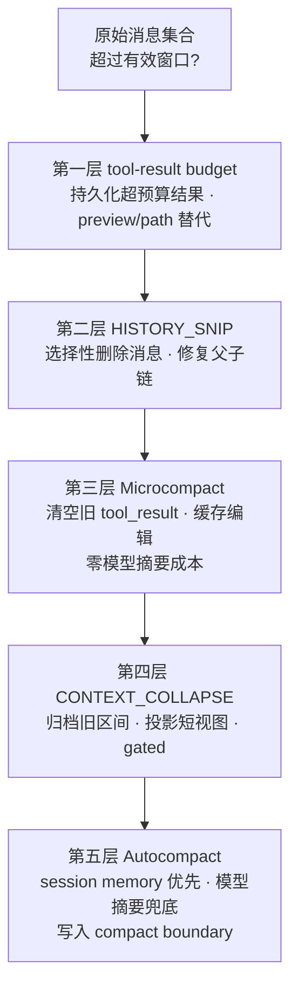

## 回答上一篇的问题

上一篇留下的问题是，你知道 Claude Code 出现过什么 bug，导致 prompt cache 大规模失效吗？

先给答案，一类典型原因是恢复会话时重新构造了一个“不完全相同”的 prompt 前缀。GitHub issue [#42338](https://github.com/anthropics/claude-code/issues/42338) 记录的复现是，`--continue` 只间隔几秒重新进入会话，`cache_read` 仍然变成 0，随后大约 512k token 被重新写入缓存。issue 将问题指向恢复流程中的 `deferred_tools_delta`，它改变了工具结果的排列，导致原本可以命中的前缀发生字节级变化。

这和缓存“自然过期”不是一回事。Anthropic 的 [prompt caching 文档](https://code.claude.com/docs/en/prompt-caching)说明，缓存按前缀做精确匹配；系统提示、工具定义、项目上下文和会话消息构成了前缀链，前面某一层发生变化，后面的缓存就不能继续复用。官方的[会话管理说明](https://claude.com/blog/using-claude-code-session-management-and-1m-context)也把 `/compact` 描述成“总结历史后继续”，而不是恢复一段原封不动的请求。

因此要把三件事分开，

- `resume/continue` 重建顺序发生回归，属于恢复 bug；
- `/compact`、模型切换、MCP 工具变化等主动改变请求前缀，属于设计上的重新建缓存；
- 等待超过缓存生命周期后自然重建，属于 TTL 到期。

本仓库的 `restored-src/` 可以确认压缩之后如何重建消息、怎样重新附加工具和项目状态，但不能单凭静态源码证明上述 issue 的线上复现，也不能把后续版本的修复结论倒灌到当前源码。至于本文的“四把手术刀”这个比喻，背景来自[源码泄露文章对四种压缩粒度的概括](https://juejin.cn/post/7623258895395110966)；下面的控制流和字段，以仓库中能直接读到的源码为准。

## 介绍本章的一些概念

- Claude Code 有**四种压缩机制，不是一种**，`HISTORY_SNIP`、Microcompact、Context Collapse、Autocompact 会在各自开关和触发条件满足时，以不同粒度参与每次 query 的请求准备流程；它们前面还有一个控制单条 API 消息工具结果总量的 Budget Reduction 层。因此图里是“五层”，概念上是“一个前置预算层 + 四种压缩机制”。
- **Context Collapse 的实现文件不在 2.1.88 source map 里**，能确认调用点、类型和持久化日志，不能确认风险评分、提交阈值和摘要生成，这是本文最重要的证据边界。
- 曾有 **1279 个会话连续压缩失败超过 50 次**，最严重的会话失败 3272 次、每天浪费约 25 万次 API 调用；2.1.88 已加熔断保护，**连续失败 3 次即停止重试**。
- 恢复会话时的缓存失效 bug（GitHub [#42338](https://github.com/anthropics/claude-code/issues/42338)）会让**约 512K token 被重新写入缓存**，根因指向 `deferred_tools_delta` 改变了工具结果的排列顺序。
- Autocompact **先尝试 session memory（零 API 成本）**，内容不足或边界不可信时才回退到模型摘要；两者组成一条回退链。

> ⚠️ **证据边界**，当前 `restored-src/` 能看到 `snipCompact.js`、`snipProjection.js`、`cachedMicrocompact.js` 和 `contextCollapse` 的调用点、类型、持久化逻辑，但对应的 gated implementation 并不完整。本文可以确定"它怎样接入、返回什么、怎样持久化"，不能臆造 snip 的选择启发式、缓存编辑器的具体删除策略，或 Context Collapse 的风险评分和提交阈值。详见 [known-gaps.md](https://github.com/TaurusGGBOY/claude-code-sourcemap/blob/main/docs/blog/reference/known-gaps.md)。

## 最小心智模型

把长会话的上下文压力想象成水位，每一层机制拦下一种"漏过去的水"，下一层只处理上一层没拦住的部分，



可以把它画成**一张"成本递增的防御阶梯"**（仓库中对应手绘版 `/images/posts/claude-code-source-reading-17/17-four-scalpels-handdrawn.png`）。最前面的 Budget Reduction 只是请求前的工具结果预算整形，不属于四把“压缩刀”；后面的机制越靠下越贵、越彻底，删除消息不需要模型，缓存编辑不重写内容，Context Collapse 的投影成本则受缺失实现限制，不能静态穷举；源码明确会把旧上下文交给模型做结构化重建的是 Autocompact 的传统摘要路径。层与层**不是互斥的 `if/else` 分支**，`HISTORY_SNIP` 和 Microcompact 可以在同一次 query 中先后执行，Context Collapse 先投影上下文，只有仍然需要时才进入最后的压缩判断。

### 压缩是否安全，要看状态有没有断

上下文过长时，源码能回答压缩机制，工程上还要回答验收：压缩前后检查 `tool_use/tool_result` 是否成对，确认关键任务状态、错误、权限约束和下一步仍在，再用固定任务做回归。前两项是消息协议与本章控制流直接支持的边界；“用黄金集比较压缩前后成功率”属于应补上的评测方法，不是源码已经提供的质量指标。

## 正文

本篇的主线是把长会话压力按成本和信息损失分层处理：先裁剪冗余，再压缩工具结果和缓存，随后才进入上下文重建或模型摘要。每一层都有自己的触发条件和可恢复边界，`compact` 不是一个无条件清空消息的按钮。

本文全部引用 `@anthropic-ai/claude-code@2.1.88` 的 `restored-src/` 还原源码；`restored-src/` 只用于定位证据，不表示内部仓库原始目录。代码块只保留证明控制流所需的字段，`// ...` 表示省略埋点、UI 消息和无关分支，每个代码块后标注证据位置。

### 一次 query 的“前置预算 + 四种压缩”顺序

还是用那张金额单位工单来观察。调查过程中，Claude Code 读过支付服务的目录、金额转换函数、回调样例和历史 issue，还启动了测试并让 teammate 在后台检查数据库。需要保留的内容包括已经确认的根因和被证伪的假设、工具调用产生的副作用及其结果、当前 worktree 与后台任务状态、下一轮必须接着做的动作。每次目录搜索的全部重复输出可以丢掉。

`queryLoop()` 在每次请求前先拿到 compact boundary 之后的消息，再按顺序执行各层机制，

```ts
let messagesForQuery = [...getMessagesAfterCompactBoundary(messages)]

messagesForQuery = await applyToolResultBudget(
  messagesForQuery,
  toolUseContext.contentReplacementState,
  // 省略 transcript 写入回调和 skipToolNames
)

let snipTokensFreed = 0
if (feature('HISTORY_SNIP')) {
  const snipResult = snipModule!.snipCompactIfNeeded(messagesForQuery)
  messagesForQuery = snipResult.messages
  snipTokensFreed = snipResult.tokensFreed
  if (snipResult.boundaryMessage) {
    yield snipResult.boundaryMessage
  }
}

const microcompactResult = await deps.microcompact(
  messagesForQuery,
  toolUseContext,
  querySource,
)
messagesForQuery = microcompactResult.messages

if (feature('CONTEXT_COLLAPSE') && contextCollapse) {
  const collapseResult = await contextCollapse.applyCollapsesIfNeeded(
    messagesForQuery,
    toolUseContext,
    querySource,
  )
  messagesForQuery = collapseResult.messages
}

const { compactionResult } = await deps.autocompact(
  messagesForQuery,
  toolUseContext,
  {
    systemPrompt,
    userContext,
    systemContext,
    toolUseContext,
    forkContextMessages: messagesForQuery,
  },
  querySource,
  tracking,
  snipTokensFreed,
)
```

> 证据，`restored-src/src/query.ts:365-468`（2.1.88 source map 还原源码），工具结果预算 → `HISTORY_SNIP` → Microcompact → Context Collapse → Autocompact 的调度顺序。

这个顺序本身就是设计，先做局部、便宜、不会生成摘要的处理，再尝试投影旧上下文，最后才允许一次完整重建。`snipTokensFreed` 会传给 Autocompact，因为最后一个 assistant message 里的历史 usage 仍反映删除前的大小（见下文"Token 估算与预算追踪"）。

### 前置层｜Budget Reduction 先控制单个 API message 的工具结果总量

Budget Reduction 容易和 Microcompact 混在一起，但它们处理的不是同一个问题。前者检查**每一个 API-level user message 中所有 tool result 的合计字符数**；后者处理已经变旧、需要清理或从缓存中删除的 tool result。Budget Reduction 发生在 Microcompact 之前，而且不调用 LLM。

`applyToolResultBudget(messages, state, writeToTranscript?, skipToolNames?)` 的入口很轻：`state` 是 `undefined` 时直接返回原消息，表示这项能力没有启用；有状态时才进入 `enforceToolResultBudget()`。默认单条消息预算是 `MAX_TOOL_RESULTS_PER_MESSAGE_CHARS = 200_000` 个字符，`getPerMessageBudgetLimit()` 允许 GrowthBook 的 `tengu_hawthorn_window` 用有限正数覆盖它，否则回退到这个默认值。

它不是把整段历史裁成固定长度，而是按消息独立判断。对每个消息，源码把结果分成已经做过决定的 frozen 项和本轮新出现的 fresh 项；只有 `frozenSize + freshSize > limit` 时，才从 fresh 项中选择足够大的结果持久化。已经发送过且未被替换的结果会被冻结，后续不会为了新的阈值再改写，这样不会破坏 prompt cache 的前缀稳定性。

```ts [pseudocode]
const limit = getPerMessageBudgetLimit()

for (const userMessage of messages) {
  const { frozen, fresh } = partitionByPriorDecision(userMessage)
  if (size(frozen) + size(fresh) <= limit) continue

  const selected = selectFreshToReplace(fresh, frozen, limit)
  for (const toolResult of selected) {
    const persisted = await persistToolResult(
      toolResult.content,
      toolResult.toolUseId,
    )
    replaceWithPreviewAndPath(persisted)
  }
}
```

替换后的模型可见内容不是语义摘要，而是一个 `<persisted-output>` 结构，包含原始大小、完整文件路径、前部 preview，若还有未展示内容则追加 `...`。完整结果仍在磁盘上；写入失败时保留原内容，不会凭空给模型一个不完整的成功替身。对于声明 `maxResultSizeChars: Infinity` 的工具（例如 Read），这层会跳过它们，仍由工具自己的结果上限负责。

#### 模型想要 preview 之外的内容怎么办？

这里的 preview 不是给结果做语义摘要，而是给模型一段可定位的入口。`generatePreview()` 最多取前 2,000 字节，优先在换行处结束；如果后面还有内容，`buildLargeToolResultMessage()` 会保留 `...`，并同时写入完整文件路径。因此，模型真正收到的是一个普通的 `tool_result` 文本，而不是一个可以自动展开的文件引用。

如果前 2KB 没有回答当前问题，模型需要根据路径再次调用 `Read`，必要时配合 `offset` 和 `limit` 分段读取。Claude Code 不会因为文件已经落盘，就把全文隐式追加到下一次 prompt；模型不发起这次读取，后面的内容就不会进入它的上下文。反过来，`Read` 返回的又是一次新的 `tool_result`，仍然要经过同一条 query loop。

这也解释了“持久化”与“模型可见”不是一回事：持久化保证完整结果有一个本地副本，preview 只决定当前这一轮模型先看到什么。

#### 预览替换会不会破坏 prompt cache？

对一个刚产生、尚未发送过的超大结果，替换发生在它第一次进入 API 消息之前；Claude Code 没有改写已经缓存的历史前缀。消息级预算还会按 `tool_use_id` 记录决定：已经替换的结果后续复用完全相同的 preview，已经原样发送过的结果则冻结，不会为了后来的预算变化再 事后 改写。这样做的目的就是让同一段前缀保持字节一致。

因此，预览替换本身通常不会让已有缓存前缀失效；真正会改变缓存命中范围的是后续对历史消息内容的清理、压缩或顺序重建。这个边界要和“结果被保存到了磁盘”分开理解。

因此两者可以这样区分，

| 机制 | 触发维度 | 模型看到的变化 | 完整结果在哪里 |
| --- | --- | --- | --- |
| Budget Reduction | 单个 API message 的 tool result 合计超过字符预算 | 持久化大结果，以 preview/path 替换正文 | 磁盘文件 |
| 时间型 Microcompact | 距离最近 assistant message 的时间间隔达到阈值 | 更早的 compactable result 改成 cleared marker | 清理函数本身不创建持久化副本；原始历史是否仍可恢复取决于 transcript 后续记录与裁剪路径 |
| 缓存型 Microcompact | 缓存编辑器的数量/保留策略 | 消息数组可以不变，API 追加 cache edits | 服务端缓存按 tool use ID 删除 |

> 证据，`restored-src/src/query.ts:365-394`（请求前调用）；`restored-src/src/utils/toolResultStorage.ts:421-434,739-909,924-936`（阈值、持久化替换和入口）；`restored-src/src/constants/toolLimits.ts:49`（200,000 字符默认值）。

### 第一刀｜HISTORY_SNIP 只剪掉已经不值得携带的消息

#### 接入点｜功能开关和读取投影

`query.ts` 只在 `feature('HISTORY_SNIP')` 为真时动态加载 snip 模块。读取历史时，`getMessagesAfterCompactBoundary()` 还会决定是否把已经剪掉的消息从当前视图中投影掉，

```ts
export function getMessagesAfterCompactBoundary<
  T extends Message | NormalizedMessage,
>(
  messages: T[],
  options?: { includeSnipped?: boolean },
): T[] {
  const boundaryIndex = findLastCompactBoundaryIndex(messages)
  const sliced = boundaryIndex === -1 ? messages : messages.slice(boundaryIndex)

  if (!options?.includeSnipped && feature('HISTORY_SNIP')) {
    const { projectSnippedView } =
      require('../services/compact/snipProjection.js')
    return projectSnippedView(sliced as Message[]) as T[]
  }
  return sliced
}
```

> 证据，`restored-src/src/utils/messages.ts:4618,4643-4653`（2.1.88 source map 还原源码），boundary 查找与 snip 视图投影；`query.ts:115-116` 的动态 require 确认 `snipCompact.js` 只在功能开关打开时加载。

两个容易漏掉的参数语义，

- `options` 可以是 `undefined`；没有 options 时仍然默认投影 snipped view。
- `includeSnipped` 是可选布尔值，默认等价于 `false`。传 `true` 时跳过投影，返回最后一个 compact boundary 之后的原始切片；功能开关关闭时也直接返回切片。

所以 `HISTORY_SNIP` 不是"把数组截成最后 N 条"。它保留了完整 transcript 的可能性，同时在 query 读取和恢复时使用一个不包含已剪片段的视图。

#### 删除消息之后，还要修复 transcript 链

snip 的 boundary 元数据里会带 `removedUuids`。恢复 transcript 时，`applySnipRemovals()` 做的事情可以概括成，

```ts
const toDelete = new Set<UUID>()
for (const entry of messages.values()) {
  for (const uuid of entry.snipMetadata?.removedUuids ?? []) {
    toDelete.add(uuid)
  }
}

const deletedParent = new Map<UUID, UUID | null>()
for (const uuid of toDelete) {
  const entry = messages.get(uuid)
  if (!entry) continue
  deletedParent.set(uuid, entry.parentUuid)
  messages.delete(uuid)
}

for (const [uuid, msg] of messages) {
  if (!msg.parentUuid || !toDelete.has(msg.parentUuid)) continue
  messages.set(uuid, {
    ...msg,
    parentUuid: resolveThroughDeletedChain(msg.parentUuid, deletedParent),
  })
}
```

> 证据，`restored-src/src/utils/sessionStorage.ts:1982-1998`（2.1.88 source map 还原源码），snip 删除与父链修复；恢复入口在 `sessionStorage.ts:3705` 附近调用 `applySnipRemovals(messages)`。

实际实现还会对删除链做路径压缩。也就是说，snip 允许删除中间的一段消息，而不是只能从头部或尾部截断；剩余消息的 `parentUuid` 会越过被删节点，重新连到仍存在的祖先，`--resume` 读取 transcript 时不会留下悬空父节点。`QueryEngine` 还注册了一个 replay hook，重放过程中遇到 snip boundary 就用 `{ force: true }` 重新计算一次 snip 结果。这说明 snip 不是一次只存在于内存的数组操作，它要在"实时 query"和"从 transcript 恢复"两条路径上保持一致。

#### 这把刀的源码边界

当前 source map 没有 `snipCompact.js` 和 `snipProjection.js` 的主体实现，所以可以确认，输出至少包含新的 `messages`、已释放 token 数 `tokensFreed` 以及可选的 boundary message；被删除的 UUID 会进入 transcript 元数据并在恢复时删除、重连；`queryLoop` 会用 `tokensFreed` 修正 Autocompact 的阈值判断。但不能从当前文件确认"哪些 tool result 一定会被选中"、选择窗口和触发阈值是什么。把"它会清理巨大的旧工具输出"作为设计意图是合理推断，把它写成当前源码已经列出的固定规则则越过了证据边界。

### 第二刀｜Microcompact 优先削减工具结果的成本

#### 入口函数的三组参数

```ts
export async function microcompactMessages(
  messages: Message[],
  toolUseContext?: ToolUseContext,
  querySource?: QuerySource,
): Promise<MicrocompactResult>
```

> 证据，`restored-src/src/services/compact/microCompact.ts:253`（2.1.88 source map 还原源码），Microcompact 入口签名。

`messages` 是必需的当前消息视图；`toolUseContext` 可以是 `undefined`，此时缓存编辑路径退回 `getMainLoopModel()` 获取模型；`querySource` 也是可选的，缓存编辑路径用它判断是不是主线程。`QuerySource` 不是任意字符串都能在静态源码中穷举，当前实现明确区分了主线程和 session memory、prompt suggestion 等 forked agent。

入口先运行 time-based microcompact，成功就直接返回；否则在 `CACHED_MICROCOMPACT` 开关打开、模型受支持且是主线程时，才尝试缓存编辑路径，

```ts
const timeBasedResult = maybeTimeBasedMicrocompact(messages, querySource)
if (timeBasedResult) {
  return timeBasedResult
}

if (feature('CACHED_MICROCOMPACT')) {
  const mod = await getCachedMCModule()
  const model = toolUseContext?.options.mainLoopModel ?? getMainLoopModel()
  if (
    mod.isCachedMicrocompactEnabled() &&
    mod.isModelSupportedForCacheEditing(model) &&
    isMainThreadSource(querySource)
  ) {
    return await cachedMicrocompactPath(messages, querySource)
  }
}

return { messages }
```

> 证据，`restored-src/src/services/compact/microCompact.ts:253-290`（2.1.88 source map 还原源码），time-based 优先、缓存编辑其次、无动作兜底；`microCompact.ts:56-66` 确认 `cachedMicrocompact.js` 通过动态 import 加载，实现文件不在 source map 中。

这里的 `return { messages }` 很重要，外部构建、不支持的模型、子 agent 或功能未打开时，Microcompact 可以完全不动作，后续压力交给 Autocompact。

#### 路径一｜时间间隔触发时直接改内容

时间路径的配置来自动态配置 `tengu_slate_heron`，静态默认值是，

```ts
const TIME_BASED_MC_CONFIG_DEFAULTS: TimeBasedMCConfig = {
  enabled: false,
  gapThresholdMinutes: 60,
  keepRecent: 5,
}
```

> 证据，`restored-src/src/services/compact/timeBasedMCConfig.ts:30,36`（2.1.88 source map 还原源码），静态默认配置与 `getTimeBasedMCConfig()` 的远程覆盖入口。

这些不是所有运行时环境都必然采用的值，`getTimeBasedMCConfig()` 会读取远程配置覆盖它们。源码能确认的控制流是，只有配置启用、query 来源符合条件、最近一个 assistant 的时间戳可用，且间隔达到或超过 `gapThresholdMinutes` 时，才会产生 trigger。

所以，`[Old tool result content cleared]` 不是“某个 tool_result 超过 2KB”或“上下文一变大”就会出现的通用错误提示。它只出现在时间型 Microcompact 的本地清理路径：当前是主线程、功能开关已启用，而且距离最近一次主线程 assistant 消息已经达到配置的闲置阈值。静态默认值是 60 分钟，但默认总开关关闭，实际部署还可能通过 `tengu_slate_heron` 改写 `enabled`、`gapThresholdMinutes` 和 `keepRecent`。

这个阈值比较的是“现在”与最近一次 assistant 消息的时间戳，不是某个工具结果自己的产生时间；“old”也不是按每个结果单独计时，而是按 compactable tool use 在消息序列中的先后顺序定义。默认保留最近 5 个，且实现会用 `Math.max(1, keepRecent)`，避免配置为 0 时把所有结果都清掉。

触发后，代码先收集 `COMPACTABLE_TOOLS` 对应的 tool use ID，按出现顺序保留最后 `keepRecent` 个；实际保留数经过 `Math.max(1, config.keepRecent)`，避免 `keepRecent` 为 0 时把所有结果都清空。这里的“old”不是逐条比较每个 `tool_result` 自己的时间戳，而是**按 transcript 中的出现顺序**定义：全部 compactable ID 中，排在最近 `keepRecent` 个之前的 ID 都进入清理集合。例如 T1 到 T7 共 7 个结果、`keepRecent = 5` 时，T1、T2 是 old，T3 到 T7 保留。然后遍历 user message 的 content block，

```ts
if (
  block.type === 'tool_result' &&
  clearSet.has(block.tool_use_id) &&
  block.content !== TIME_BASED_MC_CLEARED_MESSAGE
) {
  tokensSaved += calculateToolResultTokens(block)
  touched = true
  return { ...block, content: TIME_BASED_MC_CLEARED_MESSAGE }
}
```

> 证据，`restored-src/src/services/compact/microCompact.ts:446-500`（2.1.88 source map 还原源码），替换逻辑；`microCompact.ts:36,41,138` 分别定义 cleared marker、`COMPACTABLE_TOOLS` 与 `calculateToolResultTokens()`。

它保留 `tool_result` block 和 `tool_use_id`，只把旧结果内容替换成固定的 cleared marker。工具调用仍然保留，模型也不需要重新总结这段结果，程序只把已经不值得重复发送的大段结果变成一个短占位符。

这里还要区分“清理”和“持久化”。时间型 Microcompact 的替换代码只写入固定 marker，并没有调用 `persistToolResult()` 去为原文新建 `tool-results` 文件。如果这段结果此前已经通过 Budget Reduction 持久化过，原来的文件仍可能存在；如果此前没有持久化，不能因为看到了 cleared marker 就推断有一个可供 `Read` 的完整副本。模型当前能看到的只是 marker，是否还能从本地 transcript 或其他历史记录恢复，则取决于后续的记录、snip 和 compact 路径，不能由这个 marker 本身保证。

如果没有可清除的结果，或估算出的 `tokensSaved` 为 0，函数返回 `null`，入口继续尝试缓存编辑路径。成功清理后还会重置 Microcompact 的模块状态，并通知 prompt-cache break detector，下一次 cache read 变小是本次主动清理造成的，不应被当成异常断缓存（见下文"缓存断点策略"）。

#### 路径二｜缓存编辑时消息本身可以不变

缓存编辑路径先把当前 user message 中可压缩的 tool result 注册到缓存编辑器，再询问哪些结果需要删除，

```ts
const toolsToDelete = mod.getToolResultsToDelete(state)

if (toolsToDelete.length > 0) {
  const cacheEdits = mod.createCacheEditsBlock(state, toolsToDelete)
  if (cacheEdits) {
    pendingCacheEdits = cacheEdits
  }

  return {
    messages,
    compactionInfo: {
      pendingCacheEdits: {
        trigger: 'auto',
        deletedToolIds: toolsToDelete,
        baselineCacheDeletedTokens: baseline,
      },
    },
  }
}
```

> 证据，`restored-src/src/services/compact/microCompact.ts:89-135` 附近的缓存编辑路径（2.1.88 source map 还原源码）；`query.ts:870-888` 确认 boundary 等 API 返回真实的 `cache_deleted_input_tokens` 后再写入。`getToolResultsToDelete()` / `createCacheEditsBlock()` 来自动态 import 的 `cachedMicrocompact.js`，实现文件不在 source map 中。

这里 `messages` 原样返回。`cache_reference` 和 `cache_edits` 会在 API 层附加，boundary 也要等 API 返回真实的 `cache_deleted_input_tokens` 后再写入，客户端不用估算值冒充服务端实际删除量。

这条路径与时间型路径的缓存含义也不同：缓存编辑会让服务端删除选中的缓存引用，下一次 `cache_read` 变小是预期结果，但不是把整个 prompt cache 清空；时间型路径则认为长时间闲置后缓存已经不温热，于是直接改写本地发送视图，并主动把这次变化标记为预期的 cache deletion。两者都不表示“模型自动获得了被删除的原文”。

两条路径的前提不同，时间间隔超过阈值时，源码认为服务端缓存已不再温热，所以直接改 prompt 内容；缓存编辑路径假定缓存仍然可编辑，只告诉 API 删除哪些缓存引用。因此 Microcompact 解决的是"工具结果太贵"，而不是"整段对话需要一份新的语义摘要"，它可以让下一次请求变小，却不会负责重建计划、项目上下文或历史结论。

### 第三刀｜CONTEXT_COLLAPSE 把旧对话变成可重放的投影视图

#### 它不是直接替换 REPL 消息数组

`queryLoop()` 在 Autocompact 之前调用，

```ts
if (feature('CONTEXT_COLLAPSE') && contextCollapse) {
  const collapseResult = await contextCollapse.applyCollapsesIfNeeded(
    messagesForQuery,
    toolUseContext,
    querySource,
  )
  messagesForQuery = collapseResult.messages
}
```

> 证据，`restored-src/src/query.ts:429-451`（2.1.88 source map 还原源码），Context Collapse 调用点（`query.ts:441` 的 `applyCollapsesIfNeeded()`）。`contextCollapse` 实例来自动态 import，实现文件不在当前 source map 中。

调用点旁边的注释给出了关键区别，collapsed view 是读取时的 projection，完整历史仍在 REPL 中；summary message 存在 collapse store，而不是直接塞进 REPL 数组；`projectView()` 会重放 commit log，当前 turn 内的 `state.messages` 复用已经得到的视图。

这使它和传统 compact 的语义不同，传统 compact 生成新 boundary 后用新数组替换旧消息；Context Collapse 保留完整历史和提交记录，query 时读取一个较小的视图；视图需要恢复时，可以根据 commit log 和 snapshot 再次投影，而不是只剩一段不可逆的摘要。

#### 持久化结构能确认什么

虽然 Context Collapse 的主体目录没有随当前 source map 提供，但 `types/logs.ts` 暴露了两类日志。

提交记录包含，

```ts
type ContextCollapseCommitEntry = {
  type: 'marble-origami-commit'
  sessionId: UUID
  collapseId: string
  summaryUuid: string
  summaryContent: string
  summary: string
  firstArchivedUuid: string
  lastArchivedUuid: string
}
```

快照记录包含，

```ts
type ContextCollapseSnapshotEntry = {
  type: 'marble-origami-snapshot'
  sessionId: UUID
  staged: Array<{
    startUuid: string
    endUuid: string
    summary: string
    risk: string
    stagedAt: number
  }>
  armed: boolean
  lastSpawnTokens: number
}
```

> 证据，`restored-src/src/types/logs.ts:255-290`（2.1.88 source map 还原源码），commit 与 snapshot 的类型定义；`logs.ts:43-44` 确认 commit 有序收集、snapshot 是 last-wins 状态。

`sessionStorage` 把 commit 记录按顺序收集，把 snapshot 处理成最后一份状态；遇到 compact boundary 时丢弃旧 collapse 日志。恢复会话时，`ResumeConversation` 在功能开关打开的情况下调用 `restoreFromEntries(commits, snapshot)`（`sessionStorage.ts:1539` 附近的注释确认它重建 commit log）。因此可以直接确认它采用"区间 + 提交日志 + 快照"的持久化模型。

#### 它怎样和 Autocompact 错开

Context Collapse 的核心目的，就是在自动摘要之前先拥有自己的上下文 headroom。`shouldAutoCompact()` 因此有三层保护，`querySource === 'session_memory'` 或 `'compact'` 时返回 `false`，避免 forked compaction agent 递归压缩；Context Collapse 的 agent 使用 `querySource === 'marble_origami'` 时返回 `false`，避免它的 cleanup 重置主线程状态；Context Collapse 已启用时，主线程的 Autocompact 被抑制，让 collapse 的提交/阻塞流程负责头部空间。

发生真实 API `prompt-too-long` 时，queryLoop 还会先尝试 `recoverFromOverflow()`，如果 Context Collapse 已经提交了新的区间，就把恢复后的消息视图放回 state 并继续下一轮；只有恢复没有产生进展时，才继续走 reactive compact 或把错误交给用户。

源码注释提到 collapse 有提交和阻塞的百分比区间，但当前仓库没有提供对应的 `contextCollapse` 实现文件。可以确认"它会先投影、能持久化、能从 overflow 恢复，以及会抑制 Autocompact"，不能把注释中的百分比当成已经读到的完整算法，更不能补写风险评分或摘要生成规则。

### 第四刀｜Autocompact 负责最后的完整重建

#### 模型窗口大小从哪里来

自动压缩需要先知道一条容量线。这个值由 `getContextWindowForModel(model: string, betas?: string[]): number` 计算，单位是 token。`model` 接收当前模型名称，是由模型选择链提供的开放字符串；`betas` 是可选的 beta 标记数组，传 `undefined` 或 `[]` 都不会命中 beta 的 1M 分支。这里判断的是客户端用于预算的窗口值。

在 2.1.88 中，函数按下面的顺序判断，命中一项就返回，后面的规则不再执行。

| 顺序 | 条件 | 返回的窗口值 |
| --- | --- | --- |
| 1 | `USER_TYPE === 'ant'`，且 `CLAUDE_CODE_MAX_CONTEXT_TOKENS` 经十进制 `parseInt` 后大于 0 | 使用解析值；无有效正数则继续判断 |
| 2 | `has1mContext(model)` 为真，即模型名包含大小写不敏感的 `[1m]`，且未禁用 1M | `1_000_000` |
| 3 | `getModelCapability(model)` 命中缓存，且 `max_input_tokens >= 100_000` | 使用该字段；若禁用 1M 且字段超过 200K，则返回 200K |
| 4 | `betas` 包含 `context-1m-2025-08-07`，且 `modelSupports1M(model)` 为真 | `1_000_000` |
| 5 | `getSonnet1mExpTreatmentEnabled(model)` 命中 Sonnet 4.6 的实验配置 | `1_000_000` |
| 6 | 内部用户的 `resolveAntModel(model)` 结果提供了非零 `contextWindow` | 使用该配置值 |
| 7 | 前面的条件均未命中 | `MODEL_CONTEXT_WINDOW_DEFAULT = 200_000` |

第 4 项的支持判断仍是本地名称规则：canonical model 包含 `claude-sonnet-4` 或 `opus-4-6`。第 5 项要求 canonical model 包含 `sonnet-4-6`，没有显式 `[1m]`，且 `clientDataCache['coral_reef_sonnet']` 严格等于字符串 `'true'`；是否命中取决于运行时配置。

`CLAUDE_CODE_DISABLE_1M_CONTEXT` 经 `isEnvTruthy()` 解释，忽略大小写和两端空格后，`1`、`true`、`yes`、`on` 表示启用禁用开关，其他字符串或未设置表示关闭。它会关闭 `[1m]`、beta 和实验这三条 1M 路径，并限制能力缓存返回的较大值；内部显式窗口覆盖仍位于这些判断之前。环境数值使用 `parseInt`，这里也没有额外的整串数字校验。

> 证据，`restored-src/src/utils/context.ts:9,31-111`（窗口常量、优先级和 1M 判断）；`restored-src/src/utils/envUtils.ts:32-37`（环境布尔值）。

能力缓存需要单独说明。`getModelCapability()` 只对内部用户、`firstParty` provider 和官方 Anthropic Base URL 的组合生效；普通官方用户、第三方网关和云 provider 在这条路径上都会返回 `undefined`。因此一个未命中其他规则的自定义模型，在客户端会回退到 200K。这个回退值不能证明服务端确实支持 200K；给名称加上 `[1m]` 同样不能让服务端凭空获得 1M 能力。Models API 的获取与缓存过程，以及各家接口的字段差异，放在[第 36 篇](/posts/claude-code-source-reading-36/)展开。

> 证据，`restored-src/src/utils/model/modelCapabilities.ts:46-51,75-83`（能力缓存的适用范围与未命中返回值）。

#### 先算有效窗口，再算自动压缩阈值

`getEffectiveContextWindowSize(model)` 的参数是当前主循环模型名，源码把它交给 `getContextWindowForModel()` 和 `getMaxOutputTokensForModel()`；它不是一个可以在本文静态列举所有模型名的开放字符串。

```ts
const MAX_OUTPUT_TOKENS_FOR_SUMMARY = 20_000

export function getEffectiveContextWindowSize(model: string): number {
  const reservedTokensForSummary = Math.min(
    getMaxOutputTokensForModel(model),
    MAX_OUTPUT_TOKENS_FOR_SUMMARY,
  )
  let contextWindow = getContextWindowForModel(model, getSdkBetas())

  const autoCompactWindow = process.env.CLAUDE_CODE_AUTO_COMPACT_WINDOW
  if (autoCompactWindow) {
    const parsed = parseInt(autoCompactWindow, 10)
    if (!isNaN(parsed) && parsed > 0) {
      contextWindow = Math.min(contextWindow, parsed)
    }
  }

  return contextWindow - reservedTokensForSummary
}
```

> 证据，`restored-src/src/services/compact/autoCompact.ts:30-60`（2.1.88 source map 还原源码），有效窗口计算；`MAX_OUTPUT_TOKENS_FOR_SUMMARY = 20_000` 在 `autoCompact.ts:30`。

所以有效窗口等于模型窗口减去最多 `20_000` 的摘要输出预留。`CLAUDE_CODE_AUTO_COMPACT_WINDOW` 没设置、经 `parseInt` 得到 `NaN` 或小于等于 0 时被忽略；有效值只能把窗口再缩小。它限制的是自动压缩所用预算，不会增大服务端容量。

自动压缩阈值再减去固定的 `13_000`，

```ts
export const AUTOCOMPACT_BUFFER_TOKENS = 13_000

export function getAutoCompactThreshold(model: string): number {
  const effectiveContextWindow = getEffectiveContextWindowSize(model)
  const autocompactThreshold =
    effectiveContextWindow - AUTOCOMPACT_BUFFER_TOKENS

  const envPercent = process.env.CLAUDE_AUTOCOMPACT_PCT_OVERRIDE
  if (envPercent) {
    const parsed = parseFloat(envPercent)
    if (!isNaN(parsed) && parsed > 0 && parsed <= 100) {
      const percentageThreshold = Math.floor(
        effectiveContextWindow * (parsed / 100),
      )
      return Math.min(percentageThreshold, autocompactThreshold)
    }
  }

  return autocompactThreshold
}
```

> 证据，`restored-src/src/services/compact/autoCompact.ts:62-100`（2.1.88 source map 还原源码），自动压缩阈值计算；`AUTOCOMPACT_BUFFER_TOKENS = 13_000` 在 `autoCompact.ts:62`。

`CLAUDE_AUTOCOMPACT_PCT_OVERRIDE` 只有在大于 0 且不超过 100 时才生效；空字符串、`NaN`、负数、0 或超过 100 都回退到默认阈值。即使百分比合法，最终也取它和"有效窗口减 13,000"之间的较小值。

例如，窗口解析结果为 200K、`getMaxOutputTokensForModel()` 返回值至少为 20K，且没有窗口或百分比覆盖时，有效窗口是 `200,000 - 20,000 = 180,000`，自动压缩阈值是 `180,000 - 13,000 = 167,000`。同样的输出预留放到 1M 窗口，阈值就是 967,000。实际值必须代入当前模型的输出预算和环境配置，不能把 167K 当成所有模型共用的固定线。

#### 自动压缩不是永远打开

```ts
export function isAutoCompactEnabled(): boolean {
  if (isEnvTruthy(process.env.DISABLE_COMPACT)) {
    return false
  }
  if (isEnvTruthy(process.env.DISABLE_AUTO_COMPACT)) {
    return false
  }
  const userConfig = getGlobalConfig()
  return userConfig.autoCompactEnabled
}
```

> 证据，`restored-src/src/services/compact/autoCompact.ts:147-158`（2.1.88 source map 还原源码），自动压缩的总开关。

`DISABLE_COMPACT` 同时关闭手动和自动 compact；`DISABLE_AUTO_COMPACT` 只关闭自动路径，源码注释明确保留手动 `/compact`；两个环境变量都没有生效时，最终取全局配置的 `autoCompactEnabled`。

`shouldAutoCompact()` 的参数里有一个特别容易被忽略的 `snipTokensFreed = 0` 默认值。它先排除 `querySource` 为 `'session_memory'`、`'compact'` 和 Context Collapse agent 的调用，再检查 reactive-only flag、自动压缩配置和 Context Collapse 状态，最后计算，

```ts
const tokenCount = tokenCountWithEstimation(messages) - snipTokensFreed
const threshold = getAutoCompactThreshold(model)
const effectiveWindow = getEffectiveContextWindowSize(model)

const { isAboveAutoCompactThreshold } = calculateTokenWarningState(
  tokenCount,
  model,
)

return isAboveAutoCompactThreshold
```

> 证据，`restored-src/src/services/compact/autoCompact.ts:160-240`（2.1.88 source map 还原源码），`shouldAutoCompact()` 的判定；`query.ts:638` 确认 `tokenCountWithEstimation(messagesForQuery) - snipTokensFreed`。

`threshold` 和 `effectiveWindow` 还用于日志与 warning state；真正的 token 数会减去 snip 已经释放的粗略增量，否则 assistant usage 仍是删除前的数字，刚做完局部清理却马上触发完整压缩。

#### autoCompactIfNeeded() 先走 session memory

入口签名揭示了它不是简单的 `compact(messages)`，

```ts
export async function autoCompactIfNeeded(
  messages: Message[],
  toolUseContext: ToolUseContext,
  cacheSafeParams: CacheSafeParams,
  querySource?: QuerySource,
  tracking?: AutoCompactTrackingState,
  snipTokensFreed?: number,
): Promise<{
  wasCompacted: boolean
  compactionResult?: CompactionResult
  consecutiveFailures?: number
}>
```

> 证据，`restored-src/src/services/compact/autoCompact.ts:241`（2.1.88 source map 还原源码），Autocompact 入口签名。

参数的源码语义是，`messages` 是已经过前面几把刀的当前视图；`toolUseContext` 提供主循环上下文，模型名从 `toolUseContext.options.mainLoopModel` 取得；`cacheSafeParams` 是压缩 fork 或 API 请求可复用的稳定参数；`querySource` 可选，当前逻辑明确比较 `'compact'`、`'session_memory'`、`'marble_origami'`、`'sdk'` 和 `repl_main_thread` 前缀，其他运行时来源不能静态穷举；`tracking` 携带连续失败、上次压缩 turn 等链路状态；`snipTokensFreed` 缺省时由 `shouldAutoCompact()` 按 0 处理。

控制流可以简化成，

```ts
if (isEnvTruthy(process.env.DISABLE_COMPACT)) {
  return { wasCompacted: false }
}

if (
  tracking?.consecutiveFailures !== undefined &&
  tracking.consecutiveFailures >= MAX_CONSECUTIVE_AUTOCOMPACT_FAILURES
) {
  return { wasCompacted: false }
}

const shouldCompact = await shouldAutoCompact(
  messages,
  toolUseContext.options.mainLoopModel,
  querySource,
  snipTokensFreed,
)
if (!shouldCompact) {
  return { wasCompacted: false }
}

const sessionMemoryResult = await trySessionMemoryCompaction(
  messages,
  toolUseContext.agentId,
  getAutoCompactThreshold(toolUseContext.options.mainLoopModel),
)
if (sessionMemoryResult) {
  runPostCompactCleanup(querySource)
  return { wasCompacted: true, compactionResult: sessionMemoryResult }
}

const compactionResult = await compactConversation(
  messages,
  toolUseContext,
  cacheSafeParams,
  true,
  undefined,
  true,
  recompactionInfo,
)
runPostCompactCleanup(querySource)
return { wasCompacted: true, compactionResult, consecutiveFailures: 0 }
```

> 证据，`restored-src/src/services/compact/autoCompact.ts:241-345`（2.1.88 source map 还原源码），熔断检查 → 阈值判断 → session memory 优先 → 传统摘要兜底；`MAX_CONSECUTIVE_AUTOCOMPACT_FAILURES = 3` 在 `autoCompact.ts:70`。

真实代码还处理 cache break baseline、`lastSummarizedMessageId`、日志和异常。连续失败达到 3 次后，当前会话触发 circuit breaker，避免每一轮都向 API 发起必然失败的压缩请求（见下文"历史事故"）。

#### Autocompact 内部的第一选择｜session memory

session memory 是 Autocompact 的一种结果生成方式，不属于独立的第五层。启用判断是，

```ts
if (isEnvTruthy(process.env.ENABLE_CLAUDE_CODE_SM_COMPACT)) {
  return true
}
if (isEnvTruthy(process.env.DISABLE_CLAUDE_CODE_SM_COMPACT)) {
  return false
}

const sessionMemoryFlag = getFeatureValue_CACHED_MAY_BE_STALE(
  'tengu_session_memory',
  false,
)
const smCompactFlag = getFeatureValue_CACHED_MAY_BE_STALE(
  'tengu_sm_compact',
  false,
)
return sessionMemoryFlag && smCompactFlag
```

> 证据，`restored-src/src/services/compact/sessionMemoryCompact.ts:405-415`（2.1.88 source map 还原源码），session memory 压缩的启用优先级。

优先级要记住，`ENABLE_CLAUDE_CODE_SM_COMPACT` 为 truthy 时先返回 `true`；否则 `DISABLE_CLAUDE_CODE_SM_COMPACT` 为 truthy 时返回 `false`；没有环境变量时，两个动态 flag 必须同时为真，且它们的静态默认值都是 `false`。

配置默认值是，

```ts
export const DEFAULT_SM_COMPACT_CONFIG: SessionMemoryCompactConfig = {
  minTokens: 10_000,
  minTextBlockMessages: 5,
  maxTokens: 40_000,
}
```

> 证据，`restored-src/src/services/compact/sessionMemoryCompact.ts:57-65,102`（2.1.88 source map 还原源码），默认配置与 `initSessionMemoryCompactConfig()` 的远程覆盖入口。

`initSessionMemoryCompactConfig()` 每个进程只初始化一次，从 `tengu_sm_compact_config` 读取远程配置；`minTokens`、`minTextBlockMessages` 和 `maxTokens` 只有在远程值为正数时才覆盖默认值，0、负数或未提供都会回退。

`trySessionMemoryCompaction()` 的流程是，

1. 等待 session memory extraction 完成，读取最近一次已总结的 message UUID 和 session memory 内容；
2. 没有 memory 文件、文件仍是空模板，或已总结 UUID 在当前消息集合中找不到时返回 `null`，交给传统 compact；
3. 如果是 resumed session、没有已总结 UUID，就从当前消息末尾开始向前扩展保留区；
4. `calculateMessagesToKeepIndex()` 以最近一次总结之后的消息为起点，向前扩展到 `minTokens` 和 `minTextBlockMessages`，但不超过 `maxTokens`，也不越过最近的 compact boundary；
5. 调整起点以避免切断 `tool_use` / `tool_result` 对；
6. 读取 session memory，必要时截断过大的 section，生成 compact boundary、结构化摘要和保留消息；
7. 如果重建后的 token 数已经达到自动阈值，返回 `null` 让传统路径接管。

> 证据，`restored-src/src/services/compact/sessionMemoryCompact.ts:514-600,324`（2.1.88 source map 还原源码），`trySessionMemoryCompaction()` 主流程与 `calculateMessagesToKeepIndex()`。

它保留的内容由"上次 session memory 总结点 + token 下限 + 文本消息下限 + 工具调用完整性"共同决定，固定的"最后五条消息"并不是它的规则。构造结果时，摘要内容还会带上 transcript path；如果 session memory 被截断，会告诉模型完整内容仍可从 memory 文件读取。因此 session memory 的收益是，已有结构化状态时，不必再发起一次模型摘要请求；但它没有足够内容、边界不可信或结果仍然太大时，会干净地回退到传统 Autocompact。

#### 第二选择｜传统 compactConversation()

```ts
export async function compactConversation(
  messages: Message[],
  context: ToolUseContext,
  cacheSafeParams: CacheSafeParams,
  suppressFollowUpQuestions: boolean,
  customInstructions?: string,
  isAutoCompact: boolean = false,
  recompactionInfo?: RecompactionInfo,
): Promise<CompactionResult>
```

> 证据，`restored-src/src/services/compact/compact.ts:387`（2.1.88 source map 还原源码），传统模型摘要路径的签名。

可选值和默认值决定控制流，`suppressFollowUpQuestions` 是必需布尔值，自动压缩传 `true`，摘要完成后直接继续，不让模型再问一遍；`customInstructions` 可以是字符串或 `undefined`，它会和 `PreCompact` hook 返回的新指令合并；`isAutoCompact` 默认 `false`，`true` 时 hook 的 trigger 是 `'auto'`，失败时不显示手动 `/compact` 的错误通知；`recompactionInfo` 可以是 `undefined`，存在时记录这是压缩链中的再次压缩、上一次 turn 和自动阈值。

函数先计算 `preCompactTokenCount`，执行 `PreCompact` hook，然后生成 compact prompt。功能 flag `tengu_compact_cache_prefix` 的静态默认值是 `true`，打开时会优先尝试 forked agent 复用原请求前缀；如果没有得到有效摘要或路径报错，再回到普通摘要流。

压缩 agent 的工具权限是显式拒绝，

```ts
export function createCompactCanUseTool(): CanUseToolFn {
  return async () => ({
    behavior: 'deny' as const,
    message: 'Tool use is not allowed during compaction',
    decisionReason: {
      type: 'other' as const,
      reason: 'compaction agent should only produce text summary',
    },
  })
}
```

> 证据，`restored-src/src/services/compact/compact.ts:1125-1140,1191`（2.1.88 source map 还原源码），压缩 agent 的工具权限函数及其接入点。

所以传统 Autocompact 的模型任务是"阅读已有消息并产生摘要"，不是在压缩过程中继续执行 Bash、Read 或 MCP 工具。压缩请求本身如果遇到 `prompt-too-long`，代码会按 API round 从头部截掉一批消息并重试；摘要为空或返回 API error 时，压缩失败，不会把一个空摘要当成成功。

#### 压缩提示词要求模型交接哪些内容

沿着 `compactConversation()` 再往下看，`getCompactPrompt()` 生成的文本会被包装为一条 user 消息，追加到待总结的对话后面。它的拼接顺序是：禁止工具的前置指令、`BASE_COMPACT_PROMPT`、可选的 `Additional Instructions`，最后再次提醒不要调用工具。`customInstructions` 是开放字符串；`undefined`、空字符串或只有空白时不追加，有内容时按原文追加。前面的 `PreCompact` hook 也可以提供补充指令，合并时用户指令在前、hook 指令在后。

提示词的任务原文是：

```text
Your task is to create a detailed summary of the conversation so far, paying close attention to the user's explicit requests and your previous actions.
This summary should be thorough in capturing technical details, code patterns, and architectural decisions that would be essential for continuing development work without losing context.
```

这里的目标是让下一轮能够接着开发。提示词要求按时间顺序检查对话，保留用户的明确意图、已经采取的行动、技术决策、文件名、函数签名、代码片段、修改记录和错误修复，特别注意用户要求改变做法的反馈。上下文中已有的 `Compact Instructions` 等摘要要求，也要纳入这次总结。

> 证据，`restored-src/src/services/compact/prompt.ts:19-143,269-303`（前后置指令、基础模板和拼接）；`compact.ts:368-380,420-443`（hook 指令合并与摘要请求消息）。

#### 九部分摘要怎样变成下一轮看到的文本

基础模板明确要求以下九个部分。仍用金额单位工单来理解：下一轮既要知道“金额换算在哪里出错”，也要知道“用户后来补了什么限制、测试停在哪里”。

| 摘要标题 | 要交接的内容 |
| --- | --- |
| `1. Primary Request and Intent` | 用户的明确请求和意图 |
| `2. Key Technical Concepts` | 讨论过的重要概念、技术和框架 |
| `3. Files and Code Sections` | 查看、修改或创建的文件，文件为何重要，改动和适用的完整代码片段 |
| `4. Errors and fixes` | 错误、修复方式，以及用户对此的反馈 |
| `5. Problem Solving` | 已解决的问题和仍在进行的排查 |
| `6. All user messages` | 所有非工具结果的用户消息，保留反馈与意图变化 |
| `7. Pending Tasks` | 用户明确要求、尚未完成的任务 |
| `8. Current Work` | 压缩前一刻正在做的具体工作、文件和代码 |
| `9. Optional Next Step` | 与最近明确请求直接相关的下一步，如有；引用最近对话原文说明停在哪里 |

最后一项还有约束：已经结束的任务不能被擅自重新启动，下一步不能偏到无关工作或早已完成的旧请求。提示词要求引用最近对话的原话，是为了减少摘要转述带来的任务偏移。

模型被要求先输出 `<analysis>...</analysis>`，再输出 `<summary>...</summary>`。但前者只是起草阶段的文本，`formatCompactSummary()` 会把它删除，再把后者的标签替换成 `Summary:`，整理多余空行。因此，最终放回上下文的是下面这样的结构。方括号是本文的说明占位符：

```text
This session is being continued from a previous conversation that ran out of context. The summary below covers the earlier portion of the conversation.

Summary:
1. Primary Request and Intent:
   [用户请求]
2. Key Technical Concepts:
   [技术概念]
3. Files and Code Sections:
   [文件、修改和代码]
4. Errors and fixes:
   [错误及修复]
5. Problem Solving:
   [已解决和仍在排查的问题]
6. All user messages:
   [非工具结果的用户消息]
7. Pending Tasks:
   [尚未完成的任务]
8. Current Work:
   [压缩前正在做什么]
9. Optional Next Step:
   [与最近请求一致的下一步，如有]

[存在 transcriptPath 时：完整历史记录的读取路径]
[要求直接续接时：恢复上一项工作、不重复开场的指令]
```

`getCompactUserSummaryMessage(summary, suppressFollowUpQuestions?, transcriptPath?, recentMessagesPreserved?)` 负责添加外层说明。`summary` 是模型返回的文本；`suppressFollowUpQuestions` 为 `true` 时追加直接恢复工作的指令，`false` 或 `undefined` 时不追加；`transcriptPath` 是运行时提供的路径，有值时告诉模型到哪里查旧细节；`recentMessagesPreserved` 为 `true` 时追加“最近消息原样保留”的说明，`false` 或 `undefined` 时省略。传统全量调用只传前三个参数，不能从这条包装函数的存在推断最近几轮必然保留。

这段文本随后被包装为带 `isCompactSummary: true` 的 user 消息。九个部分属于提示词约定，格式化函数没有逐项验证标题是否齐全，也没有用 JSON Schema 强制字段。因此可以确认模型被要求怎样写，不能把每次实际输出都当成严格符合模板的结构化对象。

> 证据，`restored-src/src/services/compact/prompt.ts:66-143,311-374`（九部分模板、清理和包装）；`compact.ts:614-624`（摘要消息标记）。这里讲的是传统模型摘要路径，前面的 session memory 分支复用已有内容，不应套用这份生成模板。

#### 摘要之外，哪些工作资料会被补回来

只剩九部分摘要，仍然可能缺少马上要修改的代码。传统全量和部分模型压缩在成功后，还会从当前运行状态生成附件，让下一轮重新看到关键资料。

| 内容 | 恢复方式和范围 |
| --- | --- |
| 最近读取的文件 | 按访问时间倒序选取，最多尝试恢复 5 个文件，重新生成文件附件。每个文件的读取上限为 5,000 tokens，附件合计预算为 50,000 tokens；生成失败或超预算的附件不会加入。保留消息中已有有效 Read 结果的路径会去重。 |
| 当前计划 | 存在计划内容时，补回 `plan_file_reference`，包含计划路径和内容；没有计划时不生成。 |
| 计划模式约束 | 当前权限模式为 `plan` 时，补回完整的 `plan_mode` 提醒，避免下一轮丢失模式要求。 |
| 已调用的 Skill | 只恢复当前 Agent 范围内已调用的技能，包含名称、路径和内容。最近使用的优先，每个最多约 5,000 tokens，内容总预算 25,000 tokens；过长时保留开头并提示按路径读取全文。 |
| 后台 Agent 状态 | 为运行中、或已结束但尚未取回结果的本地 Agent 补回任务描述、状态、进展摘要或错误、输出文件路径。跳过已取回、`pending` 和当前 Agent 自身；不复制子 Agent 的完整对话。 |
| 工具和 Agent 信息 | 重新通知延迟加载工具、Agent 列表与 MCP 指令。部分压缩会扫描保留消息，避免重复通知已有内容。 |
| Hook 上下文 | 成功压缩后执行 `SessionStart('compact')`，把生成的 hook 消息加入结果。 |

文件预算是上限，不表示必然补回五个完整文件，也不表示一定用满 50,000 tokens。计划文件和源码识别出的 memory 路径会从普通文件恢复候选中排除；计划走单独的附件通道。`readFileState` 与 `loadedNestedMemoryPaths` 会被清空，但清空去重状态本身不能证明所有嵌套 memory 已经立即重注入。

Skill 也要区分“已用内容”和“完整目录”。源码特意保留 `sentSkillNames`，避免再次发送整份 skill listing；真正需要续接的已调用技能内容由 `invoked_skills` 附件补回。系统提示词、工具 schema 和项目上下文则仍由下一次请求的上下文组装负责，它们不属于九部分摘要。源码计算压缩后消息大小时，也明确把这些额外请求内容分开讨论。

> 证据，`restored-src/src/services/compact/compact.ts:122-130,516-594,920-983,1415-1602,1674-1705`（附件恢复、预算与排除规则），以及 `compact.ts:633-644`（消息大小与系统提示、工具、userContext 的区别）。这张表描述传统模型压缩的恢复流程，不表示每条 session memory 或其他压缩路径都会运行同一套附件生成器。

#### invokedSkills 为什么能跨多次 compact 保留

Skill 调用时，`getMessagesForPromptSlashCommand()` 先执行 `getPromptForCommand()`，再把展开后的正文交给 `addInvokedSkill()`。后者在进程状态中按 `${agentId ?? ''}:${skillName}` 保存名称、来源路径、内容和调用时间。同一 Agent 再次调用同一技能会覆盖这个记录，因此它保存的是最近一次展开结果，不是每次调用的历史副本；`agentId: null` 对应主会话，字符串对应子 Agent。

compact 后，这个 Map 仍然保留。`runPostCompactCleanup()` 的注释明确要求技能内容跨多次压缩存活，使后续 `createSkillAttachmentIfNeeded()` 还能取回保存的文本。这里应区分三份东西：

| 对象 | 传统模型压缩时的处理 |
| --- | --- |
| 旧对话中的 Skill 正文消息 | 随选定的旧消息一起被摘要或保留 |
| `STATE.invokedSkills` | cleanup 不清空，保留调用时保存的完整展开正文 |
| 新的 `invoked_skills` 附件 | 读取当前 Agent 的记录，按最近调用优先选择，受单技能约 5,000 tokens、总计 25,000 tokens 的预算限制 |

附件生成时对输出做截断和筛选，不会把截断文本写回 Map。下一次 compact 仍可从保存的正文重新生成附件。整个恢复过程不调用 `getPromptForCommand()`，因此不会为了恢复而再次替换参数或执行技能正文中的动态 shell 命令；模型收到的是上次调用保存的展开结果，不代表重新读取了磁盘上的最新 `SKILL.md`。

附件怎样进入 prompt 也有明确路径。`normalizeAttachmentForAPI()` 将 `invoked_skills` 转成 `isMeta: true` user message，加上提醒“本会话已经调用过以下技能，请继续遵循”，再列出名称、路径与恢复内容，并包裹 `<system-reminder>`。标签只是文本，API 角色仍是 `user`，内容进入 `messages`；它不会被移到顶层 `system`。

真正删除这些记录的路径包括 `/clear` 与 Agent 收尾。`clearInvokedSkills(preservedAgentIds)` 未传集合或集合为空时清空 Map；有保留集合时，删除主会话和不在集合中的 Agent 记录。fork Skill 的 `finally` 调用 `clearInvokedSkillsForAgent(agentId)`，只删除该 Agent 的记录。compact 与这些生命周期结束操作的语义不同。

最后，保存记录并不构成调用去重。Skill 的普通 inline 路径没有用这份 Map 拦截“已经调用过”的名称，模型再次发出有效且获准执行的调用时，正文仍会重新展开并追加。第 22 篇会区分[发现缓存、重复展开与恢复状态](/posts/claude-code-source-reading-22/)。

> 证据：`restored-src/src/utils/processUserInput/processSlashCommand.tsx:861-880` → `src/bootstrap/state.ts:1510-1563`；`src/services/compact/postCompactCleanup.ts:16-20`、`compact.ts:1494-1534`；`src/utils/messages.ts:3644-3662`；`src/commands/clear/caches.ts:117`、`src/tools/SkillTool/SkillTool.ts:285-287`。保留 Map 是 cleanup 的明确约定；生成此附件的路径是前文限定的传统全量、部分模型压缩，不等于所有压缩分支都恢复同一组附件。

#### 重建顺序决定"压缩之后还能做什么"

通用的压缩后消息构造器 `buildPostCompactMessages()` 按下面的顺序组装结果，

```ts
export function buildPostCompactMessages(result: CompactionResult): Message[] {
  return [
    result.boundaryMarker,
    ...result.summaryMessages,
    ...(result.messagesToKeep ?? []),
    ...result.attachments,
    ...result.hookResults,
  ]
}
```

> 证据，`restored-src/src/services/compact/compact.ts:330-345`（2.1.88 source map 还原源码），压缩后消息的固定拼接顺序。

这条通用顺序是：compact boundary → 摘要消息 → 保留的原始消息 → 状态附件 → hook 结果。`messagesToKeep` 为 `undefined` 时按空数组处理；传统 `compactConversation()` 的返回值没有提供这一段，所以不能把“压缩后保留最近几轮原文”当成全量压缩的保证。session memory、保留尾部的压缩路径和手动部分压缩各有自己的保留范围；手动 `from` 保留前缀时，调用方还要按前缀在摘要之前的顺序接回。

boundary 也承担程序状态的交接。摘要不保留原来的 `tool_reference` 块，因此源码把已发现的工具名写入 `preCompactDiscoveredTools`，让后续 schema 过滤继续识别已加载的延迟工具；有保留区间时，`preservedSegment` 记录 head、anchor、tail UUID，供恢复历史时重连消息链。这些是程序使用的元数据，不是让模型阅读的九部分摘要正文。

最后还有磁盘上的历史。摘要里的 transcript 路径给模型一个找回旧代码、错误和原文的入口；只有再读取，相应细节才会重新进入上下文。项目文件也不会因为对话被总结而撤销修改。于是压缩后的信息分布在三处：模型当前看到的摘要与附件、程序维护的任务和工具状态、磁盘上可按需读取的完整资料。

> 证据，`restored-src/src/services/compact/compact.ts:344-365,603-612,737-749,1021-1028`（保留区间、工具状态与全量返回值）；`restored-src/src/screens/REPL.tsx:4943-4953`（局部压缩的前后缀顺序）；`prompt.ts:345-355`（transcript 路径和续接说明）。


#### 完整压缩之外，还有手动的局部变体

`partialCompactConversation()` 是手动局部压缩，不应和前面的四把刀混为一谈，

```ts
export async function partialCompactConversation(
  allMessages: Message[],
  pivotIndex: number,
  context: ToolUseContext,
  cacheSafeParams: CacheSafeParams,
  userFeedback?: string,
  direction: PartialCompactDirection = 'from',
): Promise<CompactionResult>
```

> 证据，`restored-src/src/services/compact/compact.ts:772`（2.1.88 source map 还原源码），手动局部压缩的签名。

源码确认的 `direction` 只有 `'from'` 和 `'up_to'`，`'from'` 从 pivot 开始总结后半段，保留前缀；`'up_to'` 总结 pivot 之前的部分，保留较新的后缀。`userFeedback` 可以是 `undefined`，用于给局部摘要补充用户要求；`pivotIndex` 来自调用方选定的消息位置，不是一个可以从函数内部穷举的固定值。`up_to` 的保留区会过滤旧 boundary / summary，`from` 则保留它们，避免丢失更早摘要覆盖的历史；两者都去掉 progress 消息，并记录 head、anchor、tail UUID，供恢复时重连。

局部压缩的提示词也随方向改变。`getPartialCompactPrompt(customInstructions?, direction = 'from')` 默认使用“只总结最近部分”的模板，仍有前面的九个部分；`up_to` 总结前段时，第 8、9 部分改为 `Work Completed` 和 `Context for Continuing Work`，交代这一段完成了什么，以及后续消息需要的状态。自定义指令的空值处理和禁止工具的前后置提醒，与全量模板一致。

> 证据，`restored-src/src/services/compact/prompt.ts:145-291`（局部模板与默认方向）；`compact.ts:780-803,1077-1091`（保留范围和恢复锚点）。

#### 压缩完成后的 cleanup 也属于重建的一部分

`runPostCompactCleanup(querySource?)` 会根据来源决定哪些共享状态可以清理，

```ts
const isMainThreadCompact =
  querySource === undefined ||
  querySource.startsWith('repl_main_thread') ||
  querySource === 'sdk'
```

> 证据，`restored-src/src/services/compact/postCompactCleanup.ts:31-70`（2.1.88 source map 还原源码），cleanup 的来源判定与清理范围。

`undefined`、精确值 `'sdk'`、以及以 `'repl_main_thread'` 开头的来源被视为主线程压缩；其他来源，包括子 agent 的来源，不会重置主线程的 Context Collapse 和 memory-file 模块状态。无论来源是什么，cleanup 都会重置 Microcompact 状态，清空 system prompt sections、classifier approvals、speculative checks、beta tracing 和 session messages cache；主线程来源还会清理 user context 和 memory files cache，并在开关打开时重置 Context Collapse。它故意不调用 `resetSentSkillNames()`，原因就是避免 compact 之后再次发送完整 skill listing。

如果传统压缩失败，`compactConversation()` 对手动压缩添加错误通知，对自动压缩只抛出错误；`autoCompactIfNeeded()` 捕获后递增 `consecutiveFailures`，连续三次失败后停止继续尝试。旧消息不会因为一个失败的摘要请求被当成已成功重建。

### compact.ts 的 prompt 其实是“无工具摘要协议”

`restored-src/src/services/compact/prompt.ts` 给 compact agent 的第一条护栏是 `NO_TOOLS_PREAMBLE`：摘要阶段不提供工具，模型只能分析与总结，任何工具调用都只会浪费这一轮。部分压缩 prompt 还区分 `from` 与 `up_to` 两个方向，省略时按 `from` 回退；自定义说明只有非空时才追加，末尾会再次提醒当前没有工具。

返回文本还要经过一次格式化协议。`formatCompactSummary()` 会剥离 `<analysis>`，把 `<summary>` 换成 `Summary:`，并折叠多余空白。`getCompactUserSummaryMessage()` 再根据 `suppressFollowUpQuestions`、`transcriptPath` 和 `recentMessagesPreserved` 决定是否要求继续、是否附带完整 transcript 路径、以及是否提醒模型最近消息仍在窗口中。压缩不是“模型写一段摘要就结束”，而是由无工具约束、方向参数、输出清洗和恢复提示共同组成的消息协议。

### Token 估算与预算追踪｜谁的数字可信

压缩链路上有两类 token 数字，来源不同、新鲜度不同，

- **assistant usage 是权威但滞后的**。最后一次模型请求返回的 usage 反映的是删除前的消息大小，snip 删掉的内容不会让它变小。所以 `shouldAutoCompact()` 必须用 `tokenCountWithEstimation(messages) - snipTokensFreed` 修正（`query.ts:638`），否则刚做完局部清理就会立刻误触发完整压缩。
- **估算值只用于本地判断，服务端数字才写进 boundary**。时间型 Microcompact 用 `calculateToolResultTokens()` 估算每个 block 能省多少 token（`microCompact.ts:138`），只为决定"要不要清、清多少"；缓存编辑路径则把 `pendingCacheEdits` 挂到当前轮次，等 API 返回真实的 `cache_deleted_input_tokens` 后才生成 deferred microcompact boundary message（`query.ts:870-888`），客户端从不把估算值冒充服务端实际删除量。
- **预算跟随有效窗口收缩**。`CLAUDE_CODE_AUTO_COMPACT_WINDOW` 可以把窗口调小（只允许缩小），`CLAUDE_AUTOCOMPACT_PCT_OVERRIDE` 用百分比重新计算阈值（取两者较小值），`DISABLE_COMPACT` / `DISABLE_AUTO_COMPACT` 分别关闭全部或仅自动压缩。这些环境变量是 2.1.88 可以静态确认的预算控制面。

### 缓存断点策略｜什么留在断点之上，什么沉到断点之下

prompt cache 按**前缀精确匹配**，系统提示、工具定义、项目上下文和会话消息构成一条前缀链，任何一层的字节变化都会让后面的缓存全部失效。压缩机制的设计因此有一个共同的约束，**把变化尽量集中到断点之下，断点之上保持稳定**，

- **留在断点之上**（稳定、反复命中），系统提示、工具定义、项目上下文。它们只在会话开始或显式重建时变化，是缓存命中率最高的部分。
- **沉到断点之下**（易变、每次请求不同），会话消息与工具结果。压缩改动的是这一段，所以 cache 的"新前缀"从断点处开始，之前的部分继续复用。

对应到实现，`queryLoop` 在 Microcompact 成功清理后通知 **prompt-cache break detector**，下一次 cache read 变小是主动清理造成的，不应被当成异常断缓存上报；`autoCompactIfNeeded()` 也记录 cache break baseline，压缩前后的 cache 变化被归因到压缩本身，而不是被误判为回归。恢复会话时若重建顺序与压缩前不一致（`deferred_tools_delta`），前缀就悄悄变了，这正是下一节 #42338 的机制。

### 历史事故｜重试失控与恢复失效

#### 事故一｜1279 个会话的压缩失败风暴

源码注释记录了一类历史故障，曾有 **1279 个会话连续压缩失败超过 50 次**，最严重的单个会话失败 **3272 次**，每天因此浪费约 **25 万次 API 调用**，每一次失败都向 API 发一次必然失败的压缩请求，没有任何停止条件。2.1.88 的补救是 **3 次失败的 circuit breaker**，`tracking.consecutiveFailures >= MAX_CONSECUTIVE_AUTOCOMPACT_FAILURES`（`autoCompact.ts:70`，值为 3）时，`autoCompactIfNeeded()` 直接返回 `{ wasCompacted: false }`，不再发起新的压缩请求；只有压缩成功才把计数归零（`consecutiveFailures: 0`）。

> 证据，`restored-src/src/services/compact/autoCompact.ts:70,262-266,343`（2.1.88 source map 还原源码），熔断常量与两处使用点。历史数字（1279 会话、3272 次、25 万次）来自源码注释，属于 [external-version](https://github.com/TaurusGGBOY/claude-code-sourcemap/blob/main/docs/blog/reference/known-gaps.md) 类别，2.1.88 已带熔断，数字描述的是更早版本线上记录。

#### 事故二｜恢复会话时 prompt cache 大规模失效（#42338）

GitHub issue [#42338](https://github.com/anthropics/claude-code/issues/42338) 记录的复现是，`--continue` 只间隔几秒重新进入会话，`cache_read` 仍然变成 0，随后大约 **512K token 被重新写入缓存**。issue 将问题指向恢复流程中的 `deferred_tools_delta`，它改变了工具结果的排列，导致原本可以命中的前缀发生字节级变化。

这和缓存"自然过期"不是一回事，需要把三件事分开，`resume/continue` 重建顺序发生回归，属于**恢复 bug**；`/compact`、模型切换、MCP 工具变化等主动改变请求前缀，属于**设计上的重新建缓存**；等待超过缓存生命周期后自然重建，属于 **TTL 到期**。本仓库的 `restored-src/` 可以确认压缩之后如何重建消息、怎样重新附加工具和项目状态，但不能单凭静态源码证明上述 issue 的线上复现，也不能把后续版本的修复结论倒灌到当前源码。完整的问答见文末"回顾"。

### 四种压缩如何协同，并与 Budget Reduction 配合

把完整链路压缩成一张表，

| 阶段 | 主要动作 | 是否改写消息内容 | 失败或不适用时 |
| --- | --- | --- | --- |
| Budget Reduction | 按单个 API message 的 tool result 总量持久化大结果，替换成 preview/path | 是，当前请求视图被替换 | 未超预算、工具被跳过或持久化失败时保留原内容 |
| 读取 boundary | 取最近 compact boundary 后的历史，并按需要投影 snip | 可能只改读取视图 | 继续使用 boundary 后的原始切片 |
| `HISTORY_SNIP` | 删除指定 UUID，重连 `parentUuid` | 是 | 返回当前消息，或交给后续机制 |
| 时间型 Microcompact | 用 cleared marker 替换旧 `tool_result` | 是 | 尝试缓存编辑 |
| 缓存型 Microcompact | 生成 `cache_edits`，消息数组原样返回 | 否 | Autocompact 继续判断 |
| Context Collapse | 提交/重放归档区间，投影较短视图 | 视图层面是 | 真实 overflow 时先尝试 recovery |
| Autocompact | session memory 优先，传统模型摘要兜底 | 是，生成新 boundary | 返回失败并保留失败计数 |

最容易误读的地方有四个，

1. **Budget Reduction 不是 Microcompact。** 前者按单条 API message 的合计字符预算把结果持久化成 preview/path，后者按时间间隔或缓存编辑策略清理旧结果；前者不生成语义摘要。
2. **snip 和 Microcompact 可以同时运行。** queryLoop 的注释明确说二者不是互斥关系；snip 释放的 token 还会进入 Autocompact 的判断。
3. **Context Collapse 不是 Autocompact 的一个摘要模板。** 它有自己的 commit log、snapshot 和读取投影；开启后，主线程自动摘要会被抑制，overflow recovery 才是后备通道。
4. **session memory 不是完整压缩之外的第五条管线。** 它是在 `autoCompactIfNeeded()` 触发之后，替代传统 `compactConversation()` 生成 `CompactionResult` 的优先分支；不能用时返回 `null`，随后仍走传统摘要。

如果回到那张金额单位工单，最理想的执行路径是，先把无价值的旧工具输出剪掉，再把仍温热的缓存引用做编辑；如果 Context Collapse 已有可提交区间，就用更短投影视图继续调查；只有这些动作仍不足以容纳请求时，才用 session memory 或模型摘要生成新的 boundary。下一轮 query 接收到的是一组带有历史结论、尾部细节和运行状态的可执行消息，不会只是简单截断的聊天记录。

## 压缩前后 Token 对比实验

用一个示意场景看每层各释放多少，一次长会话累计约 **200K token**（350+ 条消息，其中 `tool_result` 占约 140K，系统提示与项目上下文约 15K，最近 10 轮仍在使用的消息约 25K）。

| 层 | 动作 | 释放 | 剩余 |
| --- | --- | --- | --- |
| 原始总量 | ， | ， | ~200K |
| tool-result budget | 把单个 60K 的目录扫描结果持久化，模型只看约 2K preview + path | ~58K | ~142K |
| `HISTORY_SNIP` | 删除 15 条已过时的搜索/读取输出 | ~35K | ~107K |
| Microcompact（时间路径） | 9 个旧 `tool_result`（共 ~70K）替换为 cleared marker（9 × ~20 token ≈ 0.2K） | ~70K | ~37K |
| Context Collapse | 归档其中较旧的 ~30K，投影为 ~2K 摘要视图 | ~28K | ~9K（读取视图） |
| Autocompact（若仍超阈值，另一个压力场景） | session memory / 模型摘要压成 ~5K 摘要 + 保留最近 3 轮 ~8K | ~14K | —（按触发时的输入另算） |

> 证据级别，上表数字是**示意估算（inferred）**，不是源码常量，真实会话的分布完全取决于工具输出量；Autocompact 一行展示的是“仍超阈值时”的另一种场景，不应机械地和前面几行相加。源码能确认的是各层的**阈值本身**，摘要输出预留 `MAX_OUTPUT_TOKENS_FOR_SUMMARY = 20_000`（`autoCompact.ts:30`）、自动压缩 buffer `AUTOCOMPACT_BUFFER_TOKENS = 13_000`（`autoCompact.ts:62`）、session memory 窗口 `minTokens 10_000 / minTextBlockMessages 5 / maxTokens 40_000`（`sessionMemoryCompact.ts:57-65`）。

三个值得注意的点，

- **越早的层释放越多，成本越低。** Budget Reduction、HISTORY_SNIP 和 Microcompact 不需要模型参与；Context Collapse 的具体成本受缺失实现限制，Autocompact 的传统 fallback 才明确产生摘要请求。这就是"前置预算 + 四层防御"的性价比所在。
- **Microcompact 是单层释放最大的。** 工具结果通常是会话里最大的块；把 9 个旧结果换成 marker，比删除 15 条普通消息省得还多。
- **Autocompact 之后请求依然不小。** ~13K + boundary 不是"回到 1K 初始状态"；保留最近细节和附件是为了让压缩后的会话还能继续执行。

## 源码映射表

路径前缀 `restored-src/` 表示 2.1.88 source map 还原源码，行号以当前仓库为准。**MISSING** 表示对应实现文件不在 source map 中，只能确认调用点、类型或持久化逻辑。

| 机制 | 关键符号 | 位置 | 证据状态 |
| --- | --- | --- | --- |
| 调度 | `queryLoop()` 五层顺序 | `src/query.ts:365-468` | 已确认 |
| 调度 | `getMessagesAfterCompactBoundary()` | `src/utils/messages.ts:4643` | 已确认 |
| 调度 | `findLastCompactBoundaryIndex()` | `src/utils/messages.ts:4618` | 已确认 |
| HISTORY_SNIP | `snipCompactIfNeeded()`（动态 require） | `src/query.ts:115-116,401-405` | 调用点已确认，实现 ⚠️ MISSING |
| HISTORY_SNIP | `projectSnippedView()`（动态 require） | `src/utils/messages.ts:4650-4653` | 调用点已确认，实现 ⚠️ MISSING |
| HISTORY_SNIP | `applySnipRemovals()` 父链修复 | `src/utils/sessionStorage.ts:1982` | 已确认 |
| Microcompact | `microcompactMessages()` 入口 | `src/services/compact/microCompact.ts:253` | 已确认 |
| Microcompact | `TIME_BASED_MC_CONFIG_DEFAULTS` / `getTimeBasedMCConfig()` | `src/services/compact/timeBasedMCConfig.ts:30,36` | 已确认（默认值可被远程覆盖） |
| Microcompact | `TIME_BASED_MC_CLEARED_MESSAGE` / `COMPACTABLE_TOOLS` | `src/services/compact/microCompact.ts:36,41` | 已确认 |
| Microcompact | `getToolResultsToDelete()` / `createCacheEditsBlock()` | `src/services/compact/microCompact.ts:56-135` | 调用点已确认，实现 ⚠️ MISSING（`cachedMicrocompact.js`） |
| Microcompact | deferred boundary 写入 `cache_deleted_input_tokens` | `src/query.ts:866-888` | 已确认 |
| Context Collapse | `applyCollapsesIfNeeded()` 调用点 | `src/query.ts:441` | 调用点已确认，实现 ⚠️ MISSING |
| Context Collapse | `ContextCollapseCommitEntry` / `ContextCollapseSnapshotEntry` | `src/types/logs.ts:255,282` | 已确认 |
| Context Collapse | `restoreFromEntries()` 恢复 | `src/utils/sessionStorage.ts:1539` | 已确认 |
| 窗口预算 | `getContextWindowForModel()` 的规则与 200K 回退 | `src/utils/context.ts:51-98` | 已确认；能力与实验值取决于运行时 |
| 窗口能力 | `getModelCapability()` 的内部用户与官方端点限制 | `src/utils/model/modelCapabilities.ts:46-83` | 已确认 |
| Autocompact | `getEffectiveContextWindowSize()` / `MAX_OUTPUT_TOKENS_FOR_SUMMARY` | `src/services/compact/autoCompact.ts:33,30` | 已确认 |
| Autocompact | `getAutoCompactThreshold()` / `AUTOCOMPACT_BUFFER_TOKENS` | `src/services/compact/autoCompact.ts:72,62` | 已确认 |
| Autocompact | `isAutoCompactEnabled()` / `shouldAutoCompact()` | `src/services/compact/autoCompact.ts:147,160` | 已确认 |
| Autocompact | `autoCompactIfNeeded()` / `MAX_CONSECUTIVE_AUTOCOMPACT_FAILURES` | `src/services/compact/autoCompact.ts:241,70` | 已确认 |
| Autocompact | `trySessionMemoryCompaction()` / `DEFAULT_SM_COMPACT_CONFIG` | `src/services/compact/sessionMemoryCompact.ts:514,57` | 已确认 |
| Autocompact | `compactConversation()` / `buildPostCompactMessages()` / `partialCompactConversation()` | `src/services/compact/compact.ts:387,330,772` | 已确认 |
| Autocompact | `createCompactCanUseTool()` 压缩 agent 拒绝工具 | `src/services/compact/compact.ts:1125` | 已确认 |
| Autocompact | `getCompactPrompt()` / `getPartialCompactPrompt()` | `src/services/compact/prompt.ts:293,274` | 已确认 |
| Autocompact | `formatCompactSummary()` / `getCompactUserSummaryMessage()` | `src/services/compact/prompt.ts:311,337` | 已确认 |
| Autocompact | 文件、计划、Skill、后台 Agent 的恢复附件 | `src/services/compact/compact.ts:1415-1602` | 已确认 |
| Autocompact | `runPostCompactCleanup()` | `src/services/compact/postCompactCleanup.ts:31` | 已确认 |

> 证据说明，标记 ⚠️ MISSING 的行遵循 [known-gaps.md](https://github.com/TaurusGGBOY/claude-code-sourcemap/blob/main/docs/blog/reference/known-gaps.md) 的 missing 类别，能确定"怎样接入、返回什么、怎样持久化"，不能确定选择启发式、删除策略或风险评分。另有两类边界，远程配置（`tengu_slate_heron`、`tengu_sm_compact*`）属于 runtime-only，历史事故数字属于 external-version。

## 设计决策｜为什么是四层，而不是一个"压缩按钮"

源码没有提供官方选型记录，下面的解释依据代码结构与提交历史，不代表官方声明。

**第一，为什么四层而不是一层？** 因为一层机制只能覆盖一种失效模式，消息冗余（HISTORY_SNIP）、工具结果膨胀（Microcompact）、整体接近窗口（Context Collapse）、窗口溢出（Autocompact）。如果只有 Autocompact，每轮压力都可能触发昂贵的模型摘要，1279 会话的失败风暴就是代价；如果只有 snip，工具结果再大也压不下来。四层可以理解为一条成本阶梯：HISTORY_SNIP 删除消息、缓存型 Microcompact 编辑缓存都不需要模型；Context Collapse 的具体成本受缺失实现限制；源码明确会调用模型完成结构化重建的是 Autocompact 的传统摘要路径。每一层拦截上一层漏掉的压力，层内不适用时再把请求交给后续机制。

**第二，为什么先试 session memory，再走模型摘要？** 因为 session memory 是**零 API 成本**的，它复用后台 extraction 已经提取的结构化内容，不发起新的摘要请求，速度也快得多。但它的可用性有前提，memory 文件存在、边界可信、重建后仍在阈值内；任何一个前提不满足，`trySessionMemoryCompaction()` 就返回 `null`，干净地回退到传统路径。这是回退链，不是互斥分支，优先复用已有状态，得不到才花钱重建。

**第三，为什么 Context Collapse 是 gated 的？** 数据面上的理由是确定的，它的实现目录不在 2.1.88 source map 中，调用点被 `feature('CONTEXT_COLLAPSE')` 包裹，持久化需要新的"区间 + commit log + snapshot"模型和恢复路径（`restoreFromEntries`），注释还提到 staged/commit 的百分比区间和 risk 评分，这是一套比其它三层复杂得多的状态机。合理推断（inferred），投影归档对一致性要求高，必须先经过实验验证再默认启用，因此以 feature-gated 形式存在。可以确认它是 gated 的，不能确认官方上线它的确切时间表。

## 练习｜在真实会话里观察四层防御

1. **跑一个长会话，观察 token 用量。** 用 `claude --debug` 启动一次需要多轮搜索与读取的任务（比如跨目录重构）。在 debug 日志里找与 compact、microcompact、snip 相关的事件和 token 计数；留意 `cache_read` 与 `cache_creation` 的数值变化，哪一轮出现断缓存，对照本文的"缓存断点策略"判断是主动清理还是恢复回归。

2. **用 `/compact` 触发一次压缩，对比压缩前后的消息数量。** 先运行 `/context` 记录压缩前的消息条数和 token 估算，再执行 `/compact`，完成后再次运行 `/context` 对比。观察两点，压缩后是否还保留了最近的原始消息（`messagesToKeep`）；如果日志中出现 session memory 相关的 compaction 事件，说明走了零成本的 memory 路径，没有发起模型摘要请求。

## 自测

1. Microcompact 和 Autocompact 的区别是什么？
2. 为什么 Context Collapse 会有一条 missing-source 警告？
3. 3272 次失败事故之后，加入了什么熔断保护？

<details>
<summary>参考答案</summary>

1. **粒度与成本不同。** Microcompact 只处理"工具结果太贵"，时间路径把旧 `tool_result` 内容替换成 cleared marker，缓存编辑路径生成 `cache_edits` 让 API 删除缓存引用，全程不需要模型总结（`microCompact.ts:253`）。Autocompact 是最后的重建层，先试 session memory（零成本），失败后调用 `compactConversation()` 让模型生成摘要，并写入 compact boundary（`autoCompact.ts:241`）。一句话，Microcompact 改内容/改缓存，Autocompact 重建上下文。

2. **因为它的实现文件不在 2.1.88 source map 里。** 能确认调用点（`query.ts:441` 的 `applyCollapsesIfNeeded()`）、类型（`types/logs.ts:255,282` 的 commit/snapshot）和持久化（commit log + snapshot + `restoreFromEntries`），但 gated implementation 目录没有随 source map 提供，所以风险评分、提交阈值和摘要生成规则属于证据边界之外，只能推断不能臆造。

3. **连续失败 3 次的 circuit breaker。** `MAX_CONSECUTIVE_AUTOCOMPACT_FAILURES = 3`（`autoCompact.ts:70`），`tracking.consecutiveFailures` 达到 3 时，`autoCompactIfNeeded()` 直接返回 `{ wasCompacted: false }`，不再向 API 发起必然失败的压缩请求；只有成功才把计数归零。历史记录是 1279 个会话失败超过 50 次、最严重 3272 次、每天浪费约 25 万次 API 调用（external-version，注释来源）。

</details>

## 回顾｜prompt cache 为什么大规模失效过

<details>
<summary>展开查看回顾</summary>

上一篇问，Claude Code 出现过什么 bug 导致 prompt cache 大规模失效？是一类恢复回归。GitHub issue #42338，`--continue` 隔几秒重进会话，`cache_read` 仍变为 0，约 512K token 被重新写入缓存；根因指向恢复流程中的 `deferred_tools_delta` 改变了工具结果排列，令前缀字节级变化。要区分三类原因，`resume/continue` 重建顺序回归是恢复 bug；`/compact`、模型切换、MCP 变化主动改前缀是设计上的重建；超过生命周期是 TTL 到期。`restored-src/` 只能确认压缩后消息如何重建，不能证明线上复现。

</details>

## 留给下一篇的问题

当 `/compact` 进行到一半时，你手动中断，然后再次执行 `/compact`，你觉得压缩还能继续进行吗？

## 相关链接

- **上一篇**，[16 项目上下文如何组装并注入](/posts/claude-code-source-reading-16/)，前缀链与缓存边界
- **下一篇**，[18 生命周期机制如何横切整个运行时](/posts/claude-code-source-reading-18/)，回答本文的 `/compact` 中断问题
- **平行阅读**，[40 如何从会话中提炼知识](/posts/claude-code-source-reading-40/)，Autocompact 优先路径的产物如何产生
- **平行阅读**，[20 会话历史如何持久化与恢复](/posts/claude-code-source-reading-20/)，transcript 恢复与 snip 删除链
